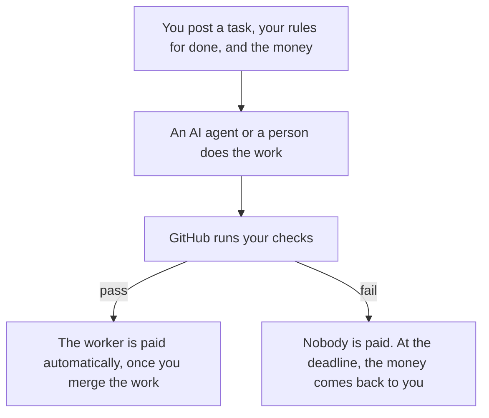
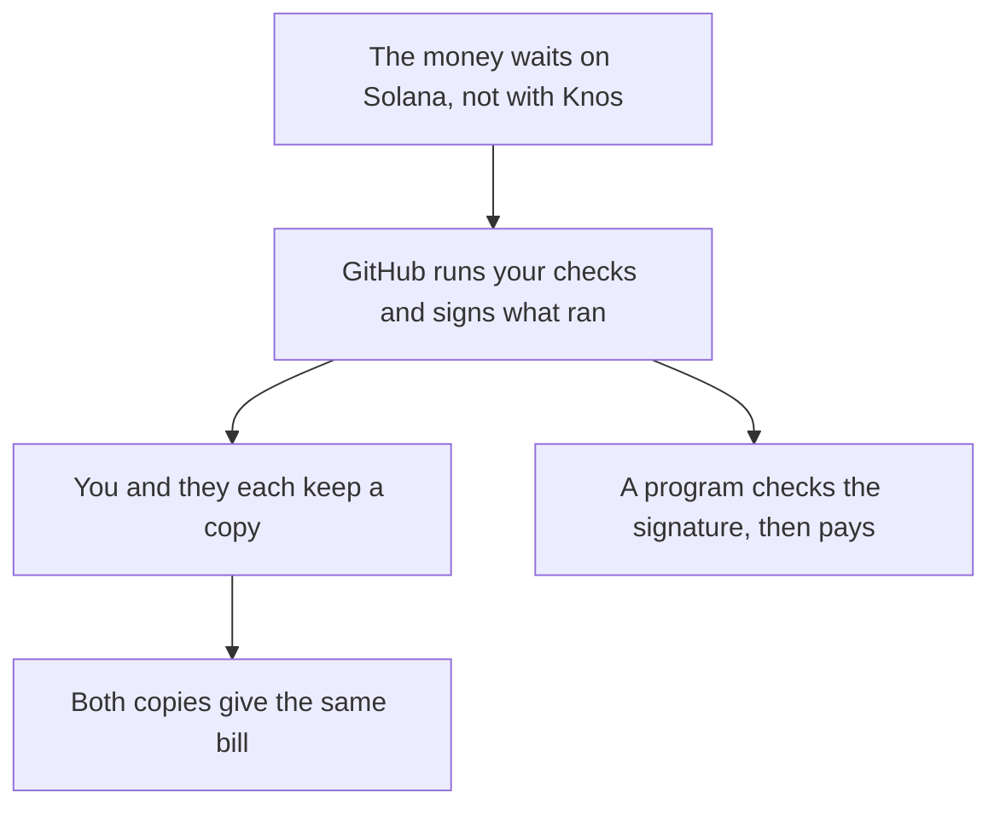

<h1>
  <picture>
    <source media="(prefers-color-scheme: dark)" srcset="https://raw.githubusercontent.com/drexthealpha/Knos/v0.3.27/web/brand/wordmark-dark.svg">
    <source media="(prefers-color-scheme: light)" srcset="https://raw.githubusercontent.com/drexthealpha/Knos/v0.3.27/web/brand/wordmark-light.svg">
    
  </picture>
</h1>

**The neutral meter for AI agent work: neither side keeps the count.**

Pay AI agents only when your checks pass.

For teams that pay AI coding agents on GitHub: a program holds the pay until your checks pass.

Of 241 merged agent pull requests claiming passing tests, 9 failed a test, build, lint or type check.

[Check a pull request](https://drexthealpha.github.io/Knos/) · [Check every claim yourself](docs/JUDGES.md)

## How it works

*You set the rules first. The money moves only when the work passes them.*

1. One comment on an issue (a task's page on GitHub) posts the task, your checks and the pay: `/knos fund 20 checks: test`.
2. An [AI agent](docs/WORDS.md#ai-agent) or a person sends the work as a [pull request](docs/WORDS.md#pull-request).
3. When the [checks](docs/WORDS.md#checks-ci) pass and you [merge](docs/WORDS.md#merge) the work, a program pays the worker.

**Ready to try it on your own repository?** [Get started in five minutes](docs/START.md).

## Try it in ten seconds

Open [the check](https://drexthealpha.github.io/Knos/check/) in your browser. Paste the link to an AI agent's pull request. It tells you whether the agent's checks really passed.

No pull request at hand? Press **Try a sample**. It checks a made-up bill from an AI agent.

There is nothing to install, no sign-up, and nothing is sent to Knos.

## Why nobody can fudge the count

GitHub (where your code lives) [signs](docs/WORDS.md#signed) a [token](docs/WORDS.md#token-oidc) for each run of your checks. The token proves which workflow ran, on which commit. Nobody else can make it.

A workflow is the script that runs your checks. A commit is one saved version of the code.

*GitHub signs which workflow ran, on which commit. Both sides rebuild the same bill, and a program pays.*

You and the other side each keep a copy of those signed runs. Each side rebuilds the bill from its own copy (the command is `knos meter reconcile`).

**The two bills match line for line, so neither side can change the count alone.**

The money waits in a program on [Solana](docs/WORDS.md#solana), not with Knos. That program checks GitHub's signature before it pays. Today one person can still change that program, after a public wait ([who holds the keys](docs/TRUST.md)).

Today Knos earns its fee only when work is accepted. When you get a refund, the fee goes back to you. So Knos gains when work passes, and the meter is not yet fully neutral ([the plan to fix it](docs/reference/CHARTER.md)).

Why Solana: Money is released with no custodian, and neither buyer nor supplier can change the count. One person holds every upgrade key today; a program change waits 48 hours in public. A custodian is a company that holds your money for you.

## Is it real?

It runs on test money only: [test USDC](docs/WORDS.md#test-usdc) on Solana's practice network, [devnet](docs/WORDS.md#devnet).

There are no customers yet. Nobody has bought anything ([what is not real yet](docs/reference/DISCLOSURE.md)).

One person holds every key today. Any change to the programs waits in public for 48 hours first ([who holds the keys](docs/TRUST.md)).

<!-- bench:today -->
| What | Today | Read from |
|---|---|---|
| This copy | Release 0.3.27, October 2026. A copy naming an older release, or another product, is out of date | [CHANGELOG.md](CHANGELOG.md); the newest: [PyPI](https://pypi.org/project/knos/) |
| Reproduced by someone else | 0 of 270 | [docs/reference/CAPABILITIES.md](docs/reference/CAPABILITIES.md), the rows "reproduced by someone else" |
| Exercised at the public devnet program ids | 26 of 270: GitHub token verification, funding by one comment, funding from a wallet, pay on merge, refund at the deadline, pause, work orders, an order paying up to four payees, orders judged by the buyer's black-box tests, auto-accepted orders, a holdback released after its warranty, top-ups, single-use tokens, one counted evaluation, a counted batch of evaluations, the seller's own count, a payee's passkey wallet, a passkey funder, the passkey relay, the site's Buy page, an x402 order, the upgrade gate, strict JSON in the verifier, an outcome that is not code, ES256 tokens in one transaction, the presentation grace | [docs/reference/CAPABILITIES.md](docs/reference/CAPABILITIES.md), the rows "exercised on devnet" |
| Deployed at the public devnet program ids, no transaction recorded | 3 of 270: GitLab token verification, the key guardian, holding pay for a payee with no wallet | [docs/reference/CAPABILITIES.md](docs/reference/CAPABILITIES.md), the rows "deployed on devnet" |
| Tested here only | 237 of 270, each with the test its row names | [docs/reference/CAPABILITIES.md](docs/reference/CAPABILITIES.md), the rows "tested locally" |
| Written, not tested | 4 of 270 | [docs/reference/CAPABILITIES.md](docs/reference/CAPABILITIES.md), the rows "implemented" |
| Outside funders | 0 | [docs/NUMBERS.md](docs/NUMBERS.md), row 1 |
| Outside repositories | 0 | [docs/NUMBERS.md](docs/NUMBERS.md), row 2 |
| Outside payees | 1, on tasks Knos funded itself | [docs/NUMBERS.md](docs/NUMBERS.md), row 3 |
| Payments between unrelated accounts | 3, on tasks Knos funded itself | [docs/NUMBERS.md](docs/NUMBERS.md), row 4 |
| Buyer interviews held | 0 | [docs/NUMBERS.md](docs/NUMBERS.md), row 5 |
| Letters of intent | 0 | [docs/NUMBERS.md](docs/NUMBERS.md), row 6 |
| Reproductions signed by GitHub | 0 | [docs/NUMBERS.md](docs/NUMBERS.md), row 7 |
| Outside programs reading the verifier | 0 | [docs/NUMBERS.md](docs/NUMBERS.md), row 8 |
| Shadow counts published | 0 | [docs/NUMBERS.md](docs/NUMBERS.md), row 9 |
| Paying customers | 0 | [docs/reference/DISCLOSURE.md](docs/reference/DISCLOSURE.md) |
| Revenue | 0; test USDC is not money | [docs/reference/MARKET.md](docs/reference/MARKET.md) |
| Outside security review | none | [docs/reference/ASSURANCE.md](docs/reference/ASSURANCE.md) |
| Key holders | one person holds every key; an upgrade waits 48 hours in public | [docs/reference/GOVERNANCE.md](docs/reference/GOVERNANCE.md) |
| Network and money | Solana devnet, test USDC; mainnet is not touched | [docs/reference/SECURITY.md](docs/reference/SECURITY.md) |
<!-- /bench:today -->

## Check every claim yourself

Start at [the release page](docs/reference/MANIFEST.md): the code, how it is built, what runs on devnet, the payments and the fees.

One task from start to end, on 9 Oct 2026 with Knos 0.3.23, in a repository Knos owns, with test USDC (one step fixed by hand): [funded](https://explorer.solana.com/tx/3UaY22WKexigMpkVhibfeMdNgBiyybWm2Z4LuLskKGbNUDXV34yYWyH42atxFjELbrqSgoVs6TwpFzSQwhfXqzgM?cluster=devnet) · [wrong work refused](https://github.com/drexthealpha/knos-witness/actions/runs/37890511112/job/113690226126) · [paid](https://explorer.solana.com/tx/2PtmKUrQHKPARZE4nr35Te559NGQSG7tSHUfwzcKCAjL7gzvQ76fNTVLMWvq8mcZLxd27tbyTe31mCk2PxEGfAqa?cluster=devnet) · [replay paid nothing more](https://github.com/drexthealpha/knos-witness/pull/10#issuecomment-6075196710) · [the record](https://github.com/drexthealpha/knos-witness/blob/acaa854d241c2e030f521b6f5603c8f43c93bab6/witness.json).

Every other claim is one click from [docs/JUDGES.md](docs/JUDGES.md).

## The number

Knos read 241 merged pull requests by AI agents whose description said the tests pass. **In 9 of them, a test, build, lint or type-check job had failed at the last commit** (3.7%; the true share is very likely between 2.0% and 6.9%; [docs/backtest.json](docs/backtest.json)). 19 had a failed check of any kind (7.9%).

A first, automatic scan counted 16 and 30. A person then re-read each one and took out 11 of the 30: they were not merged into the main branch, or the failure or the claim did not hold ([docs/index_review.json](docs/index_review.json), method [version 1](docs/INDEX_METHOD.md), counted by `scripts/backtest.py`).

A second, larger count: in 147 of 826 repositories (17.8%), the first such pull request by an AI agent had a failed check of any kind ([docs/reference/BENCH.md](docs/reference/BENCH.md)). A failed check is GitHub's record, not a judgment of why it failed.

## Words

Pull request, devnet, multisig and more, each in one plain line: [docs/WORDS.md](docs/WORDS.md).

## Questions

### What is Knos?

Knos is the neutral meter for [AI agent](docs/WORDS.md#ai-agent) work. Neither side keeps the count.

### How does Knos pay an AI agent?

You post the task, your [checks](docs/WORDS.md#checks-ci) and the pay before work starts. When the checks pass and you [merge](docs/WORDS.md#merge), a [program](docs/WORDS.md#program) pays the agent.

### Does Knos use real money?

No. It runs on [devnet](docs/WORDS.md#devnet), Solana's practice network, with [test USDC](docs/WORDS.md#test-usdc) worth nothing.

### What does Knos cost?

Checking is free; paying adds 0.30%, at least 0.05 [test USDC](docs/WORDS.md#test-usdc). A tip pays the fee out of the amount instead.

### Who holds the money?

A program on [Solana](docs/WORDS.md#solana) holds it, not Knos. Today one person can change that program, after a public wait.

### Can the buyer refuse to pay?

Not once the checks pass and the work is merged. Before that, the buyer still chooses whether to merge.

### What is a neutral meter?

A count of work that neither side keeps alone. A program checks GitHub's [signature](docs/WORDS.md#signed) of which workflow ran, on which commit.

### How do I try Knos?

Open [the check](https://drexthealpha.github.io/Knos/check/) and paste an AI agent's pull request. It answers within ten seconds, with no sign-up.

## Read more

`uvx knos shadow invoice.csv`: the same check from a terminal, on a bill of your own (it needs uv, a tool for Python).

- [Get started](docs/START.md): check a pull request, fund a task, get paid, install the tools.

- [Pricing](docs/PRICING.md): what Knos costs. The check is free.

- [Trust](docs/TRUST.md): who holds the keys, what is tested, and what is not.

- [The story](docs/STORY.md): one task in seven steps, each with its evidence.

- [Check every claim](docs/JUDGES.md): each claim, one click from its proof.

- [Every other document](docs/README.md): the map of the documents.

---

Contact: open an issue, or report a security problem privately: [SECURITY.md](SECURITY.md).

Below: tables that scripts write from the code and the chain, and the licence. Nobody types them by hand.

<!-- programs:start -->
| program | address | on devnet, as [`docs/capabilities.json`](docs/capabilities.json) records it |
|---|---|---|
| `knos-oidc`, the verifier | `FkwZdsYCmzicJMtHLTkPK76bYNVG4WNwkWJBiVWNtF3W` | runs `2.2` |
| `knos-pay`, the escrow | `5y7iWJ1VAMJjnnWbbdo2a2PsWJEwTExSNpzrvQSEnS8k` | runs `2.2` |
| `knos-meter`, the count | `FUMKkcE95x2kZUj1zZTCbgcYBmJ3WXPHL8pyA8J6anX` | runs `1.1` |
| `knos-passkey`, a wallet from a passkey | `FQPX9i5kQxLYKZyyPgM2fVK9am3w1LSk1Cuoer1sSY85` | runs `1.1` |
<!-- programs:end -->

This page names no time for an upgrade, so it stays true before and after one. To see whether a change to the
programs is waiting, done or withdrawn, run `knos status`, or read the site's banner or its
[upgrade record](https://drexthealpha.github.io/Knos/upgrades.json) ([`web/upgrades.json`](web/upgrades.json) is the
copy kept here).

The first set of programs ([`programs`](programs)) has no upgrade authority, so nobody can change it.
It stays as a record, and no new task is funded there.

<!-- capabilities:start -->
**Reproduced by someone else:** none recorded yet. **Exercised on devnet:** `verify_github`, `fund_by_comment`, `fund_from_wallet`, `pay_on_merge` and more, each named in the table. **Deployed on devnet:** `verify_gitlab`, `key_guardian`, `hold_and_bind`. Everything else is tested locally, implemented or not built: [the table with the evidence](docs/reference/CAPABILITIES.md) has one row for each capability, from [`docs/capabilities.json`](docs/capabilities.json). Only runs at the public program ids count here. Each capability's row also notes, with its transaction, any earlier trial run at separate test addresses (Knos 0.3.14).
<!-- capabilities:end -->

MIT licence, all of it. Built by drexthealpha. Everything Knos remembers is kept by the [Sibyl](https://sibyllabs.org) memory engine.
<!-- mcp-name: io.github.drexthealpha/knos -->
