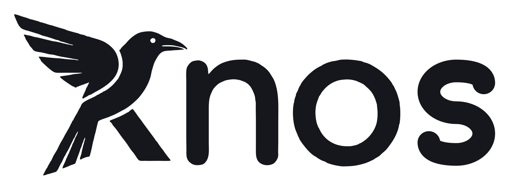

<h1>
  <picture>
    <source media="(prefers-color-scheme: dark)" srcset="web/brand/wordmark-dark.svg">
    <source media="(prefers-color-scheme: light)" srcset="web/brand/wordmark-light.svg">
    
  </picture>
</h1>

**The neutral meter for AI agent work: neither side keeps the count.**

Of first agent pull requests that claimed passing tests, 17.8% had a failed check ([147 of 826 repositories](docs/BENCH.md)).

[Try the demo](https://drexthealpha.github.io/Knos/#demo) · [Check an invoice](https://drexthealpha.github.io/Knos/#shadow) (shadow mode) · [Install](docs/INSTALL.md)

## Prices

| Line | Unit | Price |
| --- | --- | --- |
| Check | pull request checked | free, forever |
| Meter | evaluation | 10,000 a month free per organisation, then 0.05 USD; 0.02 on a committed-volume plan |
| Verify | dollar of outcome billing the count verifies | 0.5% to 1.0%, the greater of this and the Meter fee, capped per deliverable (proposed; nobody has bought it) |
| Control | organisation, per year | Team 25,000 USD; Business 80,000; Enterprise from 250,000 (Enterprise is not deliverable yet: it needs single sign-on, private deployment and support that do not exist) |
| Supplier connection | supplier connected to a buyer, per year | 5,000 USD each beyond the first five; the buyer pays; a supplier never pays to be counted |
| Pilot | one buyer and its suppliers, 30 days | 2,500 USD, credited against the first year of Control (nobody has bought it; no legal entity to invoice from yet) |
| Settle | dollar settled, paid by the funder on top | 2.5% of the first 1,000, 1% from 1,000 to 50,000, 0.5% above; minimum 0.40. On devnet this is test money: zero revenue |
| Index data, Advance, Assurance | | not offered |

**The rule: Knos never charges the party being rated.** Nobody has bought anything.
[docs/MARKET.md](docs/MARKET.md) has the fee by order size, one customer worked through and the first steps;
[docs/PILOT.md](docs/PILOT.md) is the Pilot in full.

## What is real today

Devnet is test mode: everything runs on **Solana devnet**, and the money is **test USDC**. Mainnet is not touched.

- **What works, and how far each part has got:** [docs/CAPABILITIES.md](docs/CAPABILITIES.md), one row per capability with its evidence.
- **Who uses it:** [docs/submission/NUMBERS.md](docs/submission/NUMBERS.md). Nobody outside Knos has funded an order, bought anything or signed anything.
- **Who can change it:** one person, through a multisig, after a public 48-hour delay ([docs/GOVERNANCE.md](docs/GOVERNANCE.md)). No outside security firm has examined anything.

<!-- programs:start -->
| program | address | on devnet, as [`docs/capabilities.json`](docs/capabilities.json) records it |
|---|---|---|
| `knos-oidc`, the verifier | `FkwZdsYCmzicJMtHLTkPK76bYNVG4WNwkWJBiVWNtF3W` | runs `2.0` until its upgrade proposal has executed; `2.1` was proposed through the multisig and runs at this address only once that proposal has executed (the live state is in [`web/upgrades.json`](web/upgrades.json)); the 0.3.14 rehearsal ran it at a staging address of its own ([docs/CAPABILITIES.md](docs/CAPABILITIES.md)) |
| `knos-pay`, the escrow | `5y7iWJ1VAMJjnnWbbdo2a2PsWJEwTExSNpzrvQSEnS8k` | runs `2.0` until its upgrade proposal has executed; `2.1` was proposed through the multisig and runs at this address only once that proposal has executed (the live state is in [`web/upgrades.json`](web/upgrades.json)); the 0.3.14 rehearsal ran it at a staging address of its own ([docs/CAPABILITIES.md](docs/CAPABILITIES.md)) |
| `knos-meter`, the count | `FUMKkcE95x2kZUj1zZTCbgcYBmJ3WXPHL8pyA8J6anX` | runs `1.0` until its upgrade proposal has executed; `1.1` was proposed through the multisig and runs at this address only once that proposal has executed (the live state is in [`web/upgrades.json`](web/upgrades.json)); the 0.3.14 rehearsal ran it at a staging address of its own ([docs/CAPABILITIES.md](docs/CAPABILITIES.md)) |
| `knos-passkey`, a wallet from a passkey | `FQPX9i5kQxLYKZyyPgM2fVK9am3w1LSk1Cuoer1sSY85` | runs `1.0` until its upgrade proposal has executed; `1.1` was proposed through the multisig and runs at this address only once that proposal has executed (the live state is in [`web/upgrades.json`](web/upgrades.json)); the 0.3.14 rehearsal ran it at a staging address of its own ([docs/CAPABILITIES.md](docs/CAPABILITIES.md)) |
<!-- programs:end -->

This page names no time for an upgrade, so that it is true before and after one. Whether a proposal is pending, has
executed or was withdrawn is read from the chain by `knos status`, the site's banner and the site's
[upgrade record](https://drexthealpha.github.io/Knos/upgrades.json) ([`web/upgrades.json`](web/upgrades.json) is the
committed copy). The first deployment ([`programs`](programs)) has no upgrade authority and stays as a record; nothing
new is funded there.

<!-- capabilities:start -->
**Reproduced by someone else:** none recorded yet. **Exercised on devnet:** none recorded yet. **Deployed on devnet:** `verify_github`, `verify_gitlab`, `key_guardian`, `fund_by_comment`, `fund_from_wallet`, `pay_on_merge`, `hold_and_bind`, `refund`, `pause`, `meter_single`, `passkey_payee_wallet`, `upgrade_gate`. Everything else is tested locally, implemented or not built: [the table with the evidence](docs/CAPABILITIES.md) has one row for each capability, from [`docs/capabilities.json`](docs/capabilities.json). Deployed and exercised are counted only at the public program ids; what the 0.3.14 rehearsal ran at staging addresses of its own is in the note of each capability it ran, with its transaction.
<!-- capabilities:end -->

## How it works

A work order is a task, its budget and the terms that decide whether it is done, fixed before the work starts. A
bounty on an issue is the smallest one.

1. **Fund with terms.** A maintainer comments on an issue: `/knos fund 20 checks: test`. The terms are hashed into the
   order. Nothing changes them afterwards.
2. **Accept.** Someone opens a pull request, a person or a coding agent, and she merges it. Had `test` failed at that
   commit, the merge would pay nothing, and a comment would name the check.
3. **Pay, or only count.** A workflow at a pinned commit reads GitHub's record of the merge, and GitHub signs the run.
   A Solana program checks that signature and pays the author. A buyer who pays by invoice uses the count alone:
   `knos-meter` records each signed evaluation once, and moves no money.

The seller can settle without the buyer, after a merge in a public repository: `knos settle --neutral <pull request URL>`.
With no payment by the deadline, the amount and the fee go back, and that needs no token.

A check can also pay without a merge, when it is black-box: of 63 cheating pull requests, 56 passed plain CI and 0
passed it ([docs/TAMPER.md](docs/TAMPER.md)).

Every command and term (`checks`, `paths`, `days`, `warranty`, `holdback`, `arbiter`, `/knos offer`, `/knos split`):
`/knos help`, and [docs/SECURITY.md](docs/SECURITY.md), section 3. Why a signed run and not a description:
[docs/WHY.md](docs/WHY.md). What else exists, and where it is ahead: [docs/COMPARE.md](docs/COMPARE.md).

## Limits

[docs/SECURITY.md](docs/SECURITY.md) has all of them. The ones to know first:

- **Devnet, test USDC, no outside review.** `knos mainnet-check` fails on that line on purpose.
- **A signature authenticates a statement, not the truth.** GitHub signs which workflow ran, at which commit, in which
  repository. It does not sign what the workflow read.
- **The seller's own settlement covers public repositories only.**
- **A passed check is not good work.** An order buys what its terms say, and the funder chose the terms.
- **Knos inherits GitHub's failures.** If GitHub signs something false or is down, the programs believe it or wait.
- **The payout is USDC on Solana.** No card, no bank transfer, no bank payout.

## Documents

- **Try it:** [SHADOW](docs/SHADOW.md) (check an invoice, no install), [PLAYGROUND](docs/PLAYGROUND.md) (fund a test
  order with one comment), [INSTALL](docs/INSTALL.md), [CONSOLE](docs/CONSOLE.md), [PILOT](docs/PILOT.md),
  [the recording](https://github.com/drexthealpha/Knos/releases/latest/download/demo.mp4) (a release with no recording has no such file).
- **For finance:** [FINANCE](docs/FINANCE.md) (the four records and the exports), [METER](docs/METER.md),
  [RECEIPT](docs/RECEIPT.md), [TERMS](docs/TERMS.md) (terms cited by hash), [OUTCOMES](docs/OUTCOMES.md).
- **The verifier:** [VERIFIER](docs/VERIFIER.md) (any RS256 issuer), [OIDC](docs/OIDC.md), [COMPOSE](docs/COMPOSE.md),
  [CONFORMANCE](docs/CONFORMANCE.md), [INTEGRATIONS](docs/INTEGRATIONS.md), [X402](docs/X402.md), [ADAPTERS](docs/ADAPTERS.md).
- **Trust:** [SECURITY](docs/SECURITY.md), [ASSURANCE](docs/ASSURANCE.md), [INVARIANTS](docs/INVARIANTS.md),
  [PROVENANCE](docs/PROVENANCE.md) (source to build to chain), [UNWRAPS](docs/UNWRAPS.md), [TAMPER](docs/TAMPER.md),
  [DRILLS](docs/DRILLS.md), [GOVERNANCE](docs/GOVERNANCE.md), [CONTROLS](docs/CONTROLS.md), [PRIVACY](docs/PRIVACY.md),
  [REGULATION](docs/REGULATION.md), [REPRODUCE](docs/REPRODUCE.md).
- **Numbers:** [BENCH](docs/BENCH.md) (every measured number), [INDEX](docs/INDEX.md) (the Agent PR Index by week),
  [LOAD](docs/LOAD.md), [NUMBERS](docs/submission/NUMBERS.md) (outside use, zeros included).
- **The business:** [MARKET](docs/MARKET.md), [WHY](docs/WHY.md), [COMPARE](docs/COMPARE.md), [TEAM](docs/TEAM.md),
  [DISCLOSURE](docs/DISCLOSURE.md).
- **Operating it:** [RELAY](docs/RELAY.md), [OPERATIONS](docs/OPERATIONS.md), [RELEASE](docs/RELEASE.md),
  [CHANGELOG](CHANGELOG.md).

## What is in this repository

| | |
|---|---|
| [`programs-v2`](programs-v2) | The four programs above. Each file's first lines say what it does. |
| [`programs`](programs) | The first deployment, exactly as deployed. |
| [`.github/workflows`](.github/workflows) | The workflows a repository calls, published at one pinned commit of `drexthealpha/knos-workflows`. |
| [`src/knos`](src/knos) | What the workflows run: the judge, the relay, receipts, statements, the Stop hook, the MCP server. |
| [`crates`](crates), [`idl`](idl), [`sdk/settle`](sdk/settle), [`examples`](examples), [`conformance`](conformance) | What another team builds on. |
| [`web`](web) | The site. It reads GitHub and Solana in the browser; there is no Knos server. |
| [`terms`](terms) | The terms registry: each set of terms, by hash. |

## History

Knos 0.1 (1–7 Sep 2026) was shared memory for coding agents built on Sibyl. 0.2 and 0.3.0–0.3.9 (29 Sep – 2 Oct)
tried coordination, budgets and a jobs market before the measurement above showed where the problem was
([drexthealpha/knos-labs](https://github.com/drexthealpha/knos-labs)). 0.3.10 to 0.3.15 are the two deployments, work
orders, the count and the console. 0.3.16 is this release. [docs/DISCLOSURE.md](docs/DISCLOSURE.md) says what was
built when and what came from elsewhere.

MIT, all of it. Built by drexthealpha. Its memory engine is [Sibyl](https://sibyllabs.org).
<!-- mcp-name: io.github.drexthealpha/knos -->
