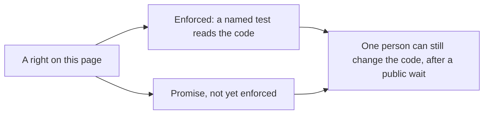

# The charter

**In plain words.** This page lists the rights Knos gives you. Each right is one line. Each line says one of two
things. "Enforced" means a test checks the code on every change; the test is named. "Promise, not yet enforced" means
no code holds it yet. The page has a fingerprint (a [hash](WORDS.md#hash)) at the bottom. If one letter changes, the
fingerprint changes.

Money here is [test USDC](WORDS.md#test-usdc) on [devnet](WORDS.md#devnet). It has no value. This page is not a
contract and not legal advice.

*Every right is either checked by a test or marked as a promise. Neither stops an upgrade.*

## What can change, and who can change it

Read this first. It limits every line below.

- One person, the founder, holds every key that can change the [programs](WORDS.md#program) (the code that holds the
  money).
- A change waits 48 hours in public before it can run. During that wait you can see it coming.
- A longer wait of 8 days is approved. It was approved on 9 October 2026 by two of the founder's own keys, and can be
  applied 48 hours after that approval ([GOVERNANCE.md](GOVERNANCE.md), section 2). Until then the wait is 48 hours.
- An [upgrade](WORDS.md#upgrade) can change any right on this page. A test checks today's code only.
- Details: [GOVERNANCE.md](GOVERNANCE.md).

## The rights

| Right | Where it holds | Status |
| --- | --- | --- |
| You get your money back after the deadline. The refund needs no message from GitHub. No pause can stop it. | `knos_pay`: `Refund` and `RefundOrder` | Enforced by `tests/test_neutrality.py::test_the_refund_needs_no_token_and_no_pause_can_stop_it` |
| No key of Knos's signs a verdict, picks a payee or moves an order. | `knos_pay`, `knos_meter`; the Python modules that judge | Enforced by `tests/test_neutrality.py::test_knos_fee_account_only_receives_fees_and_lowers_a_rate` and `tests/test_neutrality.py::test_the_modules_that_make_verdicts_know_no_fee_and_no_account_of_knos` |
| The fee is at most 0.30% of the amount, or 0.05 when that is larger. A Plan can only lower the rate. | `knos_pay`: `FEE_BPS`, `FEE_MIN`, `SetPlan` | Enforced by `tests/test_neutrality.py::test_the_fee_never_exceeds_the_rate_or_its_floor` and `tests/test_neutrality.py::test_set_plan_only_lowers_the_rate` |
| The fee reads the amount and the rate only. It is the same whoever accepts the work. | `knos_pay`: `fee_of`, `order_fee` | Enforced by `tests/test_neutrality.py::test_the_fee_reads_the_amount_and_the_rate_only` |
| An open order keeps the rate it was funded at. A top-up uses the order's own rate. | `knos_pay`: `TopUp`, `PayOrder` | Enforced by `tests/test_neutrality.py::test_an_open_order_keeps_the_rate_it_was_funded_at` |
| The payee of an order pays no fee. The buyer pays it on top of the amount. | `knos_pay`: order funding and `PayOrder` | Enforced by `tests/test_neutrality.py::test_an_orders_fee_is_paid_on_top_and_never_taken_from_its_payees` |
| The payee of a job pays no fee. Today a job (the older kind of bounty) takes its fee out of the amount. Changing that needs an upgrade. | not held | Promise, not yet enforced |
| The party being rated never pays for its rating. Every invoice line is the buyer's. | `src/knos/billing.py` (off chain; nothing has been sold) | Enforced by `tests/test_billing.py::test_the_rated_party_never_pays_no_line_is_ever_addressed_to_a_supplier` |
| Two judges run by one person count as one judge. The program counts repository owners. The relay also refuses two runs started by one account, unless every account is the operator's own; that round is labelled own. | `knos_pay` 2.2 (owners); the relay, off chain (the account that started a run) | Enforced by `tests/test_quorum_controller.py::test_runs_that_share_an_owner_or_a_starter_are_one_controller` and `tests/test_quorum_controller.py::test_the_relay_does_not_carry_a_quorum_two_runs_of_one_starter_would_complete` and `tests/test_quorum_controller.py::test_the_relay_carries_an_own_round_and_says_so` |
| The fee does not depend on the verdict. Today a refunded order gets its fee back, so Knos earns only on yes. The fix is written in [PROPOSAL-2.3.md](PROPOSAL-2.3.md). | not held | Promise, not yet enforced |
| You can leave before any upgrade runs. Today an order with a later deadline needs 7 days of notice; the wait is 48 hours. The 8-day wait closes that gap. | not held until the 8-day wait is applied | Promise, not yet enforced |
| A second person, outside Knos, can block a change. Today there are 0 such key holders. | not held | Promise, not yet enforced |

The rules that grow from these rights are in [STANDARD.md](STANDARD.md).

## How to check this page

- Each "Enforced" line names a test. `tests/test_neutrality.py` fails if a named test does not exist.
- The fingerprint below is written by `scripts/charter_hash.py`. The same test fails if it does not match.
- A promise never names a test. When a promise gets a test, its line changes, and so does the fingerprint.

---

sha256 of everything above this line: `3b5df15bd1c8de3e4f9b5c4e231f4281a3c09f92e0f8f864e12ae76d1e78609a`. Check it yourself: `sed '/^---$/,$d' docs/CHARTER.md | sha256sum`. `tests/test_neutrality.py` checks it on every change.
