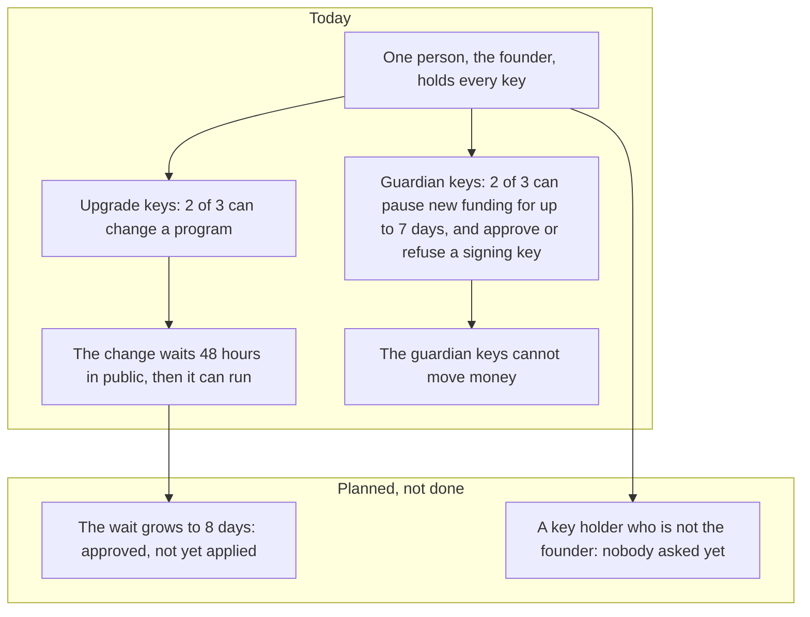

# Governance: who can change what, today

**In plain words.** One person, the founder, holds every key that can change the [programs](WORDS.md#program) (the code that holds the money). Each change is public for 48 hours before it runs; a longer wait of 8 days is approved, not yet applied. Other keys can pause new funding for 7 days at most, but cannot move money.


*Who can change the programs today, and the two changes that are planned.*

This page says who can change the programs and the keys they trust, what stands between that power and a user's
money, and what is planned. It describes the programs as devnet holds them, with test USDC; the pending proposals
are in [`web/upgrades.json`](../web/upgrades.json). [SECURITY.md](SECURITY.md) is
the security model; [INVARIANTS.md](INVARIANTS.md) is what the programs guarantee while they are unchanged.

**The short version.** One person can change every program, 48 hours after saying so in public. Both multisigs are
2-of-3 over the same three member keys, and all three are the founder's. So the 48-hour delay gives **notice**. It does not give
independent oversight: nobody else has to agree, and nobody else can refuse.

**Leaving before an upgrade is not always possible.** A Balance can be withdrawn at once, but an open order whose
deadline falls after the upgrade's time cannot be refunded before it: a cancellation gives the seller 7 days of
notice, and the upgrade delay is 48 hours. `knos exit --before-upgrade` lists every holding of yours with its way out
and the hours it misses by (section 2). What closes it for open orders: a time lock of 8 days, set by a Squads
configuration transaction. That transaction was created and approved by two member keys on 9 October 2026, once
proposals 7 and 8 had run. It is approved, not yet applied: until a member executes it, which the Squads program
allows 48 hours after the approval, the time lock on chain is 48 hours.

**Outside key holders today: 0.** What would change it: one person opens a "Key holder request"
([KEYHOLDER.md](KEYHOLDER.md), one page) and the founder runs one command (section 5).

**One machine holds enough keys to do everything:** the founder's key folder has the key that writes build buffers
and all three member keys (section 6).

**Three plans are on this page, and none of them is a fact.** Each waits on a person who does not exist yet.

| plan | where | what has been done |
|---|---|---|
| An outside key holder on each multisig: what they would check before every vote | sections 4 and 5; [KEYHOLDER.md](KEYHOLDER.md) | nothing: nobody has been asked. The page they would read and the command that adds their key are written and tested |
| A two-owner organisation for the pinned workflows and the relay | section 9 | nothing: the organisation does not exist |
| The verifier frozen after an outside review; the escrow kept upgradeable behind the delay | section 7 | nothing: no review has been done or commissioned |

## 1. Who can change what

| what | who, today | how fast | what limits it |
|---|---|---|---|
| The code of `knos_pay`, `knos_oidc`, `knos_meter`, `knos_passkey` | the upgrade multisig: 2 of 3 keys, all the founder's | 48 hours after the vote that approves it | the delay, and that the proposal and its bytes are public for those 48 hours. An upgrade can do anything, including taking every order's money |
| The upgrade multisig's own members, threshold and delay | the same 2 of 3 | the same 48 hours | it has no config authority: only a vote changes it |
| Which signing keys the verifier accepts | a new key: an attestation from one of two repositories of one personal GitHub account, then a day, then the guardian's approval. A refresh of a key the issuer still publishes: anyone (section 7) | a day and the guardian's vote | constants in [`pins.rs`](../programs-v2/knos_oidc/src/pins.rs) |
| Revoking a key; pausing new funding for at most 7 days | the guardian multisig: 2 of 3 keys, all the founder's | at once (no time lock) | it has no instruction that moves money, and cannot block a refund, a withdrawal or a payment under a good key |
| The guardian multisig's own members | the same 2 of 3 | at once | no config authority |
| A contract fee rate for one repository owner | `FEE_OWNER`, one key of Knos's | at once | only downward, until an expiry: under `knos_pay` 2.1 the first tier between 0.5% and 2.5%; under 2.2 (proposal 8) to no less than 0.10% |
| An order's terms, payee, amount or deadline after funding | nobody | | the program has no such instruction; a change takes an upgrade |
| The first deployment ([`programs`](../programs)) | nobody | | neither program has an upgrade authority |

Read it yourself: `knos status` prints both multisigs as the chain has them (members, threshold, delay, config
authority) and every pending proposal; `node scripts/governance.mjs show --check` does the same from the Squads
accounts. On devnet the Squads program itself has an upgrade authority, which is Squads' and not ours
([SECURITY.md](SECURITY.md), section 7).

## 2. What the 48 hours are, and are not

- **They are notice.** From the approving vote, the proposal, the buffer with the new bytes, and (when the build
  came from the release workflow) the upgrade gate's record of the commit it was built from are on chain.
  The site shows a banner on every view. [`web/upgrades.json`](../web/upgrades.json) and the Atom feed
  `web/upgrades.xml` list every proposal with its program, build hash, source commit, earliest execution time and
  status, so a funder can follow the feed instead of visiting the site
  ([`scripts/upgrade_feed.py`](../scripts/upgrade_feed.py)). The feed is rewritten when the site is built, so it
  is as fresh as the last build; the banner and `knos status` read the chain directly.
- **What a funder can do inside them, and what not.** `knos exit --before-upgrade --wallet <address>` (or
  `--github-id <n>`) reads the pending proposal and every Balance and order of yours, and prints for each the
  instruction that takes the money out of `knos_pay`, who sends it, when, and whether that is before the upgrade can
  execute ([`src/knos/exit.py`](../src/knos/exit.py); tested against the program in `tests/test_exit.py`). The
  feed and `knos status` give the hours left. The rules are the program's:

  | what you hold | the way out | before an upgrade approved now? |
  |---|---|---|
  | a Balance | `Withdraw`, your wallet signs, at once | yes |
  | an open order past its deadline | `RefundOrder`, anyone sends it, at once | yes |
  | an open order whose deadline is inside the 48 hours | `RefundOrder` after the deadline | yes |
  | an open order whose deadline is later | `Cancel` moves the deadline to at most 7 days away (`NOTICE`), then `RefundOrder`; a wallet's order is cancelled by its wallet, a Balance's by a `/knos cancel` comment, which needs GitHub | **no**: 7 days of notice are longer than 48 hours |
  | an order held for a payee who has bound no wallet | `RefundOrder` after the 180-day hold | **no** |
  | a holdback in its warranty (up to 90 days) | `Release` to the seller when it ends; back to the funder only by a judge's revert token | **no** |

  **Where an order cannot be left, and why.** The notice protects the seller who is working on the order: a funder
  who could take the money back at once could cancel after the work was done. So the timetable has two promises
  that disagree, and today the seller's wins: an upgrade can execute while a funder's order is still in its notice.
  For comparison, L2BEAT's framework for rollups asks that users have at least 7 days to exit before an unwanted
  upgrade, and 30 days at its highest stage
  ([L2BEAT, "Introducing Stages"](https://medium.com/l2beat/introducing-stages-a-framework-to-evaluate-rollups-maturity-d290bb22befe)).
- **The plan that closes the gap for open orders, with no program change.** Set the upgrade multisig's time lock
  above the notice plus the presentation grace: an order cancelled when an upgrade is approved is refunded 7 days,
  2 hours and 1 second later, so the lock must be at least 612,002 s. The plan is 8 days (691,200 s); about 22 hours
  above the minimum are for sending the `Cancel`, which for a Balance's order is a comment and a workflow run.
  [`scripts/timelock_plan.py`](../scripts/timelock_plan.py) reads the multisig and prints the Squads configuration
  transaction: `config_transaction_create` with one action, `SetTimeLock { new_time_lock: 691200 }`, then a
  proposal, 2 approvals, and `config_transaction_execute`, which itself waits out the present 48 hours. It refuses
  while any proposal of the multisig is a draft, active, or approved and not executed, because the change makes
  every earlier proposal stale: one not yet approved can no longer be approved, and an approved upgrade waits the
  new time lock from its approval. So the release run applies it only after proposals 7 and 8 have executed.
  Facts from the Squads v4 source: `time_lock` is the seconds between approval and execution; at most 3 × 30 days;
  `SetTimeLock` calls `invalidate_prior_transactions`
  ([state/multisig.rs](https://github.com/Squads-Protocol/v4/blob/main/programs/squads_multisig_program/src/state/multisig.rs),
  [config_transaction_execute.rs](https://github.com/Squads-Protocol/v4/blob/main/programs/squads_multisig_program/src/instructions/config_transaction_execute.rs),
  [vault_transaction_execute.rs](https://github.com/Squads-Protocol/v4/blob/main/programs/squads_multisig_program/src/instructions/vault_transaction_execute.rs),
  [Squads documentation](https://docs.squads.so/main/development/typescript/instructions/create-config-transaction)).
  Once it is in force, `knos exit --before-upgrade` says that every open order can be cancelled and refunded
  before any upgrade approved from then on can execute. It does not cover held orders (180 days) or holdbacks in
  warranty (up to 90 days). The cost: every fix waits 8 days, the one in section 3 included.
  **State: approved, not yet applied.** The configuration transaction is proposal 9 of the upgrade multisig, sent
  with `node scripts/governance.mjs set-time-lock --send` (one action, `SetTimeLock { new_time_lock: 691200 }`)
  once `python scripts/timelock_plan.py --rpc` had found no proposal open, on 9 October 2026: created in
  [`42yHfmYN...`](https://explorer.solana.com/tx/42yHfmYN8pF3zxow7a4SsVWW5voEpZ5BBbnSnyx6EQXSWQYifdVUySbEPuUDpLYErr24SpEa34eExcRy5ztSECfa?cluster=devnet) and approved by two of the three member keys in
  [`MSTGH4Q9...`](https://explorer.solana.com/tx/MSTGH4Q99fy6xNWVJ8hTCjs7mJzuVD7rGNF1Ymy6JeuB3cDMThTGnsxKBBKPvv5Q741DEfKLJrecrtBibv45uyQ?cluster=devnet). The Squads program executes a configuration transaction only once the
  present time lock has run from its approval, so it can be executed 48 hours after that approval, by any member:
  `node scripts/governance.mjs execute upgrade 9`. Until then the time lock on chain is 48 hours, two members can
  still cancel it, and `knos status` lists proposal 9 as a change to the upgrade multisig itself. It is applied only
  when a release run records the executed configuration transaction here, with its signature, and the multisig
  reads back 691200 s.
- **They are not oversight.** The same person proposes, approves and executes.
- **Nothing is sent to anyone.** No comment is posted on repositories with open orders, and no email exists. The
  notice reaches someone who looks, or who subscribed to the feed.

## 3. The delay doing its job: 0.3.13's build was replaced before it ran

Knos 0.3.13 proposed new builds of `knos_oidc` (proposal 1) and `knos_pay` (proposal 2). Both were approved on
2026-10-04 07:17 UTC and could have run from 2026-10-06 07:17 UTC. During that delay a defect was found in the
proposed `knos_pay`: a pay token that had paid an order could pay a second order funded later for the same issue
at the same address ([SECURITY.md](SECURITY.md), section 15). The build never ran, so no order was ever exposed to
it. 0.3.14 withdraws both proposals and proposes corrected builds in their place, which start a new 48 hours.

The defect was found by the founder reading and testing during the delay, which is the use the delay is for. Had
he not looked, the defective build could have been executed on schedule.

The chain is the record of this, not this page: in `web/upgrades.json` proposals 1 and 2 read `replaced` once the
cancelling votes are on chain, and `pending` until then.

## 4. An independent signer: what they would be asked to do

This section is the job description of an outside key holder.

**Before voting for an upgrade, an independent signer checks four things, on their own machine:**

1. **The bytes.** Download the proposal's buffer (`solana program dump <buffer> buffer.so`), hash it
   (`solana-verify get-executable-hash buffer.so`), and compare with a build they made themselves from the proposed
   commit ([ASSURANCE.md](ASSURANCE.md) has the commands). The hash the proposer printed is not evidence. One
   command does the comparison from the chain: `python scripts/provenance.py verify-proposal <N> --so <your build>`
   reads the proposal's buffer, the gate record for those bytes and the feed, and says VERIFIED only when all agree
   with the build you made; without `--so` it prints the commands that make it ([PROVENANCE.md](PROVENANCE.md)).
2. **The gate record.** The account `["build", program, hash]` of [`examples/upgrade_gate`](../examples/upgrade_gate)
   exists and names a commit: GitHub signed that Knos's own `program.yml`, on a commit of `main` or of a release
   tag, built exactly these bytes. `knos status` and the feed print it. A proposal made with `--ungated` has none,
   and then the signer's own rebuild is the only evidence.
3. **The diff.** `git diff <the deployed commit>..<the proposed commit> -- programs-v2/`. In particular: the list
   "WHERE MONEY CAN GO" at the top of `knos_pay/src/lib.rs`; that `RefundOrder`, `Refund` and `Withdraw` still need
   no token and no key of Knos's; the constants of `pins.rs` (the genesis keys, the pinned workflows, the attesting
   account, the guardian); the program ids; and every new instruction's signer and owner checks.
4. **The tests at that commit.** The `program.yml` run of the proposed commit passed, and the release notes say
   what changed and why.

Then they vote (`node scripts/governance.mjs approve upgrade <index>`), or they do not. If anything is wrong after
approval, they vote to cancel (`node scripts/governance.mjs cancel upgrade <index>`).

**For the guardian,** before approving a key: fetch the issuer's published key set themselves, compute the
sha256 of the key's modulus, and compare it with the hash in the proposal.

**What they are not asked to do:** hold anyone's money (no member key can move an order), judge the product, or
be available at short notice for anything but a revocation.

## 5. The procedure to add one

Nothing here has been sent: there is no outside key to add. The commands exist and are tested against the multisig
accounts as devnet holds them (`scripts/governance.test.mjs`, with `tests/fixtures/governance_v2.json`).

1. The person makes a key on their own machine and opens a "Key holder request" with its public key
   ([KEYHOLDER.md](KEYHOLDER.md)). The founder confirms over the contact they gave that the key is theirs.
2. The founder prints the change, and what will be true once it has executed, for both multisigs:

   ```
   node scripts/governance.mjs replace-member <one of the founder's keys> <the new public key>
   ```

   It sends nothing. It prints the members afterwards, the threshold, how many voting keys the founder holds, how
   many outside key holders there are, and in one line whether the founder alone can still approve. The new key gets
   the permission to vote and no other (`--permissions` changes that). `add-member <key>` adds without removing;
   `set-threshold <N>` changes how many must approve; `--on upgrade` or `--on guardian` takes one multisig.
3. The same command with `--send` creates the proposal (a Squads v4 config transaction carrying `AddMember`,
   `RemoveMember` and, if asked, `ChangeThreshold`:
   [Squads documentation](https://docs.squads.so/main/development/typescript/instructions/create-config-transaction))
   and casts the founder's two votes.
4. `node scripts/governance.mjs execute upgrade <index>` runs it once the multisig's own 48 hours have passed;
   `execute guardian <index>` at once. When a change of members or threshold executes, every proposal of that
   multisig that was not yet approved becomes stale and must be proposed again; one already approved can still run.
5. `node scripts/governance.mjs show --check` prints the new member list. The holder is added to
   [`web/keyholders.json`](../web/keyholders.json), and the count at the top of this page changes.

**What has not been run:** `--send` and the execution of a config transaction have never been sent to a cluster or
a local validator. What is tested is the plan, its refusals, and the bytes of the instruction the Squads SDK builds
from it.

**One outside key of three does not bind the founder,** who still holds two: the command prints "the founder alone
can STILL approve an upgrade". The step that binds is the next one: two outside keys of three, or a threshold of 3 of
3, where one lost key ends upgrades for good. Which of the two is decided with the first key holder.

## 6. Who deploys and who approves: what one key can do

Three kinds of key are involved in an upgrade. The addresses are the ones devnet holds.

| key | address | what it can do alone |
|---|---|---|
| The deploy fee payer (`payer.json` in the key folder) | not published; it is no member of either multisig | Write a build to a buffer and hand the buffer to the vault. It cannot propose, vote or execute, and it cannot sign the loader's `Upgrade`. |
| One member key | `9XmgVhQ5i9XzqUrFn85ue2bnxjxD6KBeBCk23gAowUX9`, `9vcyLKaxG2k24PFhmMC6cRCbmM3FqxCoRyHS36aG3dyk` or `Az4ftNZuvopLHwLuxHsw9Rh3QffGsnEFzCEZj1LeH4BX` (the same three on both multisigs) | Create a proposal, cast one of the two approvals, and execute a proposal the others approved once its delay has passed. Alone it cannot approve, reject or cancel. |
| The upgrade vault | `CKCrTBN542pVhizxuSPVg8tvdnPooNxt9B7o97VuTjz2` | It is the upgrade authority of all four programs and the only signer the loader's `Upgrade` takes. It has no private key: it is an address of the Squads program, which signs for it only when executing a proposal of multisig `9HcsMEo2o6zZu9t1kbFWpnyKn7hiHaZYYFwNHZSpmWqK` that 2 members approved 48 hours before. |

**So the key that deploys a build buffer cannot by itself authorise the upgrade.** Where this is checked:

- `scripts/governance.test.mjs`, "the key that writes a build buffer cannot authorise the upgrade, and one member
  key cannot either": the `Upgrade` instruction's one signer is the vault; the vault is not on the Ed25519 curve, so
  no key file signs for it; the vault and the fee payer are not members; one member key has one vote of the two
  needed; two member keys have every power. It reads the multisig account as devnet holds it.
- [DRILLS.md](DRILLS.md), the four rows of the upgrade drill, run against the real Squads program on a local
  validator: an approved upgrade is refused before its 48 hours (`TimeLockNotReleased`) and a cancelled one never
  runs (`InvalidProposalStatus`).
- Not drilled: a key that is no member sending a proposal or a vote to the Squads program and being refused. The
  test above reads the member list; it does not send that transaction.

**What one compromised key can do.**

- *The deploy fee payer:* spend its own SOL, and put a buffer of any bytes in the vault's name. Nothing runs from a
  buffer until 2 members approve a proposal that names it, and `upgrade propose` refuses bytes GitHub's runner did
  not build (that check is in the script, not in the multisig).
- *One member key:* create proposals, which are public and do nothing without a second approval, and cast one vote.
- *Two member keys:* everything, 48 hours later for the programs and at once for the guardian.

**The present setup does not separate these duties.** One key folder (`.knos-keys`) on one machine holds the deploy
fee payer and all three member keys, so whoever has that machine has every power above. Splitting them between two
of the founder's own machines would separate nothing that matters. The separation is a second person's key
(section 5); Squads v4 gives each member its own permissions (initiate, vote, execute), so a key that deploys and
proposes can be given no vote.

## 7. The long-term upgrade model

This is a decision, with its cost stated.

- **`knos_oidc`, the verifier, is frozen after an outside review, and not before:** its upgrade authority is removed, and from
  then nobody can change which signatures it accepts or how it checks them. The verifier is small, does one thing,
  and is what every other program relies on.
- **`knos_pay`, the escrow, stays upgradeable behind the public 48-hour delay.** It holds the money and has the
  most code, and a defect in it must be fixable in place. The one in section 3 is the example.
- **`knos_meter` and `knos_passkey`:** not decided. They stay behind the same delay until it is.

What freezing costs. A frozen program's defects cannot be patched in place. A fault in the verifier would then be
answered by deploying a new verifier at a new address and upgrading `knos_pay` to read it, 48 hours away, with the
guardian revoking keys in the meantime. The constants in `pins.rs` freeze with the program: the genesis keys, the
guardian's address, the pinned rotate workflow and the account whose runs admit new keys. So the dependency on one
GitHub account (section 9) has to be resolved **before** the freeze, not after it.

The order is fixed: the outside review and its fixes first; then the move of the attesting account (section 9);
then the freeze, proposed through the multisig with its 48 hours like any other change. A release that changes
the verifier, as a correction to how it reads a token's claims does, is a reason the freeze is not earlier: a
frozen verifier could not have taken it.

None of this has happened: both programs are upgradeable today.

## 8. Keys and procedures

**What the repository defines.** `scripts/governance.mjs` reads a key folder (`--keys`, default `.knos-keys`, never
committed): `member-1.json` to `member-3.json` for each multisig's votes, `payer.json` for fees, and the two create
keys that fix the multisigs' addresses. Every command reads the chain first and can be run again after a failure.

| procedure | command | who must act |
|---|---|---|
| propose an upgrade | `bash scripts/deploy_v2.sh --propose` (builds, waits for the gate record, proposes and approves) | 2 member keys |
| execute it after 48 hours | `node scripts/governance.mjs upgrade execute <index>` | any member |
| cancel one | `node scripts/governance.mjs cancel upgrade <index>` | 2 member keys |
| approve a new signing key | `node scripts/governance.mjs guardian approve <issuer> <key hash>` | 2 guardian keys |
| revoke a key, for ever | `node scripts/governance.mjs guardian revoke <issuer> <key hash>` | 2 guardian keys |
| pause new funding, at most 7 days | `node scripts/governance.mjs guardian pause <seconds>` | 2 guardian keys |
| rehearse all of the above | `bash scripts/drill_upgrade.sh --from-devnet` ([DRILLS.md](DRILLS.md)) | drill keys, on a local validator |

**What is not written anywhere:** how the founder stores the three member keys, whether copies exist, what happens to
them if the founder cannot act, and a rotation schedule. There is no hardware security module and no key ceremony.
This page cannot supply those: they are the founder's to write. If the founder's keys are lost, no program can be
upgraded, no new signing key can be approved, and no key can be revoked; payments under the keys that are still
alive, refunds and withdrawals go on.

**The 30-day key refresh.** Every signing key in the verifier expires 30 days after it was registered or last
attested.

- **Who normally does it.** The rotate workflow runs every day on a schedule in two repositories of the account
  drexthealpha, and the public relay sends `Refresh` at most once a day for each key the issuer still publishes.
- **Anyone can do it** (in the 2.1 verifier). The attestation: run the pinned workflow
  `drexthealpha/knos-oidc-rotate/.github/workflows/rotate.yml`, at the commit in `rotate_sha2` of
  [`program_ids.json`](../programs-v2/program_ids.json), by hand (`workflow_dispatch`) from a repository of your
  own personal account, with `id-token: write`. Sending it: `Refresh` is open to anyone; `knos relay --token-file`
  carries the token with any key that holds a little SOL. Such a run refreshes keys; it never registers one.
- **Being warned.** `knos status` fails when a key has less than 7 days left, and says which.
- **When GitHub rotates its key.** A new key is admitted only on an attestation verified under a key the verifier
  already holds. So the rotation works while GitHub publishes the new key before it stops signing with the old one:
  the daily rotate run names it, anyone registers it, the guardian approves, and a day later it verifies. Drilled
  in simulation on the test builds ([DRILLS.md](DRILLS.md), "GitHub rotates its signing key mid-period"): paid one
  day after the new key was published. If GitHub signs with a key the verifier never admitted and with no other,
  every token is refused, no attestation can be verified, and only an upgrade of the verifier admits a key, 48
  hours away; open orders go back to their funders at their deadlines. Not drilled on devnet.
- **If nobody does.** Keys expire one by one, 30 days after each one's last attestation. A token under an expired
  key is refused. An expired key comes back when it is attested again, as long as the attestation is verified under
  some other key that is still usable. When the last usable key of GitHub's expires, nothing can be verified and
  nothing can be attested: no order can be funded by comment or paid, and the escrow is refund-only
  ([DRILLS.md](DRILLS.md) has the funder's steps). From there the only way back is an upgrade of the verifier
  through the multisig, 48 hours away, and after the verifier is frozen, a new verifier and an upgrade of the
  escrow.

## 9. The dependency on one personal GitHub account

The pinned workflows, the rotate workflow, the release workflow that feeds the upgrade gate, the public relay and
the site all live in repositories of one personal GitHub account, drexthealpha. GitHub can suspend an account. If
it does:

| what | why it stops | what still works |
|---|---|---|
| Funding by comment, and every pay, take, cancel and revert token of an order that pinned the published workflows | a repository's job calls `drexthealpha/Knos/.github/workflows/...` at a commit, and GitHub cannot fetch a workflow from a suspended account, so no run starts and no token is signed | an order that pinned workflows in another repository (a funder may pin a copy of its own) is not affected |
| Key refresh and new keys | the pinned rotate workflow is in the same account: nobody can make the attestation, so "refresh by anyone" stops too | keys already refreshed last until their 30 days end |
| The public relay | it is a scheduled workflow in the same account | anyone relays with `knos relay`; but with no new tokens there is little to carry |
| The upgrade gate | `program.yml` runs there | an upgrade can still be proposed `--ungated`, with only the members' own rebuild as evidence |
| The site and its feed | GitHub Pages of the same account | the chain, `knos status` from an installed package, any RPC endpoint |

**So a funded order that pinned the published workflows can only be refunded. Exactly how:**

1. **An open order funded from a wallet:** the funding wallet signs `Cancel` (no token). The deadline becomes at
   most 7 days away. After it, anyone sends `RefundOrder`; the amount and the fee return to the funding wallet.
2. **An open order funded from a Balance:** `Cancel` needs a token, which cannot be made. Wait for the order's own
   deadline; then anyone sends `RefundOrder`, and the amount and the fee return to the Balance.
3. **A Balance:** its wallet signs `Withdraw` at any time, for everything not in an order.
4. **An order held for a payee who has since bound a wallet:** anyone sends `SettleOrder`; the payee is paid. A
   payee who has not bound one cannot (binding needs a workflow in the same account); after 180 days the order
   returns to the funder with `RefundOrder`.
5. **An order in its warranty:** a revert needs a token and cannot be made. After the warranty anyone sends
   `Release`, and the holdback goes to the seller.
6. **Sending any of these** needs a Solana key with a little SOL and an RPC endpoint, and nothing of Knos's or
   GitHub's: `KNOS_RELAY_KEY=<key> knos relay` makes one pass and sends every refund, settlement and release that is
   due. The package is installed from PyPI, not from GitHub. `knos exit --wallet <address>` lists what you hold and
   when each refund becomes due.

The step-by-step version for a funder, with what each step shows, is in [DRILLS.md](DRILLS.md). Work that was
accepted but not yet paid when the account was suspended is not paid: the seller's remedy is outside the program.

**The plan: a second owner for the workflows.** Not done: the organisation does not exist, no repository has
moved, and its first step needs a second person. Move the workflows and the relay to
an organisation account with two owners, the founder and one other person, each signing in with their own second
factor, so that losing or suspending either account leaves the other able to keep the workflows published.

What the programs hold, which decides how the move must be made:

- **An order stores the repository and the commit of the workflows it pinned** (`wf_repo`, the sha256 of
  `<owner>/<name>`, and `wf_sha`; [`gh.rs`](../programs-v2/knos_pay/src/gh.rs)). A token pays it only if GitHub
  signed it for a workflow file in exactly that repository at exactly that commit.
- **The rotate and claim workflows, and the account whose runs admit a new signing key, are constants of the
  programs** (`ROTATE_REF`, `CLAIM_REF`, `ATTEST_OWNER_ID`, `ATTEST_REPO_IDS`; [`pins.rs`](../programs-v2/knos_oidc/src/pins.rs)).

The steps, in order:

1. **Create the organisation with two owners.** Each owner signs in with a second factor of their own. An
   organisation with one owner changes little: it depends on that owner's account.
2. **Publish the pinned workflows there as a new repository, by pushing the same commits.** Do not use GitHub's
   "transfer repository" on `drexthealpha/knos-workflows`: a transfer changes `<owner>/<name>`, and an open order
   is paid only by a token that names the old one. Which name GitHub signs after a transfer has not been tested
   here, so the plan does not depend on it. Pushed commits keep their hashes, so `wf_sha` stays the same; only the
   owner in the name changes. This needs no program change.
3. **Change what the installer writes.** `examples/knos-install.yml`, `examples/knos-workflow.yml` and
   `knos init` name the organisation's repository in their `uses:` lines. New orders then record the new `wf_repo`.
4. **What a paying repository must re-pin.** The `uses:` lines of its `.github/workflows/knos.yml` (the long form has
   three: `fund.yml` once and `prove.yml` twice): the owner changes, the commit does not. A repository with open orders funded
   under the old pin keeps the old lines until those orders are paid or refunded, holdbacks included, because they
   are paid only by the old repository's workflow. Then it re-pins. A repository that never re-pins keeps working
   for as long as the old repository is available.
5. **Move the rotate and claim workflows by a program upgrade.** `knos_oidc` and `knos_pay` accept the
   organisation's `ROTATE_REF`, `CLAIM_REF` and owner id beside the old ones. It passes through the multisig and its
   48 hours like any upgrade.
6. **Run the relay from the organisation,** and a second one somewhere that is not GitHub. A relay holds one
   fee-paying key and nobody's money ([OPERATOR.md](OPERATOR.md)).
7. **Retire the old location.** When no open order records the old `wf_repo` (the chain says: every Order account's
   `wf_repo`), archive `drexthealpha/knos-workflows` read-only; do not delete it, so that a late token can still be
   checked against its source. A later upgrade removes the personal account's `ROTATE_REF`, `CLAIM_REF` and owner
   id from the constants.

- **One part is not solved.** The run that admits a *new* signing key must be on a runner GitHub itself controls.
  A personal account cannot have runners with its own image; an organisation on a paid plan can
  ([SECURITY.md](SECURITY.md), section 1). So the attesting account cannot simply become an organisation. The
  options are an organisation that stays on the free plan, or several independent personal accounts of which more
  than one must attest. Neither is chosen.

## Use the gate

The delay, the build record and the check before a vote are not Knos's alone. [GATE.md](GATE.md) has the three
commands that put another team's program behind the same arrangement on devnet
([`examples/upgrade_gate/adopt.py`](../examples/upgrade_gate/adopt.py)): make a gate of your own that takes only
your build workflow's token, hand the program's upgrade authority to a Squads vault with a time lock, and check every
pending upgrade against the gate before voting. The same page says what it cannot do. Teams that have done it: 0
([COMPOSE.md](COMPOSE.md), "Who uses the upgrade gate").

## 10. What is missing, in one list

- An outside key holder on either multisig ([KEYHOLDER.md](KEYHOLDER.md)). One would hold 1 key of 3 and could
  not act alone; the founder would keep 2 and could still approve any upgrade without them.
- An exit window as long as the notice: an open order whose deadline is after an upgrade's time cannot be left
  before it. The 8-day time lock that closes it was approved on 9 October 2026 and is not yet applied (section 2).
- A second person for any duty: review, deploy, approve, relay, respond ([OPERATOR.md](OPERATOR.md) is the
  checklist; nobody has run it).
- An outside review of anything. The verifier's freeze waits on it.
- A written description of how the member keys are stored and recovered.
- A notice pushed to funders. The feed and the banner are pulled, not pushed.
- An organisation account for the workflows and the relay, and an answer for the attesting account.
- A legal entity that owns any of this ([DISCLOSURE.md](DISCLOSURE.md)).
