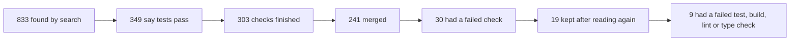

# Agent pull request count: the method

Version: 1

Frozen on 2026-10-09. `python scripts/backtest.py --check` fails if this file changes while the version above stays 1:
its sha256 is recorded in [backtest.json](backtest.json) (`method`). A change of method is a new version with a new
hash, and the counts made under version 1 stay as they were.

## Population

Pull requests opened by five AI coding agents, found with GitHub's issue search, created 2026-07-03 to 2026-09-30, read
on 2026-10-01 ([agent_pr_ci.json](agent_pr_ci.json), written by `scripts/agent_pr_ci.py`). An agent is told apart by:

| Agent | Search qualifier | Told by |
| --- | --- | --- |
| `copilot` | `author:app/copilot-swe-agent` | the pull request's author is the GitHub App `copilot-swe-agent` (GitHub Copilot's cloud agent) |
| `devin` | `author:app/devin-ai-integration` | the author is the GitHub App `devin-ai-integration` (Devin's default: it opens pull requests as itself) |
| `claude-bot` | `author:app/claude` | the author is the GitHub App `claude` (Claude Code run from GitHub: the Action, or an @claude mention) |
| `claude-code` | `"Generated with Claude Code" in:body -author:app/claude` | the description holds the line "Generated with Claude Code" and the author is not the app `claude` (Claude Code run on a person's machine, under their account) |
| `codex` | `"chatgpt.com/codex/tasks" in:body` | the description holds a `chatgpt.com/codex/tasks` link (the task link Codex's cloud agent writes) |

A person who pastes the line or the link is counted as that agent.

## The claim

A pull request claims passing tests when a line of its description (HTML comments and a quoted original prompt removed)
matches `CLAIM_RE` and not `NONCLAIM_RE` (after `_BOILER_RE` is blanked). An unticked box is no claim; a ticked box is
the agent's claim, template or not.

```
(?:\ball\s+(?:\w+\s+){0,2}tests?\s+(?:are\s+|now\s+)*(?:pass(?:es|ed|ing)?|green)|\btests?\s+(?:are\s+|now\s+|still\s+)*(?:pass(?:es|ed|ing)?|green)\b|\btests?\b[^\n.]{0,40}?\band\s+passing\b|\bCI\b(?:[\s:/,]+(?:is|are|now|run|runs|job|jobs|checks?|build|pipeline|workflows?|all|CD|#?\d+))*[\s:,]+(?:pass(?:es|ed|ing)?|green)\b|\b(?:all\s+(?:CI\s+)?checks?|(?:CI\s+)?checks)\s+(?:are\s+|have\s+)?(?:pass(?:es|ed|ing)?|green)\b|\bpass(?:es|ed|ing)?\s+all\s+(?:\w+\s+){0,2}(?:tests|checks|CI)\b|`[^`\n]*test[^`\n]*`\s*(?:[-:—]\s*)?(?:all\s+)?(?:pass(?:es|ed|ing)?|green)\b|\b\d[\d,]*\s*(?:/\s*\d[\d,]*\s*)?(?:\w+\s+){0,2}passed\b|✅\s*[^\n]{0,40}?\btests?\b|\btests?\b[^\n]{0,30}?✅)
```

```
^[ \t]*(?:>[ \t]*)*(?:(?:[-*+]|\d{1,9}[.)])[ \t]+)+\[ \](?:[ \t]|$)|\b(ensure|make sure|verify that|should|would|will|to confirm|until|once|if|before|whether|need|needs|must|expect|expected|todo|not|fail|fails|failing|failed|failure|failures|errors?|except|unless|pending|flaky|skip|red|broken)\b|n't\b
```

```
\*\*Your PR cannot be merged unless tests pass\*\*|\bfail[- ](?:closed|safe|fast|open)\b|\b0 failed\b
```

## The checks

Read at the head commit when the pull request was read. Check runs whose name matches `AGENT_RUN_RE` (the agent's own
session) are left out:

```
^(copilot|claude|claude[-_ ]?(code|review|code[-_ ]review|pr[-_ ]review)|codex|devin)$
```

A pull request is counted when its CI had finished (class `failed`, `passed` or `other`) and its merge state is known.

- `any_check_failed`: a check run concluded failure, timed_out or startup_failure, or a commit status is failure or error.
- `test_or_build_check_failed` (the strict count): a failed check whose name matches `TESTISH_RE` and not `ANCILLARY_RE`.

```
test|build|compil|\bci\b|unit|integration|e2e|pytest|jest|vitest|lint|clippy|rustfmt|fmt|typecheck|tsc|linux|windows|macos|ubuntu|cargo|gradle|maven|mvn|smoke|julia|python|node|run:|benchmark|analy[sz]e
```

```
vercel|netlify|cloudflare|workers builds|deploy|publish|label|\bcla\b|metadata|commitlint|contributor|review|lighthouse|snyk|codecov|sonar|security|audit|title|changelog|governance|evidence|non-empty|gate|lifecycle|compliance|aegis|ci-success
```

## The counts

Denominator: the merged pull requests among those counted (241). Shares carry a 95% Wilson interval.

## The second reading

Every pull request in either numerator is read again by hand on its github.com page, and the result is written to
[index_review.json](index_review.json); the recorded scan is never edited. A pull request leaves the reviewed count when:

- R1: it is not merged when read again;
- R2: it was merged into a branch other than the repository's default branch;
- R3: its claim does not cover the check that failed (a template box limited to required checks when the failed check
  is not required; a box about manual tests; a description that itself reports the failing job);
- R4: the page read again shows every check passed and none failed, so the recorded failure cannot be confirmed;
- R5: its page cannot be read.

The pull requests with no failed check are not read again, so the denominator stays 241 and the review can only lower
the counts. The reviewed counts lead; the recorded ones are stated beside them.

## Version 2 (draft, not frozen)

This is a draft. Version 1 above is still the method of record. Nothing below changes a version 1 count. The hash
check reads the file only up to this heading, so version 1 stays frozen. The numbers here are in
[backtest.json](backtest.json) under `version2_draft`, written by `scripts/backtest.py`.

### The funnel

Each step keeps some pull requests (PRs: proposed code changes) from the step before.

| Step | PRs | Share of the step before | What it means |
| --- | --- | --- | --- |
| Searched | 833 | | search hits GitHub returned for the five agents and the claim words |
| Claimed | 349 | 41.9% | a line of the description says tests or CI pass |
| Finished CI | 303 | 86.8% | the automatic checks had finished when read |
| Merged | 241 | 79.5% | merged when read: the denominator |
| Any check failed | 30 | 12.4% | merged with a failed check of any kind (the recorded scan) |
| Read again, kept | 19 | 63.3% | still counted after the second reading (rules R1-R5) |
| Strict | 9 | 47.4% | of those, a test, build, lint or type check failed: the lead number |



*Each box keeps some of the box before; the last box is the lead number, 9 of 241.*

### Intervals that allow for repositories

Some repositories (code projects) give many PRs. PRs from one project are alike, so they are not fully independent.
The Wilson interval treats them as independent. Version 2 puts two more intervals beside it:

- clustered Wilson: the Wilson interval computed as if there were fewer pull requests: 241 divided by the design
  effect (a number, never below 1, that says how much grouping by repository widens the spread);
- cluster bootstrap: 2,000 times, pick 146 repositories at random from the 146 (the same one may be picked twice;
  seed 20261010), and take the middle 95% of the shares this gives.

| Count | PRs of 241 | From how many repositories | Most from one | Wilson | Design effect | Clustered Wilson | Cluster bootstrap |
| --- | --- | --- | --- | --- | --- | --- | --- |
| Strict, after reading again (the lead) | 9 | 9 | 1 | 2.0% to 6.9% | 1.079 | 1.9% to 7.1% | 1.5% to 6.4% |
| Any failed check, after reading again | 19 | 15 | 4 | 5.1% to 12.0% | 1.876 | 4.3% to 13.9% | 3.9% to 13.4% |
| Strict, as recorded | 16 | 13 | 2 | 4.1% to 10.5% | 1.476 | 3.7% to 11.5% | 3.2% to 10.7% |
| Any failed check, as recorded | 30 | 21 | 4 | 8.9% to 17.2% | 1.973 | 7.7% to 19.5% | 7.2% to 18.9% |

The 9 of the lead come from 9 different repositories: none gives more than one. Four PRs from one repository are in
the 19 (any failed check), not in the 9. So grouping barely moves the lead's interval. It widens the others.

### Reading the negatives again

Version 1 reads again only the PRs it counts. The other 232 merged PRs (the negatives) were never read again. A
missed failure there would make the lead too low. The protocol:

1. Draw the sample from the 232 with `backtest.reread_draw` (seed 20261010). Draw 5 controls from the 9 the same
   way. Shuffle all of them together.
2. Give the reader only the shuffled links. The reader does not see which are controls, or what the scan recorded.
3. For each, the reader writes down: merged or not, the target branch, and the page's checks line.
4. Then match each row to the scan. Each negative gets one outcome:
   - consistent: all checks passed, or it was merged outside the default branch;
   - inconclusive: some checks did not pass, or there is no checks line, and the failed one cannot be named;
   - unreadable: the page shows no merge or checks;
   - flipped: a test, build, lint or type check failed on a merge into the default branch.
5. Record it in [index_reread_negatives.json](index_reread_negatives.json). `backtest.py` refuses a list that is not
   the seeded draw.

The full run reads 60 negatives, logged in, so the checks tab shows each result. If none flips, the flip rate is
below 6.0% (Wilson, 95%).

A first pass ran on 2026-10-10 with 20 negatives and 5 controls, read without logging in. Result: 0 of 20 flipped. 16
read as before, 2 could not be decided and 2 pages showed no merge or checks. Read without logging in, the checks tab
named the checks but showed no results. So 4 of the 5 controls showed "N of M checks passed" but not which one
failed. That is why the full run must be read logged in. With 16 readable, the flip rate is below 19.4% (Wilson, 95%).
That bound is too wide to change the lead. It is recorded, not used.

### A comparison group of PRs by people (planned, not run)

The question: do PRs written by people, in the same projects, get merged with a failed check as often? If they do,
the 9 of 241 says something about the projects, not about agents. The plan:

1. Same projects: the 146 repositories behind the 241.
2. Same window: created 2026-07-03 to 2026-09-30, read once, on one day.
3. People only: the author is a user account, not an app or a `[bot]` account; the description has none of the five
   agents' markers (the table at the top), and no commit names an agent as co-author.
4. Same claim: a line of the description matches `CLAIM_RE` and not `NONCLAIM_RE`, as above.
5. Matched size: in each repository, at most as many PRs by people as there are agent PRs there, newest first. That
   gives up to 241.
6. Same counts, same second reading (R1-R5), and the same blind re-read of the negatives.
7. Report the difference of the two strict shares with a cluster bootstrap interval (seed 20261010). With about 241 pull
   requests on each side and shares near 4%, that interval is about 3.5 percentage points either way (normal
   approximation), and wider once repositories are grouped. So it can show a large gap, not a small one.

Limits, said before it runs: PRs by people rarely claim tests pass in words, so many repositories will give none.
A person can use an agent without saying so. Both lower what the comparison can show.
