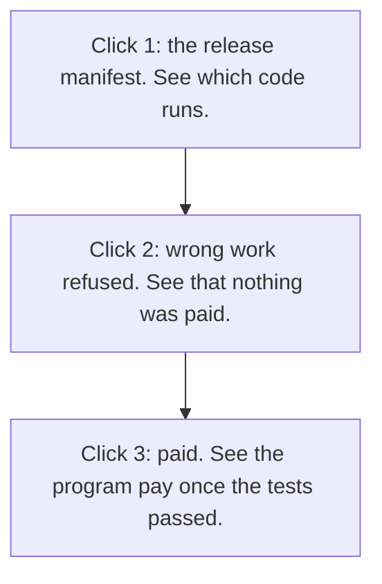

# Check every claim yourself (for judges and buyers)

**In plain words.** A buyer pays only for work that passes the buyer's tests. It runs on [test money](WORDS.md#test-usdc), and no customer has paid yet. Three links show it working.

**The neutral meter for AI agent work: neither side keeps the count.**

Knos lets buyers and suppliers agree what AI work earned payment, and independently prove that agreement later.

Of 241 merged agent pull requests claiming passing tests, 9 failed a test, build, lint or type check.

The claim: two parties who distrust each other compute the same bill from evidence a third party signed, and the
program releases the money on that signature.

Why Solana: Money is released with no custodian, and neither buyer nor supplier can change the count. One person holds every upgrade key today; a program change waits 48 hours in public.

## Start here

1. [The release manifest](reference/MANIFEST.md): source, build hash, deployed version, transactions, fee schedule.
2. The witnessed transaction (9 Oct 2026, own repository, test USDC):
   [funded](https://explorer.solana.com/tx/3UaY22WKexigMpkVhibfeMdNgBiyybWm2Z4LuLskKGbNUDXV34yYWyH42atxFjELbrqSgoVs6TwpFzSQwhfXqzgM?cluster=devnet),
   [wrong work refused](https://github.com/drexthealpha/knos-witness/actions/runs/37890511112/job/113690226126),
   [paid](https://explorer.solana.com/tx/2PtmKUrQHKPARZE4nr35Te559NGQSG7tSHUfwzcKCAjL7gzvQ76fNTVLMWvq8mcZLxd27tbyTe31mCk2PxEGfAqa?cluster=devnet),
   [replay paid nothing more](https://github.com/drexthealpha/knos-witness/pull/10#issuecomment-6075196710),
   [the record](https://github.com/drexthealpha/knos-witness/blob/acaa854d241c2e030f521b6f5603c8f43c93bab6/witness.json).
   One step fixed by hand; one agreed line, not yet settled. [Run it yourself](../examples/witnessed/README.md).

*Open the links in order.*

## Six criteria from the rules, seven from [Colosseum](https://colosseum.com/hackathon)

| judged | in one sentence | evidence |
|---|---|---|
| How well it works | A Solana program checked GitHub's signature itself and released the payment, on the public program ids, in test USDC. | [the paying transaction](https://explorer.solana.com/tx/59AfaYHTvWHhbAhiiNHCbCfEcGCxG1kCydJwfRNjZqry9bCnMF3ox6bd4P7favA9hjgzB5nk283g2Mdq3LruyNWV?cluster=devnet) |
| Potential impact | A buyer paying per merge on our sample would have paid for 19 pull requests whose checks failed, read again by hand. | [the measurement](reference/BENCH.md) |
| Novelty | The black-box check refused all 63 cheating submissions, and plain CI passed 56 of them. | [the tamper benchmark](reference/TAMPER.md) |
| User experience | A buyer pastes an invoice on the first screen and gets the count, with no install and no sign-up. | [the site](https://drexthealpha.github.io/Knos/) |
| Open source and composition | The code is MIT, and the verifier is a separate program that other Solana programs call. | [how to call it](reference/COMPOSE.md) |
| Business plan | Knos earns one fee, on value released against a signed acceptance, and the supplier never pays. | [the price book and its costs](reference/MARKET.md) |
| Founder and market fit | The founder placed first of 92 teams at Sibyl Labs in Sep 2026, and has never sold to an invoice approver. | [the team, for and against](reference/TEAM.md) |
| Insight | Every vendor counts its own outcomes, while the forge already signs a record that neither buyer nor supplier owns. | [why a neutral count](reference/WHY.md) |
| Product and execution | Every capability names its stage and the test or transaction that shows it. | [the release manifest](reference/MANIFEST.md) |
| Potential market size | Under labelled assumptions the yearly fee pool is 222,000 to 5,994,000 USD, and Knos has no share of it yet. | [the market size, with its sources](reference/MARKET_SIZE.md) |
| Founder communication | The presentation fits in three minutes: the finding, one transaction, the founder's record, the limits in one sentence, the ask. | [the story](STORY.md) |
| Viability | Each customer's delivery cost is budgeted line by line, only the monthly batch is measured, and nothing has been sold. | [the unit costs](reference/UNIT_COSTS.md) |
| Traction | Outside funders 0, outside repositories 0, interviews 0, revenue 0; one outside payee was paid on tasks Knos funded. | [the outside-use numbers](NUMBERS.md) |

The pricing page reads the fee from the chain; this page prints no rate.

## Days to approve, not seconds to pay

From merge to paid took 28 seconds at the median, over 56 payments on devnet (10 Oct 2026). Days to approve: from
the day a buyer gets a supplier's invoice to the day someone allowed to approve it does.
Not measured.

## What is not real yet

1. Money: Solana devnet and test USDC only.
2. Buyers: 0 interviews, 0 letters of intent, 0 paying customers, 0 revenue.
3. Outside use: 0 outside funders and 0 outside repositories. One outside payee was paid 3 times, on tasks Knos funded.
4. Outside checks: no security review, 0 reproductions, 0 outside programs reading the verifier.
5. Neutrality: one person holds every key, and that person is the whole team.

Limits: [DISCLOSURE.md](reference/DISCLOSURE.md). Everything else: [the map](README.md).
