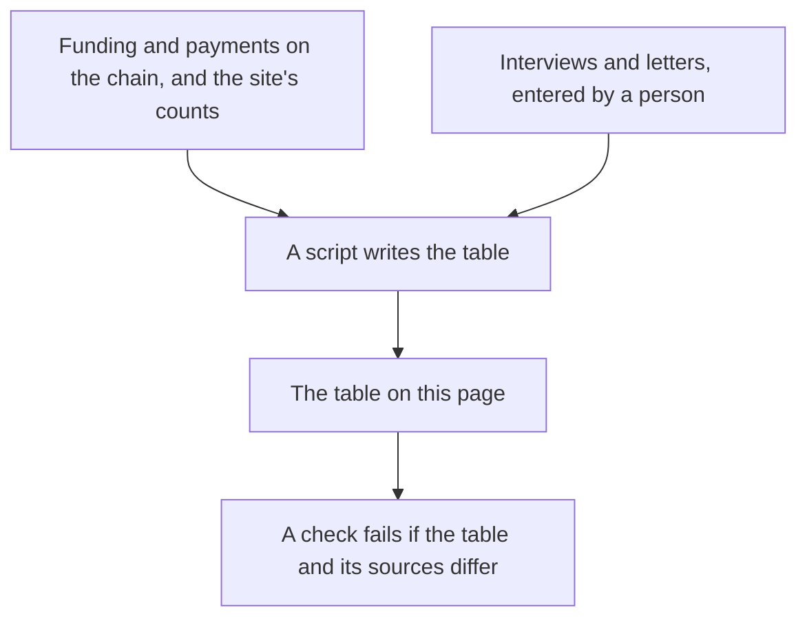

# The numbers, each with its source

**In plain words.** This page counts how much people outside Knos have used it. Most of the numbers are zero, and a zero is printed as a zero. Each number says where it is read, so you can check it.

**The neutral meter for AI agent work: neither side keeps the count.**

Nine numbers about use by anyone who is not Knos. Nothing here is a target.

*Records and people feed the table; a check fails if it drifts from them.*

## The nine numbers

The table is written by `python scripts/bench_docs.py` from the files it names. Its `--check` fails when the table
differs from them. The release run reads the chain and the site's data again and writes it again.

A number only a person can supply (an interview, a letter) is a constant in `docs/facts.json`. It is changed by hand
when the other party agrees to be counted.

<!-- bench:outside-use -->
| # | number | value | where it is read |
|---|---|---|---|
| 1 | Outside funders: accounts other than Knos's that funded a task with their own tokens | 0 | `docs/bench.json`, `devnet.stats.outside.funders` |
| 2 | Outside repositories: repositories not owned by Knos in which a task was funded | 0 | `docs/bench.json`, `devnet.stats.outsiders` (scripts/outsiders.py, in the site's build) |
| 3 | Outside payees: GitHub accounts other than the funder's that were paid | 1 | `docs/bench.json`, `devnet.stats.outsiders` (scripts/outsiders.py, in the site's build) |
| 4 | Payments between unrelated accounts: payments whose payee is another GitHub account than the funder | 3 | `docs/bench.json`, `release.payments_between_unrelated_accounts`, read from the escrows' logs |
| 5 | Buyer interviews held | 0 | `docs/facts.json`, `by_hand`: a person changes it; [DISCLOSURE.md](reference/DISCLOSURE.md) says the same |
| 6 | Letters of intent | 0 | `docs/facts.json`, `by_hand`: a person changes it; [DISCLOSURE.md](reference/DISCLOSURE.md) says the same |
| 7 | Reproductions signed by GitHub: files in `reproductions/` from a run in someone else's repository | 0 | the report files of [`reproductions/`](../reproductions/README.md) |
| 8 | Outside programs reading the verifier | 0 | `docs/facts.json`, `by_hand`: a person changes it; [DISCLOSURE.md](reference/DISCLOSURE.md) says the same; the examples in [COMPOSE.md](reference/COMPOSE.md) are Knos's own |
| 9 | Shadow counts published: a neutral count printed beside a supplier's own invoice count, with every mismatch | 0 | `docs/facts.json`, `by_hand`: a person changes it; [DISCLOSURE.md](reference/DISCLOSURE.md) says the same; [PILOT.md](reference/PILOT.md), "How it starts: shadow mode" |
<!-- /bench:outside-use -->

## What they show, and what they do not

The outside payee and the three payments between unrelated accounts: one outside contributor wrote three pull
requests that were paid on devnet, in test USDC, for bounties Knos funded on its own repository.

**That is the path working between two accounts. It is not demand, and outside funders is the number that would be.**

What the chain cannot tell apart: an account that is not on the list of Knos's own (`scripts/own_github_ids.json`)
is counted as outside. That shows it is another account.

It does not show the account is independent of Knos, and Knos does not say so.

## The other numbers

The other numbers a field or a script states (tests passing, seconds from merge to payment, tasks paid) are held to
`docs/bench.json` by `python scripts/bench_docs.py --check`.

Which builds are live on the public program ids is in `web/upgrades.json`. The stage of every capability is in
[CAPABILITIES.md](reference/CAPABILITIES.md); no count of capabilities is given here.
