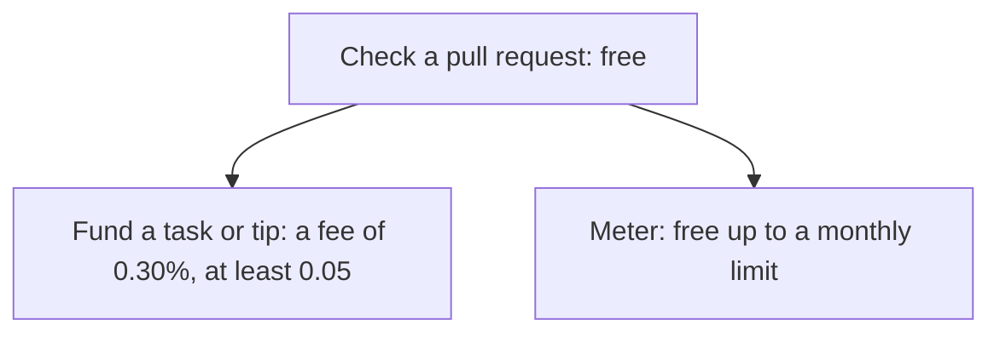

# What Knos costs

**In plain words.** Checking a pull request is free. When a task is paid, Knos takes 0.30% of it, and never less than 0.05. Today all of it is test money, so nobody pays anything real.

*Checking is free. A fee is charged only when money moves or work is counted.*

This page gives the prices the programs on [devnet](WORDS.md#devnet) charge today.

**Every price here is in [test USDC](WORDS.md#test-usdc), so Knos's revenue is zero.**

Anything else is marked PROPOSED: it is a plan, and nobody pays it.

## The check is free

Checking a pull request costs nothing, and stays free.

That covers the browser check, the `knos check` command, the Stop hook and the MCP tools.

## The fee when a task is paid

The fee is 0.30% of the amount, and never less than 0.05. It has no maximum.

The `knos_pay` program 2.2 charges it on devnet. It has done so since 9 Oct 2026.

Who bears it depends on how the money went in:

- **A funded task** (`/knos fund 20`, a [work order](WORDS.md#work-order)): the funder pays the fee on top. The
  worker gets the whole amount. A refund returns the amount and the fee.
- **A tip** (`/knos tip 5` on a merged pull request): the fee comes out of the tip. The worker gets the tip
  minus the fee.

Some worked examples, in test USDC:

| Amount | Fee | As a share |
|---|---|---|
| 5 | 0.05 | 1.00% |
| 1,000 | 3.00 | 0.30% |
| 5,000 | 15.00 | 0.30% |

Under 16.67 the floor of 0.05 is more than 0.30%. That is why 5 pays 1.00%.

## Tasks funded before 9 Oct 2026

A task funded under the older `knos_pay` 2.1 keeps the fee it was funded with.

That older fee was higher, with a floor of 0.40. It was stored with the task, so it does not change.

`knos status` says which build of the program runs now.

## The meter

The [meter](WORDS.md#meter) counts each time a buyer's tests judge a piece of work. Each one is an
[evaluation](WORDS.md#evaluation).

As deployed, `knos_meter` gives each owner 10,000 evaluations a month for free. After that, each costs 0.05 test
USDC, paid from the buyer's prepaid credits.

PROPOSED: 100,000 free a month, then 0.002 each. Nobody pays this price.

## The rest of the price book: PROPOSED

None of these lines is deployed, and nobody has bought one.

| Line | PROPOSED price | Who would pay |
|---|---|---|
| Record | 0.10 USD for each lookup of a supplier's record by a machine | the caller |
| Control | per year: Team 25,000 USD, Business 100,000, Enterprise from 400,000 | the buyer |
| Pilot | 2,500 USD for one buyer, two suppliers and 30 days | the buyer |

Control cannot be delivered yet: it needs single sign-on, private deployment and support that do not exist.

## Where the prices are fixed

The fee is written into the program's code: `FEE_BPS` and `FEE_MIN` in
[`programs-v2/knos_pay/src/lib.rs`](../programs-v2/knos_pay/src/lib.rs).

The meter's price is `FEE` and `FREE_PER_MONTH` in
[`programs-v2/knos_meter/src/lib.rs`](../programs-v2/knos_meter/src/lib.rs).

To change them takes an upgrade of the program, which waits 48 hours in public first ([Trust](TRUST.md)).

The site's [price page](https://drexthealpha.github.io/Knos/#pricing) reads the fee from the program itself.

## Read more

- [The market and the full price book](reference/MARKET.md): every line, its reasons and its sources.
- [The meter](reference/METER.md): what is counted, and who can check it.
- [Start here](START.md): check, fund and get paid in five minutes.
