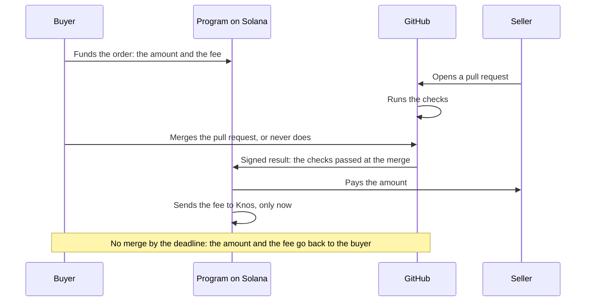
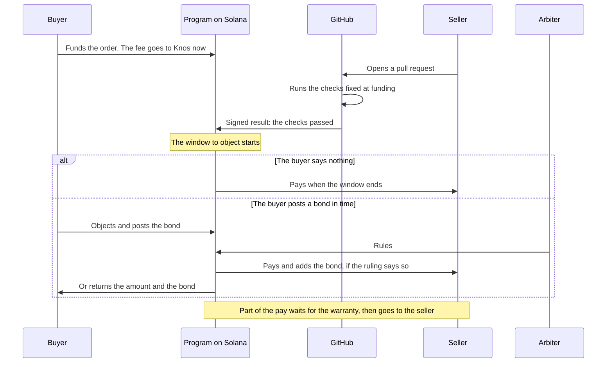

# Proposal: knos_pay 2.3

**Proposed. Not built. Not deployed.** Nothing on this page runs today. It is a written plan for one upgrade of the
payment program. That program runs on devnet (Solana's test network) as knos_pay 2.2. It moves test USDC only (test
money with no value).

## In plain words

Today a seller is paid when the buyer merges the work. The buyer can wait, or never merge. Then the money goes back
to the buyer. Knos also earns its fee only when work is paid. So Knos gains when the answer is yes.

This proposal changes four things:

1. **Pay when the checks pass.** The checks are the tests agreed when the order is funded. The buyer has a short
   window to object. To object, the buyer must put money at stake. Silence counts as yes.
2. **Charge the fee when the order is funded.** The fee no longer depends on the answer. A refund gives back the
   amount, but not the fee.
3. **Fix the tests at the start.** The files that judge get a fingerprint when the order is funded. Secret tests
   can be added the same way.
4. **Keep part of the pay for a while.** A share waits in the program for a warranty. Then it goes to the seller.

Orders funded before the upgrade keep their own rules. The upgrade waits out a public notice before it can run.

The words: a **pull request** is a proposed change to code. To **merge** is to accept it. The **program** is code on
Solana that holds the money. A **bond** is money you lose if you are wrong. A **fingerprint** (a hash) is a short code
that changes if a file changes. An **arbiter** is a person both sides accepted, at funding, to settle a dispute. A
**token** is a short message GitHub signs. More in [WORDS.md](WORDS.md).

## Today and proposed

*Today: the seller is paid only after the buyer merges, and Knos is paid only then too.*

*Proposed: the seller is paid when the checks pass, unless the buyer posts a bond in time.*

## What the program does today

These are knos_pay 2.2's own names. Each is in
[`programs-v2/knos_pay/src`](../programs-v2/knos_pay/src) and in [`idl/knos_pay_v2.json`](../idl/knos_pay_v2.json).

- An order's money sits alone in its own token account, `["ov", order]`. The `Order` account,
  `["ord", scope, source, seq]`, stores the fingerprint of the terms (`terms`), the pinned workflows (`wf_repo`,
  `wf_sha`), the fee (`fee`, `fee_bps`), the holdback (`holdback_bps`, `warranty_s`) and the `deadline`.
- `FundOrderWallet` and `FundOrderBalance` move the amount and the fee into `["ov", order]`. The fee is 0.30% of the
  amount, at least 0.05 (`order_fee`).
- `PayOrder` pays on a judge's signed token. In merge mode that token comes after the merge. An order funded with the
  `F_AUTO` option is paid without a merge, in tests mode only.
- The fee leaves the order only when work is paid: `PayOrder`, `SettleOrder` and `Release` send it to `FEE_OWNER`.
  `RefundOrder` gives back the amount and the fee. `Revert` gives back the holdback and the fee on it.
- A holdback exists already, as an option: `holdback_bps` (at most `MAX_HOLDBACK_BPS`, half the amount) and
  `warranty_days` (at most `MAX_WARRANTY_DAYS`, 90 days). It waits in the order, recorded in `["hb", order]` (`Hb`).
  `Release` pays it after the warranty. `Revert` returns it inside the warranty.
- An arbiter named at funding (`arbiter_id`) can rule with a `knos3:rule` token, and `PayOrder` pays the ruling.
- Every option is fixed at funding. No instruction changes an order's terms afterwards.

## The four changes

Each change below says what changes in which account and instruction, what stays the same for open orders, the
migration and the risks. The notice is the same for all four: see [The notice](#the-notice).

### 1. Pay when the checks pass; object only with a bond

The seller opens a pull request. GitHub runs the checks agreed at funding. If they pass, GitHub signs that result. The
program then opens a window to object. The buyer chose its length at funding. To object, the buyer pays a bond into
the order. The bond is a share of the amount, also fixed at funding. If the buyer says nothing, the seller is paid when
the window ends. If the buyer objects, the arbiter named at funding decides. The bond goes the same way as the ruling.
If the arbiter does not rule in time, the seller is paid and gets the bond. You still decide whether to merge the code.
The payment no longer waits for it.

| | knos_pay 2.3, proposed |
|---|---|
| Accounts | `Order`: three new fields in its 64 unused bytes (`O_RESERVED`): `window_s` (how long the window lasts), `bond_bps` (the bond's share of the amount) and `bond_paid` (the bond received). Two new states: `PASSED` (the window is running) and `DISPUTED` (a bond was posted). One new account, `["pass", order]`: the commit, the pull request and the payees that passed. The bond waits in `["ov", order]` with the rest of the order's money. |
| Instructions | New `Pass`: takes a token with audience `knos3:pass:<order>:<head sha>:<terms hash>:<mode>:<pr>:<payees>` from the pinned `prove.yml`, signed when the pinned checks pass on an open pull request. It writes `["pass", order]` and makes the order `PASSED` until now plus `window_s`. New `Dispute`: inside the window, the buyer pays the bond into `["ov", order]`. A wallet's order: the funding wallet signs. A Balance's order: a command token from the pinned `fund.yml`, as `Cancel` takes one today. The order becomes `DISPUTED`. New `PayPassed`: anyone sends it once the window is over, or once `RULE_WINDOW` has passed with no ruling. It pays the payees in `["pass", order]`, and the bond if there is one. `PayOrder` pays a `DISPUTED` order on the arbiter's ruling, as it pays a ruling today; the bond follows the ruling's shares. `RefundOrder` refuses a `PASSED` or `DISPUTED` order, even after the deadline. |
| Open orders | Unchanged. Funding under 2.2 refuses any byte that is not zero in the last 14 bytes of the options (`opts_of`). So no order funded under 2.2 has a window, and each is paid exactly as today. `F_AUTO` orders keep working as they do. |
| Migration | The options gain two values in those 14 bytes: the window in hours and the bond's share. Zero means no window, and the order behaves as under 2.2. A window is for a public order that is not `STANDING`, as `F_AUTO` is today, and it needs an arbiter: funding refuses a window without one. The pinned workflows get a new commit whose `prove.yml` signs `knos3:pass`. An order pinned to an older commit cannot use it. The relay and [`src/knos/settle/v2/pay.py`](../src/knos/settle/v2/pay.py) learn the three new instructions. `Version` logs 3. |
| Risks | A change that fools the checks is paid with nobody looking. The fixed tests (change 3) and the holdback (change 4) answer part of this. A buyer who misses the window loses the right to object. A bond set too low invites objections that only delay. A bond set too high makes objecting impossible. An arbiter who never answers costs the buyer the bond. Each payment takes two transactions instead of one. |

### 2. A fee that does not depend on the answer

Today Knos is paid only when the work is paid. So Knos gains when a judge says yes. A neutral meter should gain nothing
from either answer. The proposal charges the fee when the order is funded. The rate stays 0.30%, with a floor of 0.05.
A refund gives back the whole amount, but not the fee. A revert gives back the holdback, but not the fee on it.

One other way was weighed: a fee for each run of the checks, billed off chain. The price book's Meter line works that
way already ([MARKET.md](MARKET.md)). It is not the proposal, because no program enforces it.

| | knos_pay 2.3, proposed |
|---|---|
| Accounts | `Order`: no new field. Its version byte (`O_VERSION`) becomes 3 for orders funded under 2.3. Their `fee` then records what was charged, not what waits. |
| Instructions | `FundOrderWallet`, `FundOrderBalance` and `TopUp` take one more account: a token account of `FEE_OWNER`. They send the fee there at once, less the relayer's tip (`TIP`). The tip stays in `["ov", order]` for whoever sends the transaction that closes the order. `PayOrder`, `SettleOrder` and `Release` then pay the tip only. `RefundOrder` gives back the amount and pays the tip, so it takes one more account for the tip. `Revert` gives back the holdback only. A `Plan` rate (`SetPlan`) is applied at funding, as today. Jobs (`FundWallet`, `FundBalance`, `Pay`, `Refund`) do not change. |
| Open orders | An order whose version byte is 2 keeps its fee in its own account. It is paid, refunded, released and reverted exactly as today: a refund gives back the amount and the fee. |
| Migration | Clients build the longer account lists for new orders only. The price book's words for an order on chain change on the day the upgrade runs: the fee is charged on what is funded, not on what is released. On devnet every fee is test money. |
| Risks | A buyer pays the fee on work that fails, and may fund fewer orders. The fee arrives before any work is done, so it is booked differently. The 0.05 floor is now paid on every order, even one that is refunded. |

### 3. The tests that judge, fixed at funding

An AI agent could pass the checks by changing the tests. In tests mode, the terms already carry the fingerprint of the
acceptance tests. In merge mode, the terms name the checks, not the files behind them. This change fixes the files
that judge at funding. The terms list those files with their fingerprint. The pinned workflow refuses a pull request
that changes them. Whether new terms do this by default is the terms' choice ([TERMS.md](TERMS.md)), not this
upgrade's.

A buyer may also keep some tests secret. At funding, the terms carry only their fingerprint. At judging, the pinned
workflow checks that fingerprint first, then runs the tests. If the buyer does not supply them, they count as passed:
silence counts as yes. After the order closes, the buyer is asked to publish them. Nothing forces that.

| | knos_pay 2.3, proposed |
|---|---|
| Accounts | None. Both fingerprints go inside the terms. The order already stores the terms' fingerprint in `terms`. |
| Instructions | None. `Pass` and `PayOrder` already require the token to carry the order's terms fingerprint. |
| Open orders | Judged by the workflow commit they pinned (`wf_sha`) and the terms they were funded with. |
| Migration | A new version of the terms, and a new commit of the pinned `prove.yml` and `attest.yml`. New orders pin that commit. |
| Risks | Secret tests can be unfair, because the seller cannot see them. Publishing them after the order closes lets anyone judge that, but nothing makes the buyer publish. A broken test cannot be fixed for an order once funded: the buyer cancels it and funds a new one. Where secret tests are kept so that only the judging run reads them is not decided. |

### 4. Part of the pay waits for a warranty

This exists today, as an option the buyer turns on. A share of the payment stays in the program. After the warranty,
anyone can send it on to the seller. Inside the warranty, a judge's signed result can return it to the buyer. The
proposal adds two things. First, a payment made without a merge can be challenged too: the neutral run checks the
paid commit again with the pinned checks. Today that run only looks for a merge that was undone. Second, the program
records which commit was paid. So a challenge must name that commit.

| | knos_pay 2.3, proposed |
|---|---|
| Accounts | `["pass", order]` (from change 1) keeps the paid commit until the warranty ends. `Hb` does not change. |
| Instructions | `Revert` also takes `["pass", order]` and refuses a token that names another commit. `Release` closes `["pass", order]` with the order. |
| Open orders | Unchanged: an order funded under 2.2 is released and reverted as today. |
| Migration | The pinned `attest.yml` gains a run of the pinned checks on the paid commit, at a new commit. Turning the holdback on by default is the terms' choice, not this upgrade's. |
| Risks | The seller waits longer for part of the money. A holdback inside its warranty cannot leave before an upgrade ([GOVERNANCE.md](GOVERNANCE.md), section 2). A `STANDING` order still cannot have a holdback (`E_LATER`). |

## The notice

All four changes are one upgrade of knos_pay. An upgrade must pass the upgrade multisig (an account that needs several
keys to act). Then it waits out the time lock (a public wait before it can run). The time lock is 48 hours until the
approved 8-day time lock is applied. [GOVERNANCE.md](GOVERNANCE.md), section 2, has its state. This proposal should
be sent only once the 8 days are in force. During the wait, the build and its source are public: `knos status`, the
feed in [`web/upgrades.json`](../web/upgrades.json), and `knos exit --before-upgrade` for what you hold.

Today one person holds every key ([KEYS.md](KEYS.md)). So the notice lets you leave in time. It is not a vote by
anyone else.

## Not decided

- The limits this page proposes: a window of 1 hour to 14 days, a bond of at most the amount, a ruling within 14 days
  (`RULE_WINDOW`).
- How a window works with a quorum of judges (`F_QUORUM`).
- Where secret tests are kept so that only the judging run reads them.
- Whether the fee for each run of the checks should replace the fee on chain.

Nothing on this page is built or tested. Nobody outside this repository has checked it.

## New names this proposal adds

None of these exists in the program today. [`tests/test_proposal_docs.py`](../tests/test_proposal_docs.py) checks that
every other name on this page does exist, and that these do not.

| name | what it would be |
|---|---|
| `Pass` | the instruction that records a passing pull request and starts the window |
| `Dispute` | the instruction by which the buyer posts the bond |
| `PayPassed` | the instruction that pays once the window is over, or the ruling is late |
| `["pass", order]` | the account that keeps the commit, the pull request and the payees that passed |
| `PASSED` | the order's state while the window runs |
| `DISPUTED` | the order's state once a bond is posted |
| `window_s` | the order's field: how long the window lasts |
| `bond_bps` | the order's field: the bond's share of the amount |
| `bond_paid` | the order's field: the bond received |
| `RULE_WINDOW` | how long the arbiter has to rule |
| `knos3:pass` | the audience of the token that `Pass` takes |
