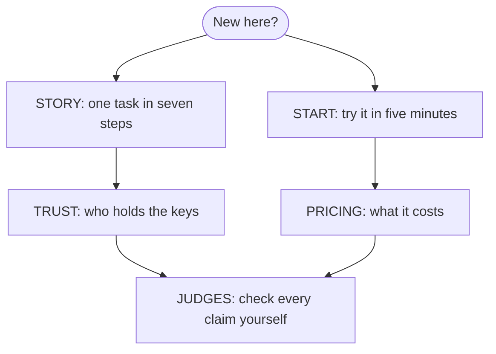

# Start here: eight pages

**In plain words.** These eight pages tell you what Knos is and how to use it. Start with [the story](STORY.md), or [try it](START.md) in five minutes. When a word is new to you, look it up in [the word list](WORDS.md).

**The neutral meter for AI agent work: neither side keeps the count.**

*Read the story or try it first; then check every claim yourself.*

## The eight pages

| page | what it answers |
|---|---|
| [STORY.md](STORY.md) | one task in seven steps, each with its evidence |
| [START.md](START.md) | five minutes: check a pull request, fund a task, get paid, install the command |
| [PRICING.md](PRICING.md) | what it costs: the check is free; the fee on a paid task; the meter |
| [TRUST.md](TRUST.md) | who holds the keys today, what is tested, and how to check a program yourself |
| [JUDGES.md](JUDGES.md) | check every claim yourself: one sentence and one link for each |
| [NUMBERS.md](NUMBERS.md) | nine numbers about use by anyone outside, zeros included |
| [TRANSACTION.md](TRANSACTION.md) | one order told end to end, from its terms to the payment |
| [WORDS.md](WORDS.md) | every technical word in one plain line |

## Reference

**[Every other document](reference/README.md) is listed once, under six questions.**

They ask: does it work, why does it matter, what is new, how do I use it, how do I build on it, and how is it run.

One more file stays in this folder: [INDEX_METHOD.md](INDEX_METHOD.md), the Agent PR Index method, fixed in advance (its hash is published), so it does not move.

`tests/test_docs_map.py` fails when a page in this folder or in `reference/` is missing from its map.
