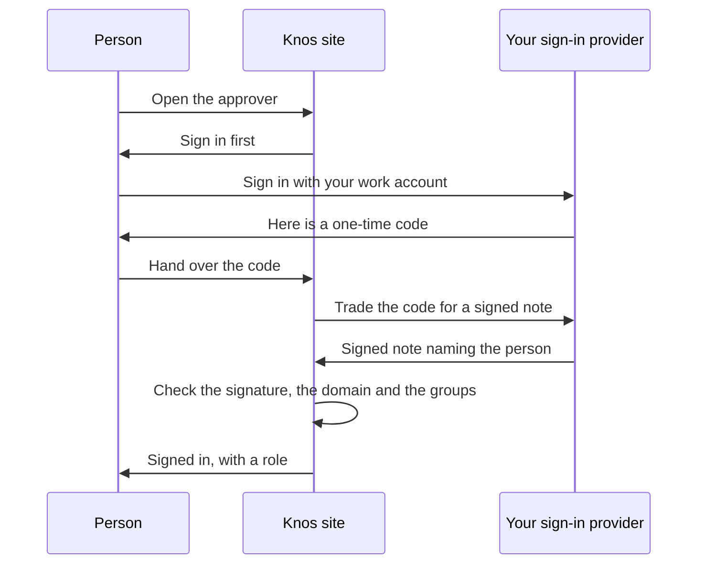

# Customer-hosted: the record API, the relay and the approver in the buyer's own cloud

**The neutral meter for AI agent work: neither side keeps the count.**

Knos hosts no server. A buyer that wants one runs it. It is one image, three roles and one config file. This page says
what the bundle is, how to start it, how people sign in, and what it does not do yet.

Two limits come first:

- **It has not been run in any cloud.** It is built and checked here, with no network (`tests/test_selfhost.py`).
- **Sign-in is tested with a fake sign-in provider only.** The test makes its own keys. No real provider has been tried
  (section 4).

| file | what it is |
|---|---|
| `deploy/Dockerfile` | the one image: bases pinned by digest, every Python package installed by its hash |
| `deploy/compose.yaml` | three services of that image: `record`, `relay`, `site` |
| `deploy/knos.example.toml` | the one config file, to copy to `deploy/knos.toml` |
| `src/knos/selfhost.py` | `knos selfhost check`, `knos selfhost plan`, and what each container runs |
| `src/knos/sso.py` | sign-in: OpenID Connect, roles, and the audit log |

## 1. The three roles

| service | what it runs | port (on 127.0.0.1) | key files it reads |
|---|---|---|---|
| `record` | the record API, `knos record serve` ([RECORD.md](RECORD.md) section 5) on the buyer's record files | 8402 | `keys.record` (signs paid answers; without it answers say they are unsigned); `keys.sso_session` with sign-in |
| `relay` | the relay worker, `knos relay --serve` ([RELAY.md](RELAY.md)), carrying tokens posted in the buyer's repositories and paying the fees from the **buyer's own** fee payer | none | `keys.relay` (and `keys.relay_more`: one fee account per order in flight), `keys.github_token` |
| `site` | the static site, built into the image from the commit named, with the approver at `#approve` | 8080 | `keys.sso_session` (and `keys.sso_client_secret`) with sign-in |

A relay decides nothing. The money goes where the token says, and the program takes a token once. Running your own
relay changes who pays the transaction fees, not who can be paid.

## 2. The config: `knos.toml`

One TOML file (a plain text settings file). `deploy/knos.example.toml` is a complete one. It has `[chain]`, `[keys]`,
one table per role, and `[sso]` when people sign in.

Every key is named **by file path**. A value that looks like a key itself is refused. So is mainnet, an unknown table
or setting, and a role without the key it needs. When a container starts, it checks the file again. Then it reads each
key file and hands it to its role. The key files are mounted read-only from `deploy/secrets/`, which
`deploy/.gitignore` keeps out of git.

```
cp deploy/knos.example.toml deploy/knos.toml          # then edit it
knos selfhost check deploy/knos.toml                  # what will run, which key files it reads; --files: they must exist here
knos selfhost plan deploy/knos.toml                   # the compose services, and the command that starts them
KNOS_COMMIT=$(git rev-parse HEAD) docker compose -f deploy/compose.yaml up -d --build record relay site
```

Without the CLI's own dependencies, `python -m knos.selfhost check|plan` is the same command.

## 3. The image

`python:3.12-slim` by its digest, as Docker Hub listed it on 6 October 2026
(`sha256:05cda9777409a9c3ffddd94a4c476b79f0769a0b4857f0c7ed9226b6800b0d6f`,
[Docker Hub](https://hub.docker.com/v2/namespaces/library/repositories/python/tags/3.12-slim)). Into it, with
`--require-hashes --no-deps --only-binary :all:`: `requirements/faucet.txt` (solders and the memory engine) and the
last line of `requirements/sign.txt`, the released knos wheel and its hash. No source tree is installed. The image
needs a wheel that has `knos.selfhost` (0.3.23 on); the build stops when the locked one does not. The containers run
as an unprivileged user, with a read-only root file system and every capability dropped. Each service keeps its state
in its own volume: the record API's lookup counts and the relay's notes. With `[sso]`, the site keeps its audit log
in `/var/lib/knos`. That folder must be a volume: the site refuses to start when it cannot write there.

## 4. Sign-in (single sign-on)

Single sign-on means your staff sign in with the account they already have at work. The bundle does it with
[OpenID Connect](https://openid.net/specs/openid-connect-core-1_0.html) (the common sign-in standard). Your sign-in
provider is the service that holds those accounts. Knos asks it who the person is. Knos keeps no passwords.



*The site never sees a password: it trusts a note your provider signed.*

### What it checks

- The site reads the provider's public settings page (its
  [discovery document](https://openid.net/specs/openid-connect-discovery-1_0.html)). The page must name the issuer you
  set, exactly.
- The sign-in uses the code flow with PKCE (a one-time secret that stops a stolen code from working),
  method S256 ([RFC 7636](https://www.rfc-editor.org/rfc/rfc7636)).
- The signed note is the ID token. Its signature must check against the provider's published keys (its JWKS).
  Only RS256 and ES256 signatures are taken. An unsigned note is refused. So is one signed with a shared secret.
- The note must come from your issuer, be meant for this site, not be expired, and carry the number this sign-in
  sent. These are the rules of [OpenID Connect Core, section 3.1.3.7](https://openid.net/specs/openid-connect-core-1_0.html#IDTokenValidation).
- When you list domains, the email must be verified and its domain listed exactly. `sub.example.com` is not
  `example.com`.
- The role comes from the person's groups at the provider.

### Roles

| role | can |
|---|---|
| viewer | open the site, the approver and the record API's private routes |
| approver | all a viewer can, and record an approval or an export |
| admin | all an approver can, and read the audit log |

A person gets the highest role whose groups they are in. `default_role` is the role of someone from a listed domain
who is in no listed group. Without it, that person is refused. A role is set at sign-in. A change at the provider
counts from the next sign-in. A session lasts `hours` (8 by default).

### What it protects

- **The site.** With `[sso]`, every page needs a signed-in person. A page asked for goes to sign-in first.
- **The approver.** It still works in the browser, on the files you drop on it. Approving or exporting is written to
  the audit log through `POST /sso/act`. Only an approver or an admin may write one. Sign-in also sets a cookie,
  `knos_signed_in`, which holds no secret: it tells the approver to write those lines. Without it, as on the public
  site, the approver sends nothing.
- **The record API's private routes.** `/records/` and `/orders/` need the same session. `/lookup/` keeps its payment
  by signature, for machines. `/health` stays open; it shows no key and no RPC address.

### The audit log

Each sign-in, approval and export is one line. A line names the person (their `sub`, email and role), what they did,
on what, and when. Each line carries the hash (a fingerprint) of the line before it. So a line changed or removed by itself is
found (`GET /sso/audit`, admins only). Someone who can write the site's volume can still rewrite the whole log, so it
does not guard against the host's own admin. The log is kept in Knos's own record store (`knos.proof.history`), in the
site's own volume. A refused request is not written.

### The config

```toml
[keys]
sso_session = "/run/secrets/sso_session"          # 32 or more random characters; the site and the record API read the same file
sso_client_secret = "/run/secrets/sso_secret"     # only when your provider gave a client secret

[sso]
issuer = "https://login.example.com"              # exactly as your provider names itself
client_id = "knos"
redirect = "https://knos.example.com/sso/callback"
domains = ["example.com"]
viewer = ["finance-readers"]
approver = ["finance-approvers"]
admin = ["knos-admins"]
# groups_claim = "groups"     default_role = "viewer"     hours = 8
```

Make the session file with `python -c "import secrets; print(secrets.token_urlsafe(48))"`. At your provider, register
`redirect` as the redirect address, and have it put the groups in the ID token.

The ports still listen on 127.0.0.1 only. Put your HTTPS front in front of them (a reverse proxy or a load balancer).
Send `/records/` and `/orders/` to port 8402, and everything else to port 8080, on one host name. The session cookie
then reaches both.

### Without `[sso]`

Nobody is asked to sign in. Then put the ports behind the identity proxy you already run. Any of these does it:

- [oauth2-proxy](https://oauth2-proxy.github.io/oauth2-proxy/), a reverse proxy that authenticates through providers,
  [OpenID Connect among them](https://oauth2-proxy.github.io/oauth2-proxy/configuration/providers/openid_connect);
- [Pomerium](https://www.pomerium.com/docs/capabilities/authentication), which works with any identity provider that
  uses OpenID Connect;
- on AWS, an [Application Load Balancer](https://docs.aws.amazon.com/elasticloadbalancing/latest/application/listener-authenticate-users.html),
  which authenticates users through an OpenID Connect identity provider before it forwards a request.

None of these has been configured or tried with this bundle.

## 5. What is not here

- Not run in any cloud.
- Sign-in tested with a fake provider only. No real provider has been tried.
- Signing out forgets the session here only. Your provider may still keep you signed in.
- No provisioning, backup or monitoring. No support commitment.

The price book's Enterprise line stays "not deliverable yet" until those exist. Mainnet is refused.
