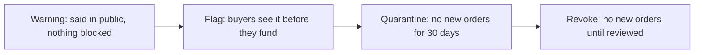

# The standard

**In plain words.** This page says how Knos should judge work, and how it should treat suppliers who break the rules.
A supplier is whoever does the work and gets paid. Most of this page is a plan. Each part says what runs today and
what is only written down. The rights it builds on are in [CHARTER.md](CHARTER.md).

Money here is [test USDC](WORDS.md#test-usdc) on [devnet](WORDS.md#devnet). It has no value.

| Part | Today |
| --- | --- |
| [1. The signal list](#1-the-signal-list) | Schema only. Nothing writes it yet. |
| [2. Cause codes](#2-cause-codes) | Schema only. The judge's path codes exist today. |
| [3. Steps before a ban](#3-steps-before-a-ban) | Criteria and log format only. Today: revoke or pause, nothing in between. |
| [4. The supplier's menu](#4-the-suppliers-menu) | Standard and Assured run on chain. Bonded is off chain only. |
| [5. Judges](#5-judges) | Runs today: the program counts owners; the relay also refuses one starter. |
| [6. A fee that ignores the verdict](#6-a-fee-that-ignores-the-verdict) | Proposed in [PROPOSAL-2.3.md](PROPOSAL-2.3.md). Not built. |

## 1. The signal list

A signal is one thing the checks measure. Today every check is a gate: it passes or the work is not paid. One more
signal exists: a revert inside the [warranty](WORDS.md#warranty) gives the [holdback](WORDS.md#holdback) back.

The plan: the buyer names three kinds of signal when funding.

- **Gate.** Must pass, or nothing is paid.
- **Warranty.** Watched after payment. If it fires inside the warranty, the holdback goes back.
- **Advisory.** Recorded, never decides money. It shows what the gates miss.

The list goes into the terms. So its [hash](WORDS.md#hash) (a short fingerprint of the terms) changes when it changes.
Nobody can add a hidden signal after funding.

```json
{
  "signals": {
    "v": 1,
    "list": [
      {"name": "unit", "class": "gate", "source": "check", "app": 15368},
      {"name": "reverted", "class": "warranty", "source": "revert", "days": 14},
      {"name": "defect-claim", "class": "warranty", "source": "issue", "label": "defect", "days": 14},
      {"name": "coverage", "class": "advisory", "source": "check", "app": 15368}
    ]
  }
}
```

Rules for the schema: `class` is `gate`, `warranty` or `advisory`. Names are unique. A `warranty` signal has `days`, at
most 90 (the program's longest warranty). At least one `gate`. An `advisory` signal never moves money.

## 2. Cause codes

Today a rejected line says why in words. The plan: each reject and each revert also carries one code. The code is
signed with the verdict. Then anyone can count why work fails.

```json
{
  "cause": {
    "v": 1,
    "line": "<invoice line id>",
    "kind": "reject",
    "code": "check_failed",
    "detail": "unit",
    "signed_by": "<the run that judged>"
  }
}
```

`kind` is `reject` or `revert`. The codes:

| Code | Means |
| --- | --- |
| `check_failed` | A gate check did not pass. `detail` names it. |
| `path_refused` | The work changed a file it may not. `detail` is one of the judge's codes today: `terms`, `workflow`, `not_from_base`, `scripts`, `protected_test_edited`, `protected_test_deleted`. |
| `deadline` | No passing verdict before the deadline. |
| `duplicate` | The same work was already counted. |
| `infrastructure` | The run failed for a reason outside the work. Never charged. |
| `reverted` | The work was reverted inside the warranty. |
| `defect_claim` | A defect was claimed and upheld inside the warranty. |
| `tamper` | Someone tried to fool the judge. |

The plan also keeps counts over a rolling window, such as the last 90 days. Today the record keeps lifetime counts.

## 3. Steps before a ban

Today there are two tools only. The guardian can revoke a signing key. It can also pause new funding for 7 days at
most. Neither is aimed at one supplier.

The plan: four steps, each one public.


*Each step needs more proof than the one before. The plan: money already paid out is never taken back.*

| Step | When | What happens |
| --- | --- | --- |
| Warning | 1 upheld `defect_claim` or `reverted` in 90 days | A line in the public log. Nothing else. |
| Flag | 3 upheld in 90 days, or 1 `tamper` claim not yet decided | Buyers see the flag before they fund. |
| Quarantine | 1 proven `tamper`, or 5 upheld in 90 days | No new orders for 30 days. Open orders run as funded. |
| Revoke | 2 proven `tamper` | No new orders until a review lifts it. |

A step lapses after 90 days with nothing new. Each step can be appealed. Open orders always keep their terms.

The public log is one line of JSON per step:

```json
{"v": 1, "at": "2026-10-10T12:00:00Z", "supplier": 583231, "step": "warning", "cause": ["<cause id>"], "until": "2027-01-08T12:00:00Z", "by": "<who decided>", "appeal": "<link>"}
```

`step` is `warning`, `flag`, `quarantine`, `revoke` or `lifted`. `cause` lists the signed cause records behind it.

## 4. The supplier's menu

A supplier can ask a buyer to fund one of three tiers. Each tier is a comment the buyer posts. The code is
`knos.terms_templates.MENU`; `tier(name)` gives the comment, the sentence and the terms.

| Tier | Comment | What it adds | Who holds it |
| --- | --- | --- | --- |
| Standard | `/knos fund 50 checks: unit` | Paid in full on a merge whose checks pass. | The program. |
| Assured | `/knos fund 50 checks: unit holdback 10 warranty 14` | 10% waits 14 days. A revert in that time gives it back. | The program. |
| Bonded | `/knos fund 50 checks: unit holdback 10 warranty 14` | The same comment as Assured. Adds a stake the supplier and the buyer agree outside Knos. | Off chain only. The program has no field for a stake. The two parties hold it by contract. Knos holds none. |

A new supplier with no record can offer Bonded. A supplier with a record can ask for Standard.

## 5. Judges

A quorum is two or three judges that must all pass the same work. Two judges run by one person are one judge.

- The program (`knos_pay` 2.2) counts judges by the owner of the repository each ran in.
- The relay also refuses to complete a quorum when two runs were started by one account. This is off chain. The
  program would count them as two. A program upgrade would make it the rule.
- One case runs anyway: an own round. There the funder and every run's starter are the relay operator's own
  accounts. Knos's own public quorum rounds are like this today: one person starts both runs. The relay carries it,
  and the payment's comment says it is an own round, not independent evidence.
- The terms refuse a quorum whose listed judges share an owner.

Tests: `tests/test_quorum_controller.py`.

Not built yet: a random draw of judges, a stake for each judge, flat pay per judgement.

## 6. A fee that ignores the verdict

Today a refunded order gets its fee back. So Knos earns only when the answer is yes. A neutral meter should gain nothing
from either answer.

The proposal: charge the fee when the order is funded. The rate stays 0.30%, with a floor of 0.05. A refund gives back
the amount, not the fee. Open orders keep their own rules. The full plan: [PROPOSAL-2.3.md](PROPOSAL-2.3.md). It needs a
program upgrade, which is not part of this release.
