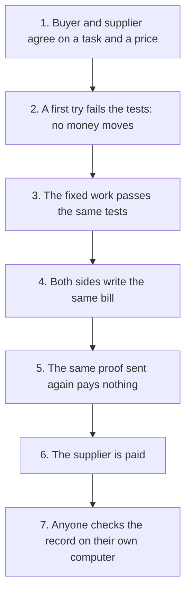

# The story: one task, seven steps

**In plain words.** A buyer puts money on a task, and someone does the work. The money moves only when the work passes the buyer's own tests. This page follows one task, paid in [test money](WORDS.md#test-usdc), in seven steps, each with its proof.

**The neutral meter for AI agent work: neither side keeps the count.**

Of 241 merged agent pull requests claiming passing tests, 9 failed a test, build, lint or type check.

Check one yourself: paste an agent's pull request [on the site](https://drexthealpha.github.io/Knos/#check). No install, no sign-up.

## Where that number comes from

The count is in [backtest.json](backtest.json). The script `scripts/backtest.py` makes it from the pull requests
listed in [agent_pr_ci.json](agent_pr_ci.json).

A failed check is GitHub's record. It is not a judgment of why the check failed.

## What Knos claims

The claim: a buyer and a supplier who do not trust each other get the same bill from records GitHub signed. A
program on Solana pays on that signature. No company sits in the middle, and no outside service reports what happened.

Why Solana: Money is released with no custodian, and neither buyer nor supplier can change the count. One person holds every upgrade key today; a program change waits 48 hours in public.

A receipt can be checked with no blockchain at all. The chain holds the money and the [root](WORDS.md#root).

## Days to approve, not seconds to pay

From merge to paid took 28 seconds at the median, over 56 payments on devnet (10 Oct 2026). A buyer does not wait for
that.

A buyer waits for a person to approve the invoice: days to approve, from the day the invoice is received to the day
it is approved. Knos has not measured that wait with any buyer, so no figure for it is given.

Check every claim yourself: [JUDGES.md](JUDGES.md).

## The seven steps

One task, start to finish. Each step has one piece of evidence: a file, a test or a transaction.

The site plays the same seven ([`web/story.js`](../web/story.js)). The round on its first screen lets you drive them
([`web/demo.js`](../web/demo.js): Agree, Fails, Passes, Statement, Replay, Pay, Verify).

*Seven steps: a failed try pays nothing, and good work is paid once.*

1. **Buyer and supplier agree one task.** Price and acceptance terms come first.
   Evidence: [The funding transaction (devnet, public program ids)](https://explorer.solana.com/tx/177CEpZ8N4r5CGNjSEWBEouTTqMDwAao9LFzwSNYiFjJZUfJdtLDeusHbmmawWxzKLp1SozNAyNCEeGxSvvBm5s?cluster=devnet)

2. **A claimed success fails the condition.** Payment is withheld, with the reason.
   Evidence: [The tamper benchmark](reference/TAMPER.md)

3. **Valid work passes.** The corrected submission meets the same check.
   Evidence: [The test that accepts correct work](../tests/test_tamper_bench.py)

4. **Both sides make the same statement.** Two records give one bill.
   Evidence: [The test that reconciles two ledgers](../tests/test_ledger.py)

5. **A replay pays nothing.** No second payment.
   Evidence: [The refused replay (devnet, public program ids)](https://explorer.solana.com/tx/4hCf7a3FpKiTexPUxX4jvPbYUUQMvgHmyjHSVjbUJ2yqe3srzxLJrsZ8QY4dpT2pt4VFSRJ4j4kQMwEcapvk3Rrp?cluster=devnet)

6. **The payment executes.** The supplier gets a portable receipt.
   Evidence: [The paying transaction (devnet, public program ids)](https://explorer.solana.com/tx/59AfaYHTvWHhbAhiiNHCbCfEcGCxG1kCydJwfRNjZqry9bCnMF3ox6bd4P7favA9hjgzB5nk283g2Mdq3LruyNWV?cluster=devnet)

7. **A verifier checks it offline.** One page lists the live code.
   Evidence: [The release manifest](reference/MANIFEST.md)

The steps are told in the order the site tells them. On the chain, the replay of step 5 was sent after the payment
of step 6. It is the same proof sent a second time, and the program refused it.

Then your own invoice: [check it](https://drexthealpha.github.io/Knos/). Nobody has paid for this yet.

**Public program ids.** The transactions of steps 1, 5 and 6 are one round on the public program ids. It is the round
the site's demo replays (`web/demo_data.json`, written by `scripts/demo_data.py`).

Which build each public program id runs is in [MANIFEST.md](reference/MANIFEST.md), from
[`web/upgrades.json`](../web/upgrades.json). The money is test USDC.

## The ask

1. Needed: an outside key holder for both multisigs. Nobody has been asked.
2. Needed: first buyers to run a shadow count. None has run.
3. Needed: an outside review of the programs. None is commissioned.

What each would do is in [GOVERNANCE.md](reference/GOVERNANCE.md), [PILOT.md](reference/PILOT.md) and
[ASSURANCE.md](reference/ASSURANCE.md).

## Limits

[SECURITY.md](reference/SECURITY.md) has all of them. The ones to know first:

- Devnet, test USDC, no outside review. `knos mainnet-check` fails on that line on purpose.
- A signature proves who made a statement, not that it is true. GitHub signs which workflow ran, at which commit, in which repository. It does not sign what the workflow read.
- The seller's own settlement covers public repositories only.
- A passed check is not good work. An order buys what its terms say, and the funder chose the terms.
- Knos inherits GitHub's failures. If GitHub signs something false or is down, the programs believe it or wait.
- The payout is USDC on Solana. No card, no bank transfer, no bank payout.

Every other document: [README.md](README.md).
