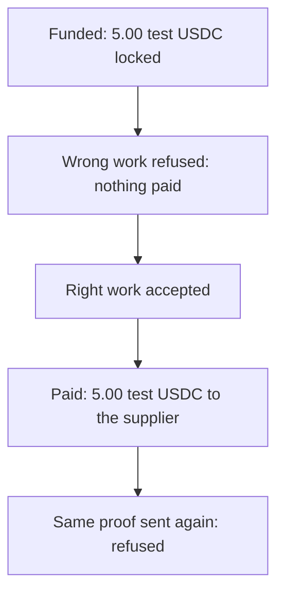

# One transaction, end to end, for a finance reader

**In plain words.** This page follows one small task from start to finish, paid in [test money](WORDS.md#test-usdc). The first try failed the buyer's tests and got nothing, and the fixed work passed and was paid 5.00. Sending the same proof again was refused, so nothing was paid twice.

*One order, step by step: wrong work is refused, right work is paid once.*

## Two records, both public

The first is one order on Solana devnet, run on 9 Oct 2026 with Knos 0.3.23 in Knos's own repository
`drexthealpha/knos-witness`. There is no outside buyer: the buyer and the supplier are both Knos accounts.

The second is a made-up invoice from a made-up supplier (`examples/shadow/invoice.csv`, which says so in its first
line). It is checked with GitHub's recorded answers, so it runs with no network.

**Nothing here was sold. Test USDC has no monetary value.**

## 1. Terms and price, before any work

- The buyer funds issue #9 with 5.00 test USDC. The terms are posted as a `knos-terms` block and hashed at funding.

- The reply names the order account and the fee before any work: the funder pays 0.40 on top
  ([funded reply](https://github.com/drexthealpha/knos-witness/issues/9#issuecomment-6075144470),
  [funding transaction](https://explorer.solana.com/tx/3UaY22WKexigMpkVhibfeMdNgBiyybWm2Z4LuLskKGbNUDXV34yYWyH42atxFjELbrqSgoVs6TwpFzSQwhfXqzgM?cluster=devnet)).

- 0.40 is the order floor of knos_pay 2.1, the build deployed when the order was funded. Upgrade proposal 8 has
  since executed: knos_pay 2.2 charges 0.30% with a 0.05 floor, which on 5.00 is 0.05.
  [MANIFEST.md](reference/MANIFEST.md) has both schedules; see also [the price book](reference/MARKET.md#3-the-price-book).

## 2. One result rejected, one accepted

- Rejected: the first work on pull request #10 failed the acceptance checks, and nothing was paid
  ([the failed run](https://github.com/drexthealpha/knos-witness/actions/runs/37890511112/job/113690226126)).

- Accepted: the corrected work passed at commit `7abbc32`
  ([the passing run](https://github.com/drexthealpha/knos-witness/actions/runs/37890595056/job/113690482455)).
  GitHub signed that run; the program checked the signature and paid 5.00
  ([payment](https://explorer.solana.com/tx/2PtmKUrQHKPARZE4nr35Te559NGQSG7tSHUfwzcKCAjL7gzvQ76fNTVLMWvq8mcZLxd27tbyTe31mCk2PxEGfAqa?cluster=devnet)).

- Cheating submissions are measured apart, judge by judge, in [TAMPER.md](reference/TAMPER.md).

## 3. Both sides rebuild the invoice

The order: the buyer's and the supplier's statements each have one line, agreed, with the same sha256
([the record](https://github.com/drexthealpha/knos-witness/blob/acaa854d241c2e030f521b6f5603c8f43c93bab6/witness.json)):

`a3791c5d92a545a16b0486a01b9d70f091e3e431074a5b6cbb47549c7a110280`

The line's "settled" step is still open: the statement does not yet record the payment.

The made-up invoice has 7 lines, for 2,900.00. Both sides run this command and get one statement:

`knos shadow examples/shadow/invoice.csv --recorded examples/shadow/recorded.json`

Its sha256 is `fd4ca7b1d9fee16ad97d60a455dec37c7abdd1a81b2f5be64299ac223351b40b`.

| Lines | Amount | Finding |
| --- | ---: | --- |
| 2 | 650.00 | checks passed at merge |
| 1 | 650.00 | a check failed at merge: disputed |
| 1 | 300.00 | not merged: disputed |
| 2 | 800.00 | duplicate: the same pull request twice, and a second one closing the same issue |
| 1 | 500.00 | could not be read: not judged |

In dispute: 1,750.00 of 2,900.00. A failed check is GitHub's record, not proof the work is bad.

## 4. Payment by the rule, and a retry with no second effect

- The program paid because GitHub's signature on the passing run checked out under the funded terms. No person
  approved the transfer.

- A replay of the same proof was refused and paid nothing
  ([the refusal](https://github.com/drexthealpha/knos-witness/pull/10#issuecomment-6075196710)). Each proof leaves a
  single-use marker on chain.

## 5. What an independent operator runs

- `pip install knos`, then the `knos shadow` command above: the same sha256, with no network.

- `python examples/witnessed/witness.py run --login YOU` repeats the order in your own repository with test USDC
  ([../examples/witnessed/README.md](../examples/witnessed/README.md)).

- The archive `witness.zip` carries its own verifier, which needs no Knos.

Nobody outside Knos has run either yet.
