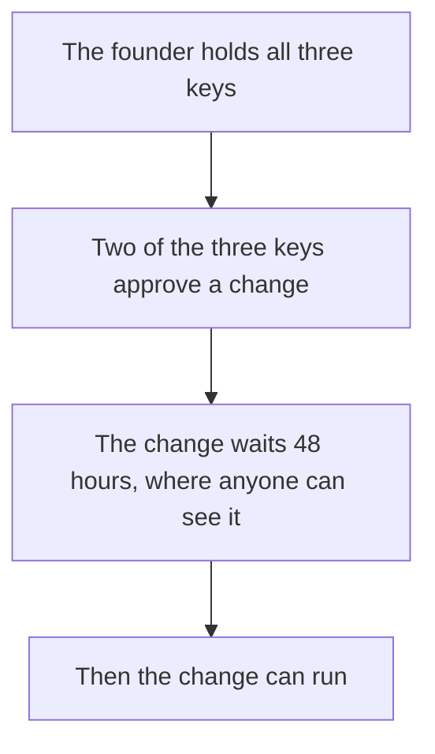

# Trust: who holds the keys, and what is tested

**In plain words.** Today one person, the founder, holds every key that can change the programs. A change must wait 48 hours in public before it can run. Nobody outside Knos has checked the code, and it runs only with test money.


*One person can change the programs, but not in secret.*

## Who holds the keys today

**One person, the founder, holds every key.** No one else holds a key yet.

The [programs](WORDS.md#program) that hold the money obey two [multisigs](WORDS.md#multisig). A multisig acts
only when enough of its keys agree.

| Key | What it can do |
|---|---|
| The upgrade multisig, 2 of 3 keys | Change the code of all four programs, after the public wait |
| The guardian multisig, the same 3 keys | Pause new funding for 7 days at most, and approve or refuse a GitHub signing key |
| `FEE_OWNER` | Receive the fees, and lower one owner's fee rate until a date |
| The deploy key | Write a new build for the upgrade multisig to vote on |

All three member keys are the founder's. So "2 of 3" does not mean two people: one person can act alone.

One machine holds all three member keys and the deploy key. [Keys](reference/KEYS.md) has the plan to add other
key holders. Nobody has been asked yet.

## How a change to the programs happens

Two of the three keys approve the change. Then it waits 48 hours, and anyone can see it coming.

`knos status` lists every change that is waiting. So does the site's [upgrade
record](https://drexthealpha.github.io/Knos/upgrades.json).

**The wait gives notice. It is not oversight: nobody else has to agree, and nobody else can refuse.**

New code can do anything, including taking the money in open tasks. A funder cannot always leave in time.

`knos exit --before-upgrade` lists each of your holdings, and whether it can get out before a waiting change runs.

A longer wait of 8 days is approved but not yet in force. It is proposal 9 of the upgrade multisig. Until it
is carried out, the wait on chain stays 48 hours.

The first set of programs, in [`programs/`](../programs), has no upgrade key. Nobody can change it. It stays
as a record, and no new task is funded there.

## What is tested

The same person wrote the code and the tests. A test is evidence, not proof.

- **Tests.** `python -m pytest -q tests` runs the whole suite offline. The chain tests run the built programs in
  a simulator.
- **Fuzzing.** A fuzzer feeds the program's claim reader random input. The latest nightly run tried 16,024,654
  inputs against the claim parser.
- **A second opinion on signatures.** A test compares the verifier with OpenSSL on thousands of made-up tokens.
- **Model checking.** Five Kani proofs check the payment program's fee sums: what goes in equals what comes out,
  and the fee stays within its bounds.

None of these covers everything. No model checker has been run on the verifier, the program that checks GitHub's
signatures.

The founder also read the verifier and the payment program line by line, as an attacker would. That is his own
check, not an audit.

[Assurance](reference/ASSURANCE.md) lists each rule, the test that holds it, and what is not covered.

## What nobody has done yet

No outside firm has audited the code. Nobody outside Knos has reviewed it, and no review is commissioned.

It runs on [devnet](WORDS.md#devnet) only, with [test USDC](WORDS.md#test-usdc). Mainnet is not touched.

`knos mainnet-check` lists every gate before real money. Its last gate, an outside review, fails on purpose.

## Check a deployed program yourself

`knos status` reads the programs from the chain. It says which version runs, who can change it, and what is
waiting.

To compare the program on devnet with this source, build it the same way the release does. You need docker,
`solana-verify` and a clone on a Linux file system:

```bash
solana-verify build "$PWD" --workspace-path "$PWD/programs-v2" --library-name knos_pay --base-image solanafoundation/solana-verifiable-build:2.3.11
solana-verify get-executable-hash programs-v2/target/deploy/knos_pay.so
solana-verify get-program-hash -u devnet 5y7iWJ1VAMJjnnWbbdo2a2PsWJEwTExSNpzrvQSEnS8k
```

The two hashes must be the same. The steps for the verifier, `knos_oidc`, are in
[Assurance](reference/ASSURANCE.md#reproduce-it-yourself).

## Read more

- [Security](reference/SECURITY.md): who is trusted for what, and every known limit.
- [Governance](reference/GOVERNANCE.md): who can change what, and the plans that are not done.
- [Keys](reference/KEYS.md): every key, who holds it, and the plan to share them.
- [Assurance](reference/ASSURANCE.md): the tests, the fuzzing and the proofs, and how to run them.
