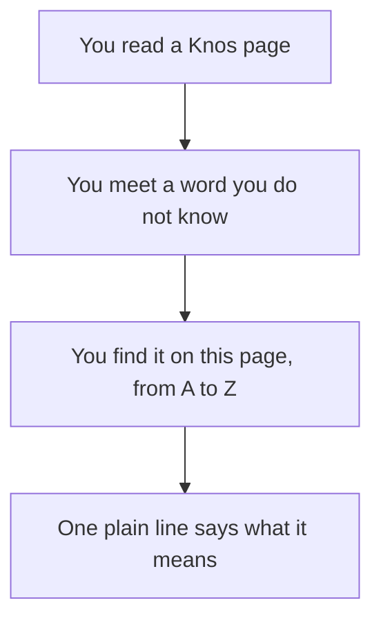

# Words

**In plain words.** This page explains each word the Knos pages use. Each word gets one short line. The words are in order from A to Z.

*A link on a word in a Knos page leads to its line here.*

Some words are about the code: [AI agent](#ai-agent), [pull request](#pull-request), [checks](#checks-ci) and [merge](#merge).

Some are about the money: [Solana](#solana), [devnet](#devnet), [test USDC](#test-usdc) and [escrow](#escrow).

Some are about trust: [signed](#signed), [program](#program), [upgrade](#upgrade) and [multisig](#multisig).

### AI agent

A computer program that does a task on its own, such as writing code.

### Assurance level

How much stands behind a passed line: the checks reported it, or someone ran them again.

### Balance

Money a buyer puts in once, so that later tasks can be paid from it.

### Black-box check

A test that runs the work as a separate program and only compares its answers.

### Checks (CI)

Tests and other automatic checks that run on every change to code. CI means "continuous integration".

### Custodian

A company or person that holds your money for you.

### Devnet

Solana's practice network. Its money is not real. Knos runs only here today.

### Escrow

Money held by a third party until the agreed work is done. In Knos, a program holds it.

### Evaluation

One check of one piece of work. The meter counts evaluations.

### Fee owner

The Knos account that receives the fees.

### Forge

The site that hosts the code and runs its checks, such as GitHub or GitLab.

### GitHub Actions

The part of GitHub that runs your checks on its own computers, each time code changes.

### Hash

A short fingerprint of a file. Change one letter of the file and the fingerprint changes.

### Holdback

Part of a payment kept back for the warranty. The worker gets it if nothing goes wrong.

### Invoice

A bill that asks to be paid for work.

### Judge

The run that decides whether the work met the terms.

### Lamport

The smallest unit of SOL: one billionth of a SOL.

### Ledger

A list of every counted thing, in order. Each side keeps its own.

### Merge

To accept a pull request. Its change joins the main code.

### Meter

What counts the work both sides agree on. Knos is a neutral meter: neither side keeps the count alone.

### Multisig

An account that acts only when several keys agree. Today one person holds all of Knos's keys.

### Oracle

An outside service that tells a program what happened in the world.

### Passkey

A login kept on your phone or computer, opened with your face, finger or PIN. No password.

### Program

Code that runs on Solana. It does only what its code says, until someone upgrades it.

### Program id

The address of a program on Solana. Anyone can look it up.

### Pull request

A proposed change to code on GitHub. It waits for someone to accept it.

### Quorum

Two or three judges who must all pass the same work before it is paid.

### Receipt

One file that ties together the order, the signed result and the payment.

### Reconcile

To compare two records line by line, until they agree or the differences are listed.

### Refund

Money going back to the buyer, for example when nobody finished the work by the deadline.

### Relay

A helper that carries signed results to Solana for you. It cannot change them.

### Rent

A small deposit in SOL that keeps an account open on Solana.

### Root

One short fingerprint of many lines together. Change one line and the fingerprint changes.

### Signed

Sealed with a secret key, so anyone can check who said it and that nobody changed it.

### Solana

A public network of computers that keeps a shared record and runs programs. Nobody can quietly change it.

### Statement

The list of a period's work, line by line, with what each line costs.

### Terms

The rules, fixed before the work starts, that decide whether the work is done.

### Test USDC

Practice USDC on devnet. It is worth nothing. Every Knos payment so far used it.

### Time lock

A wait between approving a change and making it, so everyone can see it coming.

### Token (OIDC)

A short note GitHub signs, saying which workflow ran, in which repository, on which code.

### Upgrade

A new version of a program at the same address. It waits in public before it runs.

### USDC

A digital dollar. One USDC is meant to be worth one US dollar.

### Wallet

Keys that hold and send money on Solana. Whoever has the secret key controls the money.

### Warranty

A number of days after payment. If the work is undone in that time, the held money goes back.

### Work order

A task, its budget and its terms, fixed before the work starts.
