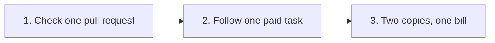

# Three things to try, in this order

**In plain words.** You can try Knos in three short steps. First you check one pull request in your browser, then you follow one paid task, link by link. Last, you run one command and see two copies of a record give one bill.

All of it runs on test money ([test USDC](../WORDS.md#test-usdc)) on Solana's practice network
([devnet](../WORDS.md#devnet)). No customer has paid for anything yet.

*Ten seconds, then five links, then one command.*

## 1. The ten-second check

A **pull request** is a piece of work sent to a code project on GitHub.

1. Open [the check](https://drexthealpha.github.io/Knos/#check).
2. Paste the link to a public pull request that an AI agent opened. Or press **Try a sample invoice**.
3. Wait about three seconds.

**What to look for.** Does the description say the tests pass? The page quotes that sentence. Then it lists
which checks failed: test, build, lint or type. Then it gives a verdict in one line. You install nothing and sign
up for nothing. Nothing is sent to Knos: your browser asks GitHub directly. GitHub answers 60 reads an hour per
address, and one check uses three, so about twenty checks an hour; the page says when you hit that limit.

## 2. One comment funds a task; passing work is paid

One comment on a GitHub issue (a task's page) sets the pay and the checks. In the run below it was
`/knos fund 5 checks: none auto`: pay 5 test USDC when the buyer's own tests pass. Without `auto`, merging the
work is what pays.

Open these links in order. They are one real run, on 9 Oct 2026, in our own repository:

1. [Funded](https://explorer.solana.com/tx/3UaY22WKexigMpkVhibfeMdNgBiyybWm2Z4LuLskKGbNUDXV34yYWyH42atxFjELbrqSgoVs6TwpFzSQwhfXqzgM?cluster=devnet).
   Look for: 5 test USDC locked in the program, not sent to Knos.
2. [Wrong work refused](https://github.com/drexthealpha/knos-witness/actions/runs/37890511112/job/113690226126).
   Look for: the tests failed, and the log says why. Nothing was paid.
3. [Paid](https://explorer.solana.com/tx/2PtmKUrQHKPARZE4nr35Te559NGQSG7tSHUfwzcKCAjL7gzvQ76fNTVLMWvq8mcZLxd27tbyTe31mCk2PxEGfAqa?cluster=devnet).
   Look for: the fixed work passed, and the program paid the worker.
4. [Replay paid nothing more](https://github.com/drexthealpha/knos-witness/pull/10#issuecomment-6075196710).
   Look for: asking to be paid again was refused.
5. [The record](https://github.com/drexthealpha/knos-witness/blob/acaa854d241c2e030f521b6f5603c8f43c93bab6/witness.json).
   Look for: every step above, each with its public link.

This run was not fully automatic: one step was fixed by hand, and one agreed line is not yet settled. To do the same run in a repository of your
own, follow [Run it yourself](../../examples/witnessed/README.md).

## 3. Two copies of the record, one bill

A **ledger** is a file that lists each piece of work and its result. The buyer keeps one; the seller keeps
another. Here the buyer left one out and called another a failure.

You need Python. In a terminal:

    git clone https://github.com/drexthealpha/Knos && cd Knos
    pip install knos
    knos meter reconcile examples/meter/buyer.jsonl examples/meter/seller.jsonl

**What to look for.**

- Two lines name the work the two copies disagree on: one only the seller has, one with a different verdict.
- The bill counts only what both copies hold alike: `202610,5,4,8000000,...`, so 5 pieces, 4 accepted.
- The `sha256` line is a fingerprint of the bill. The buyer and the seller each run the command and get the same one.
- The last line tells both sides to settle the two lines they disagree on.

More on this in [METER.md](METER.md), "A buyer who leaves events out".
