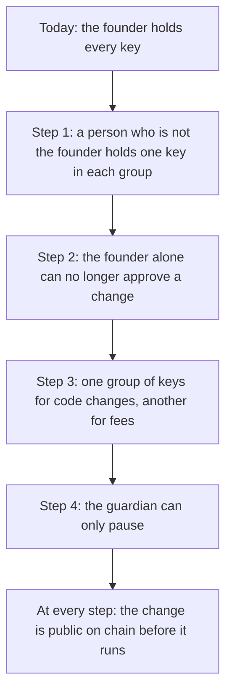

# Keys: who can change Knos

**Proposed. Not deployed.** This page is a plan. None of its steps has been taken. Today one person holds every key.

## In plain words

A key is a secret that lets its holder sign. The programs (code on Solana that holds the money) obey a few keys. Today
the founder holds all of them. So one person could change the programs, after a public wait. The plan adds key holders
who are not the founder. It gives code changes and fees different keys. And it leaves the guardian one power: to pause.

**Outside key holders today: 0.** An outside key holder is a person who is not the founder and holds a key. Nobody has
been asked yet. [KEYHOLDER.md](KEYHOLDER.md) says how a person can ask to be one.

## Who holds what today

A multisig is an account that needs several keys to act. "2 of 3" means any two of its three keys can act.

| key | what it can do | who holds it |
|---|---|---|
| The upgrade multisig, 2 of 3 | Change the code of all four programs, after the time lock (a public wait) | the founder: all three keys |
| The guardian multisig, 2 of 3, the same three keys | Pause new funding for at most 7 days (`Pause`, `PAUSE_MAX`). In the verifier (the program that checks GitHub's signatures): approve a new signing key (`Approve`) and refuse one (`Revoke`) | the founder |
| `FEE_OWNER` | Receive the fees. Lower one owner's fee rate until a date (`SetPlan`) | the founder |
| The deploy key | Write a build for the upgrade multisig to vote on. Nothing else | the founder |
| The GitHub account that holds the pinned workflows | Publish the workflows every order pins | the founder |

The addresses are in [`programs-v2/program_ids.json`](../../programs-v2/program_ids.json). `knos status` reads both
multisigs from the chain. [GOVERNANCE.md](GOVERNANCE.md), sections 1 and 6, has the detail. One machine holds all
three member keys and the deploy key.

No key here can move an order's money to itself. But the upgrade multisig can change the code, and new code can do
anything. That is why who holds those keys matters.

## The plan

*The plan in four steps. None of them has been taken.*

### Step 1: one key in each group held by someone else

A person who is not the founder makes a key on their own machine. That key replaces one of the founder's three, in
both multisigs. The founder still holds two of three, so the founder can still act alone. This step adds a witness,
not a check.

Published: the change itself, on chain, before it runs. The new member list (`knos status`). The new key in
[`web/keyholders.json`](../../web/keyholders.json). The count at the top of this page. The command is written and tested,
and has never been sent: `node scripts/governance.mjs replace-member` ([GOVERNANCE.md](GOVERNANCE.md), section 5).

### Step 2: the founder alone can no longer approve

Two keys of three are held by others, or more keys must agree than the founder holds. From here, no change runs on the
founder's word alone.

Published: the members and the number of keys needed, on chain. The line the command prints: whether the founder alone
can still approve.

### Step 3: different keys for code and for fees

The fee key receives money and lowers rates. It should not vote on code. The code keys should not touch fees. Today
`FEE_OWNER` and the upgrade multisig are different addresses, but one person holds both. The plan gives them different
holders. `FEE_OWNER` is written into the program's code. So moving it takes an upgrade of knos_pay, with its time lock.

Published: the upgrade that sets the new `FEE_OWNER`, its address in
[`programs-v2/program_ids.json`](../../programs-v2/program_ids.json), and who holds it.

### Step 4: a guardian that can only pause

Pausing stops new funding for at most 7 days, then ends by itself. It never moves money. It never stops a payment, a
refund or a withdrawal. Today the guardian can do two more things in the verifier. It can approve a new signing key
(a key GitHub signs with), which lets the verifier say yes. And it can refuse a key for ever. The plan keeps only pauses. Refusing a key becomes
a pause of that key, which ends by itself unless the upgrade keys confirm it. Approving a new key moves to the upgrade
keys, behind the time lock. This needs an upgrade of the verifier (knos_oidc).

Published: the upgrade, and a test that the guardian can sign nothing but a pause.

## What is published at every step

- The change, on chain, before it can run. The time lock is 48 hours until the approved 8-day time lock is applied
  ([GOVERNANCE.md](GOVERNANCE.md), section 2).
- The member list and the number of keys needed: `knos status`, or `node scripts/governance.mjs show --check`.
- Each outside key in [`web/keyholders.json`](../../web/keyholders.json), added only after the change has run.
- The count at the top of this page.

## Names used here

`Pause`, `PAUSE_MAX`, `GUARDIAN` and `FEE_OWNER` are in
[`programs-v2/knos_pay/src/lib.rs`](../../programs-v2/knos_pay/src/lib.rs). `SetPlan` is a knos_pay instruction.
`Approve` and `Revoke` are knos_oidc instructions ([`idl/knos_oidc_v2.json`](../../idl/knos_oidc_v2.json)).
[`tests/test_proposal_docs.py`](../../tests/test_proposal_docs.py) checks that each exists.

More words: [WORDS.md](../WORDS.md).
