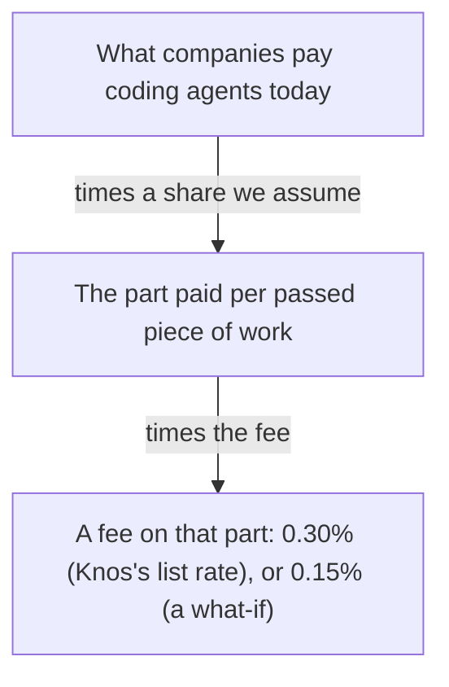

# How big the market could be, on one page

**In plain words.** Companies already pay a lot for AI that writes code. Most of it is paid per seat, not per piece of work that passed. This page guesses how much could be paid per passed piece, and what a small fee on that would be.

Knos has no share of any of this. Nothing has been sold, and Knos's revenue is 0. Every outside figure has its
link, its date and one label: **[company-reported]** (the company said it, not audited) or **[press]** (a news
report, often from an unnamed person). **[assumption]** means we chose the number; nobody measured it. Each source
was read on 10 Oct 2026. Nothing here is a forecast.

*Two multiplications: a share we assume, then the fee.*

## The formula

**Fee a year = what companies pay coding agents × the share paid per passed piece of work × the fee rate.**

- A **run rate** is one year of revenue at the pace of the latest month.
- **Paid per passed piece of work** (outcome pricing) means the buyer pays for each accepted result, not for each
  seat or each word the model reads.
- The **fee rate** is what Knos would keep: 0.30% is the price book's rate. 0.15% is not a rate Knos offers (the
  price book's lowest is 0.20%, by contract). It shows how the total moves if the price had to halve.

## Top-down: start from what coding agents earn

What four sellers of coding agents have said, or been reported to earn:

| seller | figure | when | label and source |
|---|---|---|---|
| Cursor | above 4 billion USD a year (annualised revenue) | early June 2026 | **[press]**, "a person familiar with the matter": [Dealroom, 9 Jun 2026](https://dealroom.co/news/134107-cursor-tops-4b-annualized-revenue/) |
| Claude Code | "over $2.5 billion" run-rate revenue | 12 Feb 2026 | **[company-reported]**: [Anthropic, 12 Feb 2026](https://www.anthropic.com/news/anthropic-raises-30-billion-series-g-funding-380-billion-post-money-valuation) |
| Devin (Cognition) | about 900 million USD a year (annual recurring revenue) | August 2026 | **[press]**: [Crypto Briefing, 28 Aug 2026](https://cryptobriefing.com/cognition-900m-arr-800m-cash-burn/); the company itself reported 492 million in May 2026 ([TechJack, 28 May 2026](https://techjacksolutions.com/ai-brief/cognition-ai-raises-1b-at-26b-valuation-as-devins-arr-report/)) |
| Codex (OpenAI) | not disclosed: it comes inside ChatGPT plans, and its revenue is not split out | 26 Sep 2026 | **[press]**: [gradually.ai, Codex statistics](https://www.gradually.ai/en/codex-statistics/) |
| GitHub Copilot | revenue not disclosed; 4.7 million paid subscribers | 28 Jan 2026 | **[company-reported]** on Microsoft's earnings call, read in **[press]**: [TechCrunch, 29 Jan 2026](https://techcrunch.com/2026/01/29/satya-nadella-insists-people-are-using-microsofts-copilot-ai-a-lot) |

**The base: 7,400 million USD a year.** We add the three revenue figures we have: 4,000 + 2,500 + 900. It is
too low, because Codex and Copilot are left out. It mixes dates from February to August 2026. None of it is
audited. Almost all of it is paid per seat or per token today, not per passed piece of work.

**The share paid per passed piece of work is not measured anywhere we found.** The nearest figure: in a survey of
enterprise software buyers, 27% said they favour paying by outcome. That is what buyers prefer, not what they pay
([Futurum, 12 May 2026](https://futurumgroup.com/press-release/are-outcome-based-and-hybrid-ai-pricing-models-rewriting-the-vendor-playbook/),
**[company-reported]** survey, size not stated). So we try three shares, each an **[assumption]**:

| share paid per passed piece of work **[assumption]** | value paid that way, a year | 0.30% of it | 0.15% of it |
|---|---|---|---|
| 1% | 74 million USD | 222,000 USD | 111,000 USD |
| 10% | 740 million USD | 2,220,000 USD | 1,110,000 USD |
| 27% (the buyers' stated preference) | 1,998 million USD | 5,994,000 USD | 2,997,000 USD |

## Bottom-up: start from the buyers

**Fee a year = buyers × what each pays per passed piece of work, a year × the fee rate.**

Nobody has been asked, so every input is an **[assumption]**. The worked customer in
[MARKET.md](MARKET.md) assumes 10 million USD a year; here we use smaller buyers:

| case | buyers **[assumption]** | each pays per passed piece, a year **[assumption]** | value paid that way, a year | 0.30% of it | 0.15% of it |
|---|---|---|---|---|---|
| small | 50 | 1 million USD | 50 million USD | 150,000 USD | 75,000 USD |
| middle | 500 | 1.5 million USD | 750 million USD | 2,250,000 USD | 1,125,000 USD |
| large | 1,000 | 2 million USD | 2,000 million USD | 6,000,000 USD | 3,000,000 USD |

We chose these cases near the top-down rows, so you can set them side by side. They agree because we chose them.
They are not a second proof.

## What this does not say

- It does not say Knos will win any of it. Knos has 0 buyers, 0 revenue and runs on test money (devnet).
- The fee is paid by the buyer on top of the amount for a work order. Small amounts pay a 0.05 minimum, so the fee
  on many small payments is more than 0.30% ([MARKET.md](MARKET.md), section 5).
- Revenue figures of other companies are what they said or what the press reported, on the dates shown.
- The full model, the price book and the costs are in [MARKET.md](MARKET.md).
