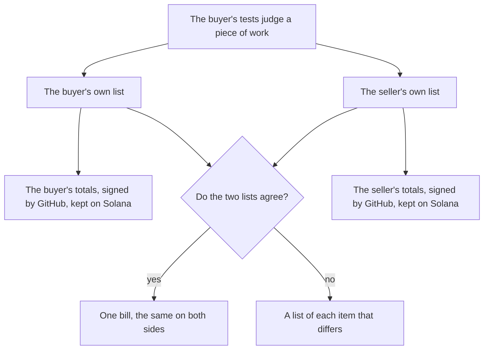

# The meter: what is counted, and who can check it

**In plain words.** The [meter](../WORDS.md#meter) counts each time a buyer's tests judge a piece of work. The buyer and the seller each keep their own list, and each puts its totals on [Solana](../WORDS.md#solana) (a public record neither side can change). When the two lists agree they make one bill, and when they do not, a command names each item that differs.

*Two lists, kept apart, become one bill when they agree.*

`knos_meter` counts **evaluations**. An evaluation is one judgment of one piece of work. It names a work order, an
artifact (a commit), the policy it was judged under and a milestone. It carries a verdict (accepted or rejected) and
the rate the seller bills if it is accepted. The buyer's pinned workflow asks GitHub to sign that judgment; the program checks
the signature on chain and counts it. Those four fields give the evaluation its id: a fingerprint (sha256) of the four joined end to end (`||` means
"followed by"):

    id = sha256(work order, 32 bytes || artifact, its 40 characters || policy, 32 bytes || milestone, u32 little-endian)

(`EvalAud::key` in [`programs-v2/knos_meter/src/gh.rs`](../../programs-v2/knos_meter/src/gh.rs)), and an id is billed
once. The count is of evaluations, accepted and rejected alike. The value is the sum of the accepted ones' rates,
in whatever the two parties settle in; the meter adds it up and moves none of it.

Everything here is on Solana devnet with test USDC. `knos_meter` 1.1, with the batch mode, is the version on devnet
since upgrade proposal 5 (October 2026). It can be upgraded only through a
multisig with a public 48-hour delay, until an outside review. The whole path below
(ledger file, the workflow's command, the signed audience, the relay, the two accounts, `verify` and `reconcile`
reading them back) runs in `tests/test_meter_e2e.py` against the program in LiteSVM. Before that upgrade it ran on devnet once,
on a staging deployment of knos_meter 1.1 during the release rehearsal of Knos 0.3.14, with tokens GitHub signed for a staging copy of the workflows:
5,000 evaluations in two batches, the seller's claim of 5,003, and a reconcile that named the 3 the buyer left out
([CAPABILITIES.md](CAPABILITIES.md), "The 0.3.14 rehearsal on devnet").

## Two modes

**Individual.** One token per evaluation (`Record`). The program writes a marker account of 88 bytes for the id, so
a second token for the same evaluation changes nothing. Every evaluation is on chain by itself; nothing else is
needed to check the count. The marker's rent is locked until two hours into the next month and is more than the
price of the evaluation (the arithmetic is [below](#what-an-evaluation-costs-in-each-mode)).

**Batched.** One token per batch (`RecordBatch`). The token carries the buyer, the seller, the month, a sequence
number, the count, how many were accepted, their value and a 32-byte Merkle root (one fingerprint that commits to every evaluation in the batch). The program writes no account per
evaluation. It adds the numbers to one Ledger account for (buyer, seller, month) and adds the root to a running
hash (a fingerprint of every batch so far, in order):

    chain = sha256(chain || root || seq || count || accepted || value)        numbers as u64 little-endian; chain starts as 32 zero bytes

A token is taken once because its `seq` must be the account's next one (error 125 otherwise; `seq` starts at 0).
Which evaluations stand behind the numbers is in a **ledger file**, off chain. The seller records its own count on chain the
same way (`ClaimBatch`, no fee) into a second account, from a repository the seller owns.

The token's audience (the text the workflow asks GitHub to sign) names the batch in ten parts, numbers in decimal with no leading zero, the root as 64 lowercase hex
characters:

    knosm:batch:<buyer>:<seller>:<yyyymm>:<seq>:<count>:<accepted>:<value>:<root>      the buyer's count (RecordBatch)
    knosm:claim:<buyer>:<seller>:<yyyymm>:<seq>:<count>:<accepted>:<value>:<root>      the seller's own (ClaimBatch)

A batch holds 1 to 100,000 evaluations, no more accepted than counted, for the chain's month or the one before it
(error 126 otherwise).

**The Ledger account** is 96 bytes: the month, the buyer, the seller, `next_seq`, the evaluations, how many were
accepted, their value, the fees the batches cost, and the running hash. There is one per buyer, seller and month for
the buyer's count (seeds `"l"`, buyer, seller, month) and one for the seller's claim (`"lc"`, the same). The relayer
of the first batch pays its rent, once; the program has no instruction that closes it, so the account stays and the
rent is not returned. It is the record: the totals and the running hash of a month stay readable.

## What a root commits to: two formats

The program reads the root as 32 opaque bytes, so what it is a hash of is the ledger's to state. There are two
commitment formats. A new batch is format 2; a format 1 batch stays readable and verifiable as format 1.

| format | the leaf is the hash of | so the root binds |
|---|---|---|
| 1 | the evaluation's id: sha256(0x00 \|\| id), node = sha256(0x01 \|\| left \|\| right), the Merkle tree of RFC 6962 (the one Certificate Transparency uses) over the ids sorted from smallest to largest, each once | the set of evaluation ids, the count, the accepted count and the value; not which evaluation was accepted |
| 2 | the whole event, in canonical bytes | every field of every evaluation: its four ids, verdict, amount and currency, buyer and seller, policy, artifact, evidence digest, evaluator, run, month and sequence |

**Why format 2 exists.** Take two evaluations at one price and swap which of them was accepted. The count, the
accepted count and the value do not move, and neither does a format 1 root, so the same signed audience stands for
both. A format 1 batch therefore cannot show which deliverable was accepted. Under format 2 the two roots differ
([`tests/test_ledger_format2.py`](../../tests/test_ledger_format2.py), and the swap pair in the conformance vectors).

**The event, byte for byte.** Eighteen texts in this order: `deliverable_id`, `evaluation_id`, `invoice_line_id`,
`settlement_id` (the four ids of [`src/knos/ids.py`](../../src/knos/ids.py)), `verdict` (one of the four words), `amount`
(the line's rate), `currency`, `buyer`, `seller`, `order`, `milestone`, `policy` (the hash of the policy or terms it
was judged under), `artifact` (the commit), `evidence` (sha256 of the issuer-signed token or receipt, as hex),
`evaluator`, `run`, `month` (six digits) and `seq` (the batch it is counted in). A whole number is decimal with no
leading zero; a field the line does not state is the empty text, and its emptiness is hashed. The bytes are
`knos.event`, a zero byte, the byte 0x02, the byte 0x12, then each text as its length in bytes (u32 big-endian) and its
UTF-8 bytes. There is no JSON in what is hashed.

    leaf        = sha256("knos.leaf.2" 0x00 || event bytes)
    node        = sha256("knos.node.2" 0x00 || left || right)
    correction  = sha256("knos.fix.2"  0x00 || the correction's key)
    root        = sha256("knos.root.2" 0x00 || number of leaves, u32 big-endian || top of the tree)

The leaves are the events in ascending order of the 32-byte evaluation id, then the corrections in ascending order of
key. An evaluation given twice is refused. The tree splits at the largest power of two below the number of leaves: a
last leaf with no sibling is carried up as it is, never hashed with a copy of itself, and a leaf can never be read as
a node because the two are hashed under different tags.

**Telling the formats apart without trusting the writer.** A format 2 header says `"format":2` beside the root; a
format 1 header says nothing, as before. The statement is checked, not believed: the format and the number of leaves
are inside the root, and no tag is shared, so `knos meter verify` recomputes the root in the stated format and a
header that names the wrong one fails, with the format the lines do hash to. A format 1 root or proof never checks as
format 2, and the reverse.

**Proofs.** `knos meter prove` gives a proof in the batch's format. A format 2 proof carries the event, so
`knos meter prove --check` shows that the batch committed to this verdict and this amount for this deliverable. A
format 1 proof shows that an id is in the set, and every command that prints one says so.

**Old months.** `knos meter migrate <ledger> [--month YYYY-MM]` re-commits each format 1 batch as a new format 2
batch written at the end of the file:

    {"batch":{"accepted":3,"buyer":424242,"count":4,"format":2,"month":202610,"root":"<64 hex>","seller":555000,"seq":0,"supersedes":"202610.0:<the format 1 root>","value":6000000}}

It has no lines of its own: its events are the lines of the batch it names, which stay where and as they were, with
their header and their anchored root. It keeps that batch's month, sequence and three numbers, because it is the same
count. It is not sent to the program as a batch: the program adds every batch to its totals and takes none of zero
evaluations, so a second anchoring would count the month twice. Until both parties hold the file and reconcile, the
new root is one party's statement about lines whose ids the chain already anchors.

## The ledger file

JSON Lines. A batch is a header line and then one canonical line per evaluation (keys sorted, no spaces, integers
and lowercase hex only), so two parties who hold the same facts hold the same bytes:

    {"batch":{"accepted":3,"buyer":424242,"count":4,"month":202610,"root":"<64 hex>","seller":555000,"seq":0,"value":6000000}}
    {"accepted":1,"artifact":"<40 hex>","buyer":424242,"deliverable":"<64 hex>","id":"<64 hex>","milestone":0,"order":"<64 hex>","policy":"<64 hex>","rate":2000000,"seller":555000}
    {"correction":{"batch":"202610.0","by":424242,"id":"<64 hex>","kind":"duplicate"}}

`deliverable` is what was bought, sha256(work order, 32 bytes || milestone, u32 little-endian): the same for every
artifact that carried the work. A line written before this field existed still reads; the field is derived from the
order and the milestone, and a line whose `deliverable` is not theirs is refused. A `correction` line is described
[below](#corrections).

A line may say its verdict in words, and then it also carries its ids:

    {"accepted":0,...,"verdict":"insufficient_evidence","dlv":"dlv_<24 hex>","evl":"evl_<24 hex>","evaluator":"neutral@<40 hex>","run":"36905461215"}

`verdict` is one of `accepted`, `rejected`, `insufficient_evidence`, `disputed`; `accepted` is 1 for the first and 0
for the other three. `dlv` and `evl` are the deliverable's and the evaluation's ids as every Knos interface writes
them ([Four ids](#four-ids-on-every-surface)); `inv` (the supplier's invoice line) and `stl` (the settlement, on an
accepted line only) are there when the writer knows them. Each is checked: an id of one kind in the place of another
is refused, and so is a `dlv` or an `evl` that is not the one the line's own fields give. A line that does not say
its verdict in words is written exactly as Knos 0.3.16 and earlier wrote it, and reads as accepted or rejected from its 1 or 0.

Code: [`src/knos/ledger.py`](../../src/knos/ledger.py), standard library only (the two commands that touch GitHub or
Solana say so). Tests: `tests/test_ledger.py`, `tests/test_ledger_periods.py`.

| command | what it does |
|---|---|
| `knos meter batch <events> --ledger <file> --month YYYY-MM` | adds a batch (the next `seq`) from evaluation lines or `knosm:eval:...` audiences, and prints the root, the totals and the audience the token must be signed for; `--claim` for the seller's own count |
| `knos meter verify <ledger> [--rpc <url>] [--claim]` | recomputes every root, every total and the running hash; with `--rpc` it reads the Ledger account of every month in the file from that node and holds the file to it (the buyer's account, or with `--claim` the seller's), and prints the two on-chain counts side by side; exit 1 if anything differs. `--onchain totals.json` takes the account's five values from a file instead |
| `knos meter prove <ledger> <id>` | the inclusion proof of one evaluation, as JSON, in the batch's commitment format; `knos meter prove --check <proof>` checks one without the ledger and says what the format binds |
| `knos meter migrate <ledger> [--month YYYY-MM]` | re-commits each format 1 batch as a new format 2 batch at the end of the file that names the batch it supersedes; no line already in the file changes. `--dry-run` writes nothing |
| `knos meter reconcile <buyer ledger> <seller ledger> [--rpc <url>]` | what only one side has, what they judged differently, what was entered twice, and the statement; with `--rpc`, each month's two on-chain counts side by side and how far apart they are |
| `knos meter correct <ledger> <id> --batch <yyyymm>.<seq> --kind duplicate\|verdict\|withdrawn` | writes a correction of one anchored entry to `<ledger>.corrections`; the next `knos meter batch` carries it in its root. Nothing is sent to the chain. With `--kind verdict`: `--accepted 1\|0`, or `--verdict` and one of the four words |
| `knos meter close <buyer ledger> <seller ledger> --month YYYY-MM` | writes the month's close record, `agreed` or `disputed` with every line in dispute; exit 1 when disputed. `--sign <record> --as buyer\|seller` has GitHub sign it in a run of that party; `--check <record>` checks the tokens kept beside it, with no network |
| `knos meter statement <ledger> --month YYYY-MM [--close <record>]` | the month's three numbers, the Meter fee, every repeat and correction; refuses a disputed month without `--disputed`. `--json`: the same month as JSON, with the four verdicts counted and one line per evaluation with its four ids and whether it is the billed outcome |
| `knos meter export <ledger>` | one CSV row per evaluation, with its verdict in words and its four ids |
| `knos meter export <ledger> --bundle <file> --close <record> --as buyer\|seller [--other <ledger>]` | one deterministic archive of a closed month; `knos meter verify <file> --bundle` checks it with no network |

`verify`, `close` and `statement` take `--individual <file>`: the ids the individual mode recorded, one a line
(`verify --rpc <url> --marks` reads the marks from the chain instead, one account read per evaluation).

The file commands need only the standard library. `--rpc` uses Knos's Solana client
([`src/knos/settle/v2/meter.py`](../../src/knos/settle/v2/meter.py): the addresses, the account reader and the
`RecordBatch` and `ClaimBatch` instructions). The audience and the Merkle tree are written once, in `ledger.py`, and
the client uses those.

## From the file to the chain

1. **The file is in a repository of its owner.** The buyer keeps its ledger in a repository of the buyer, the seller
   in one of the seller's. `knos meter batch` adds a batch on your own machine; commit the file.
2. **A run signs one batch.** [`examples/knos-meter-batch.yml`](../../examples/knos-meter-batch.yml), installed as
   `.github/workflows/knos-meter-batch.yml`, runs once a day and by hand. It calls Knos's published `attest.yml` at a
   pinned commit with the kind `batch` (a buyer) or `claim` (a seller; set the repository variable
   `KNOS_METER_KIND` to `claim`). That job runs `knos attest --kind batch --repository <this one> --order <path>`:
   it reads the file through GitHub's API (no checkout), recomputes every root and total, refuses a file that does
   not hold or whose buyer (seller, for a claim) is not the owner of the repository the run is in, and asks GitHub to
   sign the audience of the first batch the chain has not taken (or the one named: `<path>:<yyyymm>.<seq>`). One
   batch a run. A run that finds nothing new signs nothing and succeeds.
3. **The token is posted** as a `knos-eval:` comment on the repository's "knos tokens" issue. It is no secret.
4. **A relayer carries it** (`knos relay`, or Knos's public relay): two transactions verify GitHub's signature, one
   sends `RecordBatch` or `ClaimBatch`. The relay reads the audience, refuses before sending what the program would
   refuse (a wrong seq, a re-run, another owner's repository, credits that cannot pay), and reports the fee and the
   running hash.
5. **Anyone checks**: `knos meter verify <file> --rpc https://api.devnet.solana.com`.

What the program asks of each token. `RecordBatch`: GitHub's signature, a GitHub-hosted runner, the run's first
attempt, the workflow file `attest.yml` or `prove.yml` of the repository and at the commit the buyer's Credits pin,
in a repository whose owner is the audience's buyer. The same rule as `Record`. `ClaimBatch`: GitHub's signature, a
GitHub-hosted runner, a repository whose owner is the audience's seller. No workflow pin.

Not done: reading the ledger from a workflow artifact (the command reads a file in the repository); a batch larger
than GitHub's API serves as one file (100 MB, about 300,000 evaluations; a batch token carries at most 100,000).

## Who holds what

| what | who holds it | where |
|---|---|---|
| the buyer's ledger file, with the buyer's corrections | the buyer | a repository of the buyer; any copies it likes |
| the seller's ledger file, with the seller's corrections | the seller | a repository of the seller |
| each batch's totals and root, and the running hash of a month | the chain | the two Ledger accounts of (buyer, seller, month) |
| the close record of a month | both, the same bytes | beside each ledger |
| each side's signed token for the close record, and the GitHub keys it names | both | beside the close record; in the month's archive |
| the month's archive | whoever made one; either can | anywhere: it is checked with no network |

Each party keeps its own ledger. Knos needs no copy and keeps none; every command here runs on a laptop. The cost
of that: the chain holds totals and roots, not evaluations, so a party that loses its file can still show
how many it anchored and can no longer show which. Two things reduce that. Each side keeps its own file, so one lost
file leaves the other. And a closed month goes into one archive ([below](#durable-copies)) that either party can
hand to the other, to an auditor, or to cold storage, and that says so itself if one byte of it has changed. Nobody
is made to keep a copy: retention is a term of the contract between the two, not something the program or Knos
enforces.

## What each party can check alone

| who | with what | can check |
|---|---|---|
| the buyer | its ledger and the chain | that the Ledger account's count, accepted, value and running hash are exactly its batches (`verify`); that the fee taken matches the count |
| the seller | its ledger and the chain | the same for its own claim; and, **without seeing the buyer's file**, whether the buyer's count for the month differs from its own, because both totals are public |
| either | one proof and one anchored root | that a named evaluation is in a batch (`prove --check`): at most 13 hashes for a batch of 5,000 |
| an auditor | one ledger and the chain | everything that side can |
| anyone | both ledgers | which evaluations differ, and the statement (`reconcile`) |

Nobody can say *which* evaluations differ from the chain alone. That takes both files.

## A buyer who leaves events out

[`examples/meter/`](../../examples/meter) holds a buyer's ledger and a seller's for October 2026. The seller judged
seven evaluations. The buyer anchored six, and recorded one of those as rejected. Each file holds on its own:

    $ knos meter verify examples/meter/buyer.jsonl
    202610: 2 batch(es), 6 evaluation(s), 4 accepted, value 8000000, running hash edb2b3579305b5f2121fb4b539f991603f802c1040b56b482384f70d82ddce0c
    $ knos meter verify examples/meter/seller.jsonl
    202610: 2 batch(es), 7 evaluation(s), 6 accepted, value 12000000, running hash 1fa7e587e37168574bd1bded132314f0cd6a73dafd5067ba82f5a7893af496db

Once both are anchored, the chain shows two counts for the same month, 6 and 7, and two values, 8 and 12. That is
all the chain shows, and it is enough for the seller to know there is something to settle before it has seen the
buyer's file. The files say what:

    $ knos meter reconcile examples/meter/buyer.jsonl examples/meter/seller.jsonl
    202610 a84efce01a23db3635166e574a8bb99b1ffcc55491dd67d03f9322f35dbdbac4 only the seller has (missing from the buyer's count): accepted, rate 2000000
    202610 c9f06a898bc6dae84b02d8fabf6d608fa54706fbe1b356de72362c84019f3648 differs in verdict: buyer rejected at 2000000 in 202610, seller accepted at 2000000 in 202610
    buyer,424242
    seller,555000
    rate,2000
    free,100000
    month,count,accepted,value,fee,buyer_only,seller_only,disputed
    202610,5,4,8000000,0,0,1,1
    sha256,cfa4bcb4f5095580ad563bcbf6fc4471f3818e95b0c8c18cba41c9394f6cb16f
    202610 verdicts of what both hold: 4 accepted, 1 rejected, 0 insufficient evidence, 0 disputed; 4 deliverable(s) accepted for the first time (billed once each)
    The two ledgers differ. The statement counts only what both have and describe alike; settle the lines above between you.

The statement counts what both sides have and describe alike, and beside it how many each side has alone and how
many they dispute. It names the two roles, never "mine" and "theirs", and sorts by id, so the buyer and the seller
get the same bytes and can compare the last line. `fee` is the price book's proposed Meter line: the first 100,000
evaluations of a month free, then 0.002 USD each (`--rate` takes another, in millionths of a USD), from prepaid credits.
That is the proposed price. The deployed `knos-meter` program charges 0.05 per evaluation after 10,000 free a month
(test USDC); changing it waits for a program upgrade. The Meter fee is not the release fee: `knos-pay` takes 0.30%,
at least 0.05, on top of an order's amount (the funder pays) and out of a job's amount (the payee gets the rest). The
free allowance is the buyer's for the month across all its sellers; a buyer with several passes what is left with
`--free`.

A seller whose event is missing has three things to show: its own line for the evaluation, the proof that the line
is in a batch it anchored (`knos meter prove`), and the GitHub-signed run that produced the verdict. What happens
next (the buyer adds the event in a later batch, or disputes it) is between the two; the path is agreed in the
contract before the work, not decided by the program.

## What the count proves and what it does not

**What an anchored batch proves.** That a workflow file at a pinned commit, in a repository GitHub says is owned by
the buyer (`RecordBatch`) or by the seller (`ClaimBatch`), stated these totals over this root, once, and that
nothing after it changed the statement: the running hash of the month covers every batch in order. With the ledger
file, that each evaluation under the root is exactly the line the party holds (`verify`, `prove`).

**What it does not prove.**

- That the statement is true. GitHub's signature says which workflow spoke and in whose repository; the workflow
  derives the verdicts. A compromised runner or a wrong check signs just as well.
- That a root is the root of real evaluations, or that a batch's count, accepted and value are those of the lines
  under it. `verify` does that, from the file.
- **That every relevant event was supplied.** A root, in either format, commits to what was put under it and says
  nothing of what was left out. A buyer that leaves an evaluation out anchors a perfectly valid smaller count.
  Completeness comes from both sides submitting independently and reconciling: the seller anchors its own count, and
  `knos meter reconcile` sets the two files against each other and reports what one side left out (omissions), what
  one side entered twice (duplicates), what both hold and describe differently, with each differing field by name
  (conflicts), and the corrections each side carries. For two format 2 ledgers every field is compared; when either
  holds a format 1 batch, verdict, rate and month are, and the output says so. A month is
  [closed](#closing-a-month) from both.
- **That an evaluation was counted once.** In batch mode the program keeps no account per evaluation, so it cannot
  see one repeated in two batches, or recorded both singly (`Record`) and in a batch: the marker of the single mode
  and the root of a batch do not know of each other, and the buyer is billed for both. This is decided off chain, by
  one function ([below](#one-function-decides-what-counts-once)).
- That the verdict was right. That is the judge's and the policy's, named in each line.
- That the data still exists. If both files are lost, the totals remain and the evaluations behind them do not.
- That the two parties agree. A buyer's count and a seller's claim are two statements by two parties. The chain
  records both and takes neither side. Agreement is the close record, and it is off chain.

An order that needs each evaluation to stand on chain by itself uses the individual mode.

## The three numbers

A statement gives three numbers for a month and never adds them together.

| number | what it counts | what it is for |
|---|---|---|
| **evaluations** | every evaluation that counts once: one run of a policy on one artifact for one deliverable, accepted or rejected | the Meter's billable unit: the price book proposes the first 100,000 a month free, then 0.002 USD each; the deployed program charges 0.05 after 10,000 until an upgrade |
| **accepted outcomes** | deliverables (work order + milestone) with an accepted evaluation, counted once, in the month it is first accepted | what a vendor's per-outcome price multiplies |
| **rejected evaluations** | evaluations whose verdict is rejected | the work that was judged and not accepted; billable to the Meter, not an outcome |

The third counts the verdict `rejected` and no other. A month that holds either of the two newer verdicts states them
on two more lines, `insufficient_evidence_evaluations` and `disputed_evaluations`, and its first line says
`knos meter statement,2`; a month of accepted and rejected alone is stated as version 1, byte for byte as before.
The four counts add up to `evaluations`. An evaluation that could not tell is billable to the Meter like any other
run, and is never an outcome and never the supplier's failure.

The first and the second differ whenever work is split. A deliverable carried by ten pull requests is at most ten
evaluations (ten artifacts were judged) and one accepted outcome: the identity of what was bought is the order and
the milestone, not the pull request. The same holds across months: a deliverable accepted in October and evaluated
again in November is no second outcome. `tests/test_ledger_periods.py` holds both cases.

The chain's `value` is the sum of the rates of the accepted *evaluations*, because the program sees evaluations and
has no notion of a deliverable. For work that was split, that sum is larger than what a per-outcome price comes to,
so the statement prints both: `value_of_accepted_evaluations` (what the chain adds) and `value_of_accepted_outcomes`
(one rate per accepted deliverable, that of the evaluation that first accepted it). A vendor's invoice per outcome
uses the second. Making the chain's `value` count per deliverable would need a program change and is not built.

    $ knos meter statement seller.jsonl --month 2026-10
    knos meter statement,1
    buyer,424242
    seller,555000
    month,202610
    state,open
    evaluations,7
    accepted_outcomes,6
    rejected_evaluations,1
    accepted_evaluations,6
    meter_rate,2000
    meter_free,100000
    meter_fee,0
    value_of_accepted_evaluations,12000000
    value_of_accepted_outcomes,12000000
    sha256,<of the lines above>
    anchored,7,in 2 batch(es),running hash 1fa7e587e37168574bd1bded132314f0cd6a73dafd5067ba82f5a7893af496db
    anchored_and_not_counted,0

The lines down to `sha256` are made only of what both parties hold once a month is agreed, so the buyer and the
seller compare that one hash. The lines after it are this ledger's own record: what it anchored, and below that one
line for every repeat and every correction. `anchored_and_not_counted` is how many evaluations the chain's counter
holds that the statement does not count (repeats and withdrawals). For the buyer, each of those past the free
allowance was charged 0.05 USD in credits that the program cannot give back; the statement makes the number visible
and settling it is between the buyer and Knos, off chain. Nobody has had to yet.

## Four verdicts, and what the chain holds of them

A verdict is one of four words ([`src/knos/ids.py`](../../src/knos/ids.py)): `accepted`, `rejected`,
`insufficient_evidence` (the run could not tell: not an acceptance, and not held against the supplier) and
`disputed` (somebody contested the verdict and nobody has resolved it). Only `accepted` is billed as an outcome.

**The on-chain batch format is unchanged; this needs no program change.** A batch token still carries a count, how
many were accepted, their value and a root; the single mode's token still carries accepted 1 or 0. So the chain
knows two things about a verdict: accepted, or not. `insufficient_evidence` and `disputed` live in the off-chain
ledger line and in corrections, and **in the anchored totals they count as "not accepted"**, together with
`rejected`: for every batch, count - accepted = rejected + insufficient evidence + disputed. A format 1 root is over
the evaluations' ids, so a line that says `insufficient_evidence` and the same line written as accepted 0 give the
same root and the same token; a format 2 root is over the whole line, verdict included, so they do not. What tells
the three apart in a format 1 batch is the ledger file each party holds: `knos meter reconcile`
reports a line the buyer holds as insufficient evidence and the seller as rejected as a difference in verdict, and
a month with such a line closes `disputed` until the two files say the same.

`knos meter reconcile` prints, for each month, the four counts of the evaluations both sides hold alike, and with
`--json` gives them as `statement[].verdicts` beside `accepted_outcomes`. `knos meter statement --json` gives
`verdicts` for the month of one ledger.

## Four ids on every surface

One purchased milestone can take ten pull requests, three agents and twenty evaluations, so four things are never
called by one id. Each is a prefix and 24 hex characters, made by `knos.ids` from the same parts everywhere:

| id | what it names | made from | where it is written |
|---|---|---|---|
| `dlv_` deliverable | what was bought; billed once | the order (its 32 bytes as hex) and the milestone; a standing order's milestone is the pull request | ledger line `dlv`; receipt `ids.deliverable`; statement JSON; reconcile JSON; export CSV `deliverable_id`; audit export `deliverable_id` |
| `evl_` evaluation | one run of the acceptance on one artifact | the deliverable, the commit, the policy (the terms' hash), the evaluator as `<judge>@<workflow commit>`, the run | ledger line `evl`; receipt `ids.evaluation`; statement and reconcile JSON; export CSV `evaluation_id`; audit export `evaluation_id` |
| `inv_` invoice line | one line a supplier sent for payment | the supplier, the invoice, the line | ledger line `inv`; receipt `ids.invoice_line`; audit export `invoice_line_id` |
| `stl_` settlement | one movement of money for one deliverable | the deliverable, the method (`chain`, `bank`, `other`), the reference (the transaction's signature) | ledger line `stl`; receipt `ids.settlement`; audit export `settlement_id` |

What is not there, said plainly. A ledger line names its evaluator and run only when its writer knew them; without
them its `evl` is one id per deliverable, artifact and policy, which is not the id a receipt of the same run
carries. The chain never sees an invoice, so `inv` is on a line only when a party put it there. The audit export is
made from the program's log lines, which carry neither the commit nor the run: its `evaluation_id` and
`invoice_line_id` are empty unless the version 4 receipt of the line's transaction is at hand. The 32-byte `id` and
`deliverable` of a ledger line are still the bytes the program bills by; the four ids are names for people and
files, and nothing on chain reads them. Vectors: `conformance/vectors/ids.v1.json`.

## One deliverable is billed once

One accepted commercial outcome per deliverable under one order: the first evaluation of the deliverable, in the
order the ledger counts (month, then batch, then id), whose verdict is accepted after every correction.
`ledger.billing` is the one function that says which, and `knos meter statement --json` marks that line
`"billed": true` and every other `false`. `ledger.RULES` holds the table below, and a test holds the two together.

| what happened | what it is | what the ledger makes of it | what it adds to the accepted outcomes |
|---|---|---|---|
| a retry | the same deliverable and artifact, judged again | a new evaluation | nothing: the deliverable is billed once |
| an alternate branch | the same deliverable, another artifact | a new evaluation | nothing: the first accepted one stands |
| a reopened ticket, inside the warranty | the same deliverable, contested after it was accepted | a correction of the accepted evaluation's verdict | nothing new: the correction takes the outcome back, or leaves it |
| a reopened ticket, after the warranty | the same work, asked for again | a new deliverable only when the terms say so | one outcome when the terms say so, else nothing |
| ten pull requests for one milestone | one deliverable, ten artifacts | ten evaluations | one outcome, when the first is accepted |

A retry of the same artifact under the same policy has the 32-byte id the program already bills once, so one batch
cannot say two things of it: the retry's verdict reaches the ledger as a correction of the first entry. Whether a
reopening is inside the warranty is a comparison of two times with the window the terms set (`ledger.reopened`); a
new deliverable after it has the key `<milestone>/reopened/<n>` (`ledger.reopened_key`), and exists only when the
terms say a reopening after the warranty is new work. The Meter's own fee is per evaluation and is not touched by
any of this: ten evaluations are ten evaluations.

## One function decides what counts once

Identity is the 32-byte evaluation id the program bills by. `ledger.canonical` takes a ledger (and, when there is
one, the list of ids the individual mode recorded) and returns the entries that count and every entry that does
not, with the reason:

- written twice in one batch (the root holds each id once, so this was never billed twice);
- in another batch as well;
- recorded singly as well: the individual mode has a mark for it.

Of the entries that share an id, the first in time is kept: batches in the order the chain takes them (month, then
`seq`), then by id; an individually recorded evaluation comes before any batch, because it stands on chain by
itself. `verify`, `close`, `statement` and the archive all use this one function, so they cannot disagree.

`knos meter verify` **fails** a ledger in which an evaluation is counted twice, and names it:

    batch 1 of 202610: evaluation 7c1e... is already in batch 0 of 202610: it is counted twice. If batch 1 is not anchored yet, take the line out and build the batch again; if it is anchored, the chain billed it twice: run `knos meter correct <ledger> 7c1e... --batch 202610.1 --kind duplicate` and anchor the next batch, which carries the correction

The pinned workflow runs the same check before it signs, so a ledger with an uncorrected repeat gets no further
batch signed. Once the correction is in a batch, `verify` passes and the statement says
`billed twice on chain, corrected in batch 2 of 202610`.

The list of individually recorded ids comes from a file (`--individual`) or from the chain (`verify --rpc <url>
--marks`). A mark can be closed from two hours into the month after its own, so for a month that is over, keep the
list as a file. A buyer and a seller who use one mode for one work order never meet this case.

## Corrections

The program's counters only go up: no instruction of `knos_meter` lowers a count, changes a verdict or removes a
batch. So a correction is a **signed ledger record, not a chain write**:

    {"correction":{"batch":"202610.1","by":424242,"id":"<64 hex>","kind":"duplicate"}}

| kind | what it says of the entry in that batch | what the statement does |
|---|---|---|
| `duplicate` | it is a repeat; the evaluation is counted elsewhere | drops that entry |
| `verdict` | the verdict that stands: `accepted` (1 or 0), or `verdict`, one of the four words (`{"correction":{...,"kind":"verdict","verdict":"disputed"}}`); a line carries one of the two | counts it with the corrected verdict; an outcome it takes back is no longer an accepted outcome |
| `withdrawn` | it should not have been counted | takes it out of all three numbers |

A verdict correction can set any of the four verdicts. The batch it corrects stays as the chain took it: a batch
that said accepted still adds one to the anchored `accepted`, whatever the correction says, and a correction to
`insufficient_evidence` or `disputed` counts as "not accepted" exactly as one to `rejected` does. The statement and
the close record carry the word.

`by` is the GitHub owner id of the party that issues it, the ledger's buyer or its seller. `knos meter correct`
writes the line to `<ledger>.corrections`; the next `knos meter batch` puts it in that batch. There it is a leaf of
the batch's Merkle tree with its own prefix, `sha256(0x02 || sha256(line))`, after the evaluations' leaves
(`0x00`), so no correction can be read as an evaluation and a batch without corrections has exactly the tree it
had before. The root GitHub signs for that batch therefore **anchors the correction**: `knos meter prove <ledger>
<sha256 of the line>` gives its inclusion proof. The batch's count, accepted and value are of its evaluations only,
and the chain's totals stay what they were; the statement nets the correction and shows it, and the close record
lists every correction of the month with the party that issued it and the ledger that anchored it.

Because the program is unchanged: a correction rides in a batch that has at least one
new evaluation, because the program takes no batch of none; a correction is a statement by one party, and it
changes the month's result for both only when the other party's ledger then says the same (the close decides); and
a fee already taken for a repeat is not returned by the program.

## Closing a month

`knos meter close <buyer ledger> <seller ledger> --month 2026-10` writes the close record, a canonical JSON that is
the same bytes whoever computes it from the two files:

- the buyer, the seller and the month;
- for each ledger: the final running hash of its batches (what its Ledger account on chain holds), how many
  evaluations and batches it anchored, and the three numbers;
- every correction of the month, who issued it, which batch it corrects and which batch anchors it;
- `state`: **`agreed`** when the two ledgers hold the same evaluations with the same verdicts and rates after
  deduplication and corrections; otherwise **`disputed`**, with every line in dispute and why: missing from the
  buyer's ledger, missing from the seller's, verdict differs, rate differs, month differs, or a duplicate that has
  no correction.

On the two example ledgers:

    $ knos meter close examples/meter/buyer.jsonl examples/meter/seller.jsonl --month 2026-10 --out close.json
    the buyer's ledger: 6 evaluation(s), 4 accepted outcome(s), 2 rejected evaluation(s); anchored 6 in 2 batch(es), running hash edb2b357...
    the seller's ledger: 7 evaluation(s), 6 accepted outcome(s), 1 rejected evaluation(s); anchored 7 in 2 batch(es), running hash 1fa7e587...
    IN DISPUTE a84efce01a23db3635166e574a8bb99b1ffcc55491dd67d03f9322f35dbdbac4: missing from the buyer's ledger
    IN DISPUTE c9f06a898bc6dae84b02d8fabf6d608fa54706fbe1b356de72362c84019f3648: verdict differs
    202610 is DISPUTED. Wrote close.json (sha256 cb64c5b0...).
    A disputed month is not an invoice. Settle the lines above (add the missing evaluation in a later batch, or `knos meter correct`), then close again.

**A disputed month never becomes an invoice silently.** `knos meter close` exits 1. `knos meter statement --close
close.json` prints no totals for it and exits 1; with `--disputed` it prints them under
`note,DISPUTED: this is not an invoice`, with one `disputed,<id>,<why>` line for every line in dispute. A statement
made without a close record says `state,open`. The way out of a dispute is in the files: the buyer adds the missing
evaluation in a later batch, or one side anchors a correction, and the month is closed again. Which side gives way
is for the contract between them; nothing here decides it.

**Signing.** Each side signs the close record by having its own GitHub run attest the record's sha256. In a job
with `permissions: id-token: write`, in a repository of that party:

    knos meter close --sign close.json --as buyer        # the seller: --as seller, in a repository of the seller

The job asks GitHub for a token whose audience is

    knosm:close:<buyer>:<seller>:<yyyymm>:<sha256 of the close record>

and keeps it beside the record (`close.json.buyer.jwt`, `close.json.seller.jwt`) with the GitHub keys it names
(`close.json.jwks.json`). The command refuses to keep a token whose repository owner is not the party named.
`knos meter close --check close.json` verifies both tokens **offline**: the RS256 signature against those keys
(the verifier the evidence bundle uses, `knos.bundle.rs256`), the issuer, the audience, and that the repository's
owner id is the record's buyer or seller. It exits 0 only for an agreed month signed by both.

**The chain holds the batches, not the close.** Period close and corrections are off chain and signed by each
side's GitHub run. `knos_oidc` can verify any GitHub token on chain, but `knos_meter` has no instruction that reads
a close audience, so nothing on chain says a month is closed, agreed or disputed. An on-chain close would need a
program change and is not built. What ties the close to the chain is the pair of running hashes in the record:
`knos meter verify <ledger> --rpc <url>` shows each is the one its Ledger account holds.

Limits of the signature: a close token is checked after GitHub's own few minutes of validity, so its
expiry is not held against it; what is checked is that GitHub signed these bytes for that owner at the time `iat`
names. The check trusts the keys it is given. That they are GitHub's is checked once, with a network, against
`https://token.actions.githubusercontent.com/.well-known/jwks` or the `knos_oidc` key accounts; GitHub rotates its
keys, which is why the keys used are kept. No close has been signed by a real GitHub run yet: the tokens in the
tests are signed by a test key.

## Durable copies

    knos meter export buyer.jsonl --bundle 2026-10.tar --close close.json --as buyer --other seller.jsonl
    knos meter verify 2026-10.tar --bundle

The archive is one tar of a closed month: `MANIFEST.json` (the sha256 of every file), the close record, the ledger
of the party that made it (and the other's with `--other`), the month's corrections drawn from each ledger, each
side's signed token as far as there is one, and the GitHub keys those tokens name. It is deterministic (names in
order, times zero, one mode, no owner), so the buyer and the seller building it from the same files get the same
bytes and can compare one hash. `export --bundle` writes nothing that would not verify.

`verify --bundle` needs no network. It checks every file against the manifest and the archive against its one
form, recomputes every root, total and running hash of each ledger, recomputes the close record from the two
ledgers (with one ledger: that side's hash and numbers; the other side's are then the record's word, and it says
so), and checks each token. It names a party that has not signed. A changed byte anywhere fails it; the test
changes a byte in every file and along the whole archive. What it does not do is ask the chain: comparing the
running hashes with the Ledger accounts is `verify --rpc`.

## Design choices

**The free allowance is counted in the month of the chain's clock.** A batch may be for this month or the last one
(a batch for September can arrive on 2 October). The 10,000 free evaluations and the plan's count are the buyer's
for the month in which the batch is *recorded*, as `Record` counts a single evaluation. So a September batch
recorded in October uses October's allowance, and the Ledger account it is added to is September's. The fee of a
batch is `count` past what is left of the allowance, times the rate, taken from the buyer's credits; a batch the
credits cannot pay is refused whole and the same token can be sent again while it is good.

**`ClaimBatch` needs no workflow pin.** A claim is the seller's statement about its own work. It costs nothing,
moves nothing and is written to an account of its own, so there is nothing a pinned workflow would protect: the
program asks only that GitHub signed it for a run in a repository the seller owns. The example workflow still calls
the published `attest.yml`, because that command checks the file before it signs; a seller may use any workflow.
What follows: a claim is exactly as good as the seller's care for its own repository.

**An evaluation recorded both singly and in a batch is visible only in the ledger.** The program keeps no
per-evaluation account in batch mode, which is the point of the mode. `verify --individual` (or `--marks`) fails
such a ledger, and a `duplicate` correction answers it.

**One batch, one token, in order.** `seq` must be the account's `next_seq`, so batches are recorded in the file's
order and a token cannot be replayed. A batch skipped on chain blocks the ones after it until it is sent.

## What an evaluation costs in each mode

Inputs. A transaction costs 5,000 lamports per signature ([Solana docs](https://solana.com/docs/core/fees)). Rent
is (128 + bytes) × 5,080 lamports on the clusters today: `getMinimumBalanceForRentExemption(88)` returned 1,097,280
lamports and `getMinimumBalanceForRentExemption(96)` 1,137,920 from `api.devnet.solana.com`, and 1,137,920 for 96
bytes from `api.mainnet-beta.solana.com`, on 4 Oct 2026. (The older rule, (128 + bytes) × 6,960, gives 1,503,360 and
1,559,040; it is what LiteSVM charges in the tests and not what either cluster charges today.) SOL is taken at
121.50 USD: [CoinGecko](https://www.coingecko.com/en/coins/solana) quoted 121.49 and
[Coinbase](https://www.coinbase.com/price/solana) 121.46 on 4 Oct 2026. One lamport is a billionth of a SOL.
Carrying one GitHub-signed token is three transactions of one signature each: two to verify a token signed with an
RSA-2048 key ([BENCH.md](BENCH.md), "The verifier on chain") and one for the instruction.

Compute units of the instruction itself, measured in LiteSVM (`tests/test_meter_batch.py` prints the first pair):
`RecordBatch` 77,035 for the first batch of a ledger (it creates the account) and 70,692 for a later one, each
with a fee transfer; `ClaimBatch` 57,412 and 50,946. The relay asks for 110,000 and 60,000. All are under the 200,000 a transaction gets by default.

| | individual (`Record`) | batched (`RecordBatch`), 5,000 in a batch |
|---|---|---|
| transactions per token | 3 | 3 |
| fees spent per evaluation | 3 × 5,000 = 15,000 lamports = 0.0018 USD | 15,000 ÷ 5,000 = 3 lamports = 0.00000036 USD |
| rent per evaluation | (128 + 88) × 5,080 = 1,097,280 lamports = 0.1333 USD, locked, returned to the relayer from two hours into the next month | none |
| rent per buyer, seller and month | none beyond the above (the month's count account, 64 bytes, is not in this table) | (128 + 96) × 5,080 = 1,137,920 lamports = 0.138 USD, once, not returned |
| what knos_meter takes on devnet per evaluation past its free 10,000 (test money; the price book's proposed Meter line is 0.002 USD past 100,000, from prepaid credits) | 0.05 (0.02 on a plan) | the same |
| against the 0.05 USD price | the locked rent is 2.7 times the price | fees and rent together come to about one hundred-thousandth of the price per evaluation, at 1,000,000 evaluations a month |

The share of the instruction's own signature is 5,000 ÷ 5,000 = 1 lamport per evaluation; the other two lamports are
the verification. 5,000 is an example size: a batch may hold up to 100,000, which divides the same 15,000 lamports
further. The seller's `ClaimBatch` costs its relayer the same three transactions per batch, the rent of the claim
account once a month (1,137,920 lamports), and no Knos fee.

## Working capital at 1,000,000 evaluations a month

One buyer, one seller, 1,000,000 evaluations in the month, SOL at 121.50 USD.

| | individual | batched, 200 batches of 5,000 |
|---|---|---|
| SOL locked in rent at month end | 1,000,000 × 1,097,280 lamports = 1,097.28 SOL = 133,320 USD, put up by the relayer, returned from two hours into the next month | none |
| SOL spent on rent | none (the markers' rent comes back) | 1,137,920 lamports = 0.00114 SOL = 0.14 USD for the buyer's Ledger account; the same again for the seller's claim |
| SOL spent on transaction fees | 1,000,000 × 15,000 lamports = 15 SOL = 1,822.50 USD | 200 × 15,000 lamports = 0.003 SOL = 0.36 USD |
| what knos_meter takes for the month on devnet (test money; at the price book's proposed price: 900,000 × 0.002 = 1,800 USD) | 990,000 × 0.05 = 49,500 (19,800 at 0.02) | the same |
| credits that must be prepaid at one time | 0.05 USD: each evaluation is paid as it is recorded | 250 USD: a batch of 5,000 past the allowance is paid whole (100 USD at 0.02) |

So the individual mode ties up about 133,000 USD of somebody's SOL for a month to count 49,500 USD of fees, and the
batch mode ties up nothing per evaluation. What the batch mode gives up is in "What the count proves and what it
does not".

Not in the tables, and not measured: the rent held against a verified token's account while it exists (it is closed
after the instruction); priority fees; and any of this on devnet with tokens GitHub signed.
