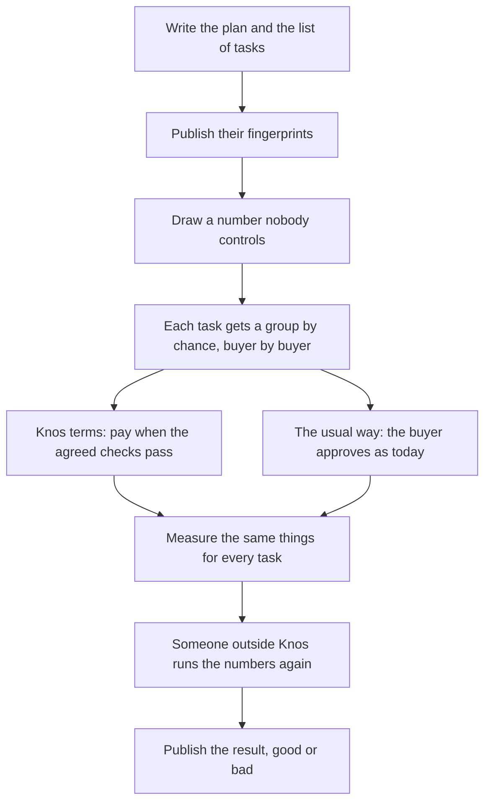

# The Pilot: one buyer, two suppliers, 30 days, one reconciled invoice

**Close a supplier's invoice with evidence both sides can check.**

The neutral meter for AI agent work: neither side keeps the count.

This is the one thing Knos offers for money today. It is an offer, not a record: **nobody has bought it, nobody has
been asked, and there is no legal entity to invoice from yet.** Nothing on this page reports demand. The last
section says what blocks it.

## In plain words

A Pilot is a paid trial. One buyer and two of its suppliers use Knos for 30 days. Each task goes into one of two
groups by a fair draw: Knos terms, or the buyer's usual way. We then compare the two groups. The rules for that are
written below, before any task starts. Nothing has been run yet. New words are explained in
[WORDS.md](../WORDS.md).

## How it starts: shadow mode

A Pilot starts in shadow mode. For the first period the count runs beside the invoices the buyer already receives
and changes nothing: no money moves through Knos, nobody's process changes, no supplier is paid differently, and
the buyer approves its invoices exactly as before. Shadow mode asks the buyer for no trust and no money. It is
free, with or without a Pilot after it, inside the Meter's free allowance.

What shadow mode produces is two numbers side by side for each supplier, the supplier's invoice count and the
neutral count, and every line where they differ. The first line the two sides have to settle between them is the
reason to buy the Pilot: the Pilot is the same work for two suppliers over 30 days. It ends with one reconciled
invoice and the findings as numbers, with someone answerable for them. A shadow count that finds no difference is a result too, and
the buyer should then not buy the Pilot.

No shadow count has been run with anyone, and none is published.

## Who it is for

A company that buys agent work per outcome from two or more suppliers (agent vendors, agencies, contractors
paid per merged change or per milestone) and has their invoices to reconcile. The person who signs is whoever
must authorise those payments and defend them afterwards: an engineering director or a finance controller.

It is not for a company with one supplier (there is nothing to compare), for work billed by the hour or the seat,
or for a maintainer with a bounty: the free check and `/knos fund` already serve that.

## What the buyer gets: four deliverables

A Pilot is **one buyer, two suppliers, 30 days, one reconciled invoice, and quantified findings.** Two suppliers
are the scope the price covers; a third is a second Pilot. Under a contract, connecting a supplier costs nothing.

| | deliverable | what it is |
|---|---|---|
| 1 | **One reconciled invoice** | The buyer's accepted work for the 30 days, from both suppliers, set against what each billed, as one list of deliverables. Each line has the order, the milestone, the artifact, the policy version that judged it and the verdict. A deliverable is counted once, whatever number of pull requests carried it. |
| 2 | **A mismatch list** | Every difference between what was accepted and what was billed, named: billed and not accepted; accepted and not billed; billed twice; judged differently by the two sides. A mismatch is a dispute line, never an invoice line. |
| 3 | **A statement both sides verify** | For each supplier, one statement that the buyer computes from its ledger and the supplier computes from its own, to the same totals (`knos meter reconcile`, [METER.md](METER.md)). The statement counts only what both sides have and describe alike. |
| 4 | **Quantified findings** | The four numbers below, before and after, written down with their sample sizes, and given to the buyer whether or not they flatter Knos. With them, the measures of the fair test below, for each group. |

Each statement can be checked from the two ledger files alone. Totals are also written to Solana devnet as test
data, to show the mechanism; devnet keeps no promise about its history, so nothing in the Pilot depends on it.

## What the buyer does

1. Names the two suppliers in scope and one repository per supplier relationship.
2. Installs Knos in each repository **by a pull request** it reviews and merges: one workflow file and one policy
   file, no secret ([INSTALL.md](INSTALL.md)).
3. Writes the acceptance terms for each deliverable before the work starts: the checks that must pass and the
   paths that may change. Templates exist; the buyer chooses and edits.
4. **Keeps a ledger**: one file in a repository of its own, which its workflow appends to.
5. Gives the last closed month of invoices from the same suppliers, as the baseline.
6. Names one person who approves invoices, for an hour at the start and an hour at the end.

## What each supplier does

1. Agrees to the terms before starting each deliverable. They cannot be changed after funding, by either side.
2. **Keeps a ledger of its own**, in a repository of its own, and records its own count of the month. The buyer
   does not need to show the supplier its file for a difference to become visible.
3. Sends its invoice for the period as it normally would.

A supplier pays nothing. A supplier who will not keep a ledger is out of scope, and the Pilot says so in its
report: with one ledger there is nothing for the two sides to agree on.

## What is measured, before and after

| measure | how it is taken | before | after |
|---|---|---|---|
| Invoice preparation time | hours the buyer's and each supplier's people spend preparing and checking one period's invoice, as they report it | the last closed month | the Pilot's 30 days |
| Disputed lines | invoice lines questioned, corrected or credited, out of all lines | the same month | the mismatch list |
| Acceptance-to-approval time | days from a deliverable being accepted to its invoice line being approved | the same month | from the time of the accepting run and the buyer's own approval record |
| Repeat use | whether the buyer and each supplier run a second period without being asked | not applicable | recorded 30 days after the end |

Before and after cannot show what Knos caused: a month can differ from the last for many reasons. The fair test below
can.

## A fair test, written down before it starts

Nothing in this section has been run, and no buyer has seen it. It is the plan, fixed in advance. Then nobody can
change the rules after seeing the results.

### Why a fair draw, and not before and after

A month without Knos and a month with Knos differ in many ways. The work changes. The people change. So the change in a
number does not show what Knos did.

A fair draw does. Inside each buyer, every task goes into one of two groups by chance:

- **Knos terms.** The rules for "done" are written and locked before work starts. The agreed checks (tests a computer
  runs on each change) decide. The buyer pays only for work that Knos accepts.
- **The buyer's usual way.** The buyer checks and approves the work as it does today.

The money is real in both groups. The buyer pays its suppliers from its own bank, as it does today
([RAILS.md](RAILS.md)). Knos never holds that money. Mainnet (the real Solana network, with real money) is not touched.

Chance alone picks the group, so both groups get the same mix of work. A gap between them then comes from the terms or
from luck. The size of the test below says how much luck to allow for.

*How the fair test runs, from the written plan to the published result.*

### The draw

1. The buyer lists its tasks before the Pilot starts. A task can be a planned piece of work, or a numbered slot, such
   as "the 7th task we open".
2. Knos publishes the list's fingerprint (sha256: a code that changes if one letter changes).
3. Then a number nobody controls is drawn. Its source is named in advance, for example a public random number service
   such as [drand](https://drand.love).
4. `python scripts/pilot_plan.py assign --tasks tasks.csv --seed <that number>` puts each task in a group. It works in
   blocks of four tasks, two in each group. So the groups stay even as tasks come in.
5. Knos publishes the fingerprint of that file before the first task starts. Anyone can run the same command later.
   They get the same file and the same fingerprint.

A task stays in the group it was drawn for. If someone changes its terms later, it still counts in its first group. A
task that is listed but never done is reported too.

### What is measured, for every task in both groups

| Measure | What it means | Where it comes from |
| --- | --- | --- |
| Paid with a failed check (the main measure) | the buyer paid, and a test, build, lint or type-check job had failed on the work it paid for | the code host's own record of each check (GitHub's or GitLab's) |
| Hours to approve | the hours from the supplier saying "done" to the buyer approving payment | the buyer's approval record and the code host's times |
| Disputes | either side questions a payment in writing | the mismatch list and the buyer's own records |
| Wrongful refusals | the buyer refused or held payment for work that met the terms | each refusal, read again after the Pilot |
| Reverts within 30 and 90 days | the change was undone within 30 or 90 days of payment | the repository's history |
| Cheats caught | work broke the rules to pass (it edited the tests that judge it, skipped a check, or claimed a pass that failed) and was stopped before payment | each refusal, read again after the Pilot |
| False refusals | the checks refused work that met the terms, for example because a test fails at random | each refusal, read again after the Pilot |

Cheats caught and false refusals are reported side by side, in the same table and the same type. Checks that catch
cheats but also refuse good work have not succeeded. Each refusal is read again by a person who is not told the task's
group, under rules written before the Pilot. Nobody has agreed to do that reading yet.

### What counts as success, and what counts as failure

This is decided now, before any result.

- **Success** needs all three of these:
  1. Fewer tasks are paid with a failed check in the Knos group. The test allows a 1 in 20 chance of a false alarm,
     either way. It compares the groups inside each buyer, then adds the buyers up (a standard method for combining results across groups, the Mantel-Haenszel test).
  2. In the Knos group, false refusals are at most 1 task in 50.
  3. In the Knos group, the middle task (the median) waits no more hours to approve than in the usual group.
- **Failure:** any of the three is not met once the planned number of tasks is done.
- **Not enough tasks:** fewer tasks are done than planned. This is reported as "not enough tasks", never as success.

In the Knos group the main measure should be near zero by design. Knos terms do not pay when an agreed check fails. So
the real question is the usual group: does the buyer's usual way pay for such work at all? If it almost never does,
Knos's main claim fails for that buyer, and the report says so.

The results are read once, at the end. Nobody stops early on a good result. A failure is published as plainly as a
success.

The same suppliers work in both groups. If Knos terms make them more careful everywhere, the two groups look more alike.
That makes the test harder to pass, not easier.

### How many tasks

`python scripts/pilot_plan.py power --baseline 0.0373 --effect 0.0323` prints how many tasks each group needs. It
assumes that the usual way pays for 3.7% of tasks with a failed check: the 9 of 241 below. It plans to find a fall to
0.5% (1 task in 200) with Knos terms. It allows a 1 in 20 chance of a false alarm. It gives an 80% chance to find a
real fall. The formula is written out in the script. It is the one in Fleiss, Levin and Paik, *Statistical Methods
for Rates and Proportions*, 3rd edition (Wiley, 2003), chapter 4.

| The usual way | With Knos terms | Tasks in each group | Tasks in all |
| --- | --- | --- | --- |
| 3.7% (the sample) | 0.5% | 311 | 622 |
| 2.0% (the low end of its interval) | 0.5% | 877 | 1,754 |
| 6.9% (the high end of its interval) | 0.5% | 135 | 270 |
| 3.7% (the sample) | 1.9% (half) | 1,227 | 2,454 |

The plan is the first line: 311 tasks in each group, 622 in all. One Pilot is one buyer. Unless that buyer has 622
tasks in its 30 days, the test adds up several Pilots under this same plan, buyer by buyer. With events this rare, this
way of counting is rough. It sizes the test. It is not the analysis.

### The baseline: what 9 of 241 is, and what it is not

What it is. Of 241 merged agent pull requests that claimed passing tests, 9 had a failed test, build, lint or
type-check job at the head commit: 3.7% (95% interval 2.0% to 6.9%; [backtest.json](../backtest.json), `reviewed`). A pull
request is a proposed change to code. Merged means it was accepted into the code. The head commit is the last
version of the change.

How they were picked ([INDEX_METHOD.md](../INDEX_METHOD.md)):

1. GitHub's search found 349 pull requests by five AI coding agents. They were opened from 3 July to 30 September 2026.
   Each one's description said its tests pass.
2. 303 of them had finished checks when they were read, on 1 October 2026.
3. 241 of those were merged.
4. A scan found a failed check on 30 of them. A second reading by hand kept 19.
5. In 9 of those, the failed check was a test, build, lint or type check.

What it is not:

- It is not a random sample. It is the newest pull requests that GitHub's search returned.
- It counts only merged work. Work that reviewers stopped before the merge is not in it.
- It counts only pull requests that said their tests pass.
- It is free open-source work, not paid work. No buyer's invoices were read.
- It is not a rate at which agents lie. It is not what any buyer would save.

The Pilot uses it for one thing: to size the test. Once a Pilot runs, the usual group's own share replaces it.

### Who checks the numbers

- Before the first task, Knos publishes this plan at a fixed version, the task list's fingerprint and the draw's
  fingerprint.
- After the last task, Knos publishes the task list, the draw, each task's measures and the analysis code.
- Someone outside Knos runs the analysis again from those files before the result is called final. Nobody has agreed
  to do this yet. Until someone does, the result is marked "not run again by anyone else".
- Reverts within 90 days are known only 90 days after the last task. So the result comes in two parts.

Still to do before a first task: the analysis code is not written. It will be published, with its fingerprint, before
the first task starts.

## The benefit to demand before buying: three to one

A buyer should not go on from a Pilot to a contract unless the findings show a benefit of three times the price,
on the buyer's own numbers. The rule as one worked line, at the example of [MARKET.md](MARKET.md), section 6 (its prices are proposed; the
Meter line uses the proposed 0.002 USD per evaluation after 100,000 free):

| a year's price | × 3 | the benefit the findings must show |
|---|---|---|
| 130,240 USD (Control Business 100,000 + Meter 240 + Acceptance 30,000, which is 0.30% of 10 million USD reconciled off chain) | × 3 | 390,720 USD a year |
| 373,600 USD (Control Business 100,000 + Acceptance 252,000 on 120 million USD a year + Meter 21,600 on 1,000,000 evaluations a month) | × 3 | 1,120,800 USD a year |

Both lines are hurdles to be measured in a Pilot, not claims: neither says a buyer gets the benefit.

For the Pilot alone the same line is 2,500 × 3 = 7,500 USD of benefit found in the 30 days. The benefit is the sum of
what the four measures above are worth to the buyer: hours no longer spent, lines no longer paid twice or paid for
work that did not meet its terms, days no longer waited. An hour saved counts only when it lowers what the buyer
spends or lets it not hire. The findings report three kinds apart and never add one into another: **recoveries**
(money not paid, or paid back, for lines that were duplicated or did not meet their terms), **avoided labour**
(hours, as above) and **financing benefit** (days of payment brought forward, valued at the supplier's own cost of
money). A disputed dollar is not a saved dollar, and a faster payment is not new profit. The price is not the buyer's whole cost either: its own compute, the integration and the
exceptions its people still handle are beside it ([UNIT_COSTS.md](UNIT_COSTS.md)). `knos bill estimate` prints the price and the benefit to
demand for any plan and volume. **Knos has not shown this benefit for anyone.** Nobody has measured it, and a Pilot
that finds less will say how much less, and that the buyer should not buy.

## What it costs

2,500 USD for one buyer and two suppliers, for 30 days, invoiced off chain in ordinary money. The suppliers pay
nothing, and connecting them costs nothing. No real fee is taken on chain: any release during a Pilot is on devnet in
test USDC, where the program's fee is test money and zero revenue. Acceptance on the one invoice the Pilot
reconciles is inside the 2,500 USD. After it the proposed price book applies: 0.30% of accepted value, 0.20% by
contract on the part of a month's value above 1,000,000 USD and never lower, and outcomes under 20 USD netted into one release per payee
per period ([MARKET.md](MARKET.md), section 3). Acceptance is charged once whichever rail pays the supplier, and
what a bank or a network charges for the payment is listed apart from Knos's price.

**The 2,500 USD is credited against year one.** A buyer who goes on to an annual contract
([MARKET.md](MARKET.md), section 3) pays that year's invoices less the 2,500 USD already paid: on the Team plan,
22,500 USD of Control in its first year. The Pilot commits the buyer to no contract, and a buyer who stops after it owes nothing
more. No contract exists to credit it against today.

## What it does not include

- Private repositories under a contract, single sign-on tried with a real provider, a private deployment that has run, a
  retention period, or a service-level agreement. None exists ([CONTROLS.md](CONTROLS.md)). The self-host
  bundle has single sign-on through any OpenID Connect provider, tested against a stand-in provider only.
- Knos paying the suppliers. The buyer pays them in real money from its own bank, as it does today. Mainnet is not
  touched.
- A second person to call. Support is the founder.
- A security review of Knos by anyone outside it. There has been none.

## The blockers, plainly

- **No legal entity exists to invoice from.** No company has been formed, so the invoice in "invoiced off chain"
  cannot be issued today, and nothing can sign terms or a data-processing agreement. Until that changes, the Pilot
  cannot be sold.
- **Nobody has bought it.** No buyer has been asked. Whether any buyer has this problem badly enough to pay is
  unknown.
- **The founder is one pseudonymous person.** A buyer's procurement process may refuse on that alone, and would be
  right to ask who answers if he is unavailable. Today: nobody ([TEAM.md](TEAM.md)).
- **It has never been run.** The reconciliation is tested on example ledgers
  ([`examples/meter/`](../../examples/meter)); it has not been run on a real buyer's invoices, so the 30 days and the
  price are estimates. The fair test has never been run either, and nobody outside Knos has agreed to check it.
- **Devnet only.** The batched count and the supplier's own count are live on devnet since `knos_meter` 1.1
  (upgrade proposal 5, October 2026; `web/upgrades.json`), and [CAPABILITIES.md](CAPABILITIES.md) gives each
  capability's stage. The ledger files and the statement need no chain at all.
