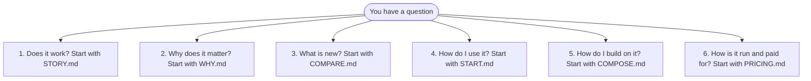

# Every document, under six questions

**In plain words.** This page lists every Knos document once, under six questions. The eight pages to read first are on [the front map](../README.md). When a word is new to you, look it up in [the word list](../WORDS.md).

*Pick your question; each one has a first page to read.*

The documents in this folder are listed below, with the eight front pages too.

`tests/test_docs_map.py` fails when a file in this folder is missing from this page.

## 1. Does it work?

| document | what it answers |
|---|---|
| [STORY.md](../STORY.md) | one task in seven steps on one page, each with its evidence |
| [JUDGES.md](../JUDGES.md) | check every claim yourself: one sentence and one link for each, and what is not real yet |
| [MANIFEST.md](MANIFEST.md) | this release on one page: source, the build live at each public id, every capability's stage, the limits |
| [CAPABILITIES.md](CAPABILITIES.md) | every capability, the stage it has reached, and the file or transaction that shows it |
| [BENCH.md](BENCH.md) | every measured number, with the command that reproduces it |
| [TAMPER.md](TAMPER.md) | which cheating submissions each judge refuses, and how much correct work each accepts |
| [LOAD.md](LOAD.md) | many orders open at once, in the local simulator |
| [DRILLS.md](DRILLS.md) | the safety paths, tested on the same program files that run on devnet |
| [drills_recovery.md](drills_recovery.md) | what a funder does in three failures, with a key of their own |
| [INVARIANTS.md](INVARIANTS.md) | what holds about money and concurrency, each with its test |
| [ASSURANCE.md](ASSURANCE.md) | the tests, the fuzzing and the proofs; no outside firm has reviewed anything |
| [UNWRAPS.md](UNWRAPS.md) | every place a program can panic, and why it cannot be reached |
| [PROVENANCE.md](PROVENANCE.md) | how each deployed program traces back to the source code it was built from |
| [FAUCET.md](FAUCET.md) | how a stranger gets test USDC and funds a first task, the faucet's rules, and its key |
| [REPRODUCE.md](REPRODUCE.md) | how someone else runs it and files a signed report |
| [OPERATIONS.md](OPERATIONS.md) | whether the canary and the relay are working, from the public record |
| [NUMBERS.md](../NUMBERS.md) | nine numbers about use by anyone outside, zeros included |
| [TRANSACTION.md](../TRANSACTION.md) | one order told end to end for a finance reader: terms, a rejection, an acceptance, payment, a refused replay |
| [FLOWS.md](FLOWS.md) | three things to try, in order: check one pull request, follow one paid task, two copies give one bill |

## 2. Why does it matter?

| document | what it answers |
|---|---|
| [WHY.md](WHY.md) | why a signed run and not a description |
| [VENDORS.md](VENDORS.md) | a page per rated agent vendor: its numbers, its right of reply, and how to earn the badge |
| [INDEX.md](INDEX.md) | the Agent PR Index: how often "tests pass" agrees with the checks, by agent and week |
| [INDEX_METHOD.md](../INDEX_METHOD.md) | the frozen count method, version 1, and a draft version 2 that also re-checks the pull requests counted as clean |
| [MARKET.md](MARKET.md) | who buys, the price book, the costs, and what can stop this |
| [MARKET_SIZE.md](MARKET_SIZE.md) | how big the market could be: a formula, its sources and labelled assumptions; no share claimed |
| [PILOT.md](PILOT.md) | the one offer for money, and the fair test written before it starts |
| [UNIT_COSTS.md](UNIT_COSTS.md) | what one unit costs Knos to deliver, measured or a budget, and the ceilings at a 90% and a 95% gross margin |
| [SHADOW.md](SHADOW.md) | a neutral count beside an invoice a buyer already receives |
| [SHARE.md](SHARE.md) | share a check: link, copied result, X post box, PNG card, README badge |

## 3. What is new?

| document | what it answers |
|---|---|
| [COMPARE.md](COMPARE.md) | each alternative, read from its own pages, and where it is ahead |
| [VERIFIER.md](VERIFIER.md) | a Solana program that checks the signed identity tokens of GitHub, GitLab, Google and others |
| [OIDC.md](OIDC.md) | the `knos-oidc` program, instruction by instruction |
| [METER.md](METER.md) | what is counted, the two ledgers, and the statement both sides rebuild |
| [EVENTS.md](EVENTS.md) | one log of events under every recording mode: ids, acknowledgements, corrections, duplicates |
| [RECEIPT.md](RECEIPT.md) | the acceptance receipt and its schema |
| [TERMS.md](TERMS.md) | terms a contract can cite by hash |
| [DISPUTES.md](DISPUTES.md) | who can do what in a dispute, at each state, with nobody from Knos |
| [LIABILITY.md](LIABILITY.md) | each way the count can be wrong, what the software does, and what nobody has signed for |
| [OUTCOMES.md](OUTCOMES.md) | outcomes other than a merged pull request |
| [X402.md](X402.md) | a proposal: pay on signed acceptance over x402, open upstream as a draft pull request |

## 4. How do I use it?

| document | what it answers |
|---|---|
| [START.md](../START.md) | get started in five minutes: check a pull request, fund a task, get paid, install the command |
| [WORDS.md](../WORDS.md) | every technical word in one plain line |
| [INSTALL.md](INSTALL.md) | every way to install the command, the check and the workflows |
| [PLAYGROUND.md](PLAYGROUND.md) | fund a test order with one comment, with a GitHub account and nothing else |
| [CONSOLE.md](CONSOLE.md) | the console, for whoever authorises a payment |
| [FINANCE.md](FINANCE.md) | the four records of a deliverable, and the accounting exports |
| [RAILS.md](RAILS.md) | paying by bank: evidence, statement, approval, a payment instruction file, and the status coming back |
| [NETTING.md](NETTING.md) | small outcomes netted into one release per supplier per period, and what the chain enforces of it |
| [SUPPLIER.md](SUPPLIER.md) | for the supplier: the rules before the work, every refusal in plain words, appeals |
| [PAYEE.md](PAYEE.md) | the payout page: a passkey address, one link, the run you start; why it is not one click |
| [RECORD.md](RECORD.md) | the supplier's kit: a public record, a badge, one line to install, a receipt for the invoice |
| [ADVANCE.md](ADVANCE.md) | an advance by a third party against a funded order: the offer, the one transaction, the three ends, no recourse |
| [RETENTION.md](RETENTION.md) | what a root proves and does not, who keeps what, and what still verifies if Knos is gone |
| [VAULT.md](VAULT.md) | keeping evidence: sealed bundles, export, retention, checkpoints, a restore drill |
| [PRIVATE.md](PRIVATE.md) | a neutral count for private repositories without showing the code |
| [AGENTS.md](AGENTS.md) | an agent finds work, takes it, submits it and is paid |

## 5. How do I build on it?

| document | what it answers |
|---|---|
| [COMPOSE.md](COMPOSE.md) | the verifier, the escrow and the record, from another program |
| [GATE.md](GATE.md) | the upgrade gate for your own program: three commands, and what it cannot do |
| [ES256.md](ES256.md) | a second kind of signed token (ES256), checked in one transaction; live on devnet since 9 Oct 2026 |
| [CONFORMANCE.md](CONFORMANCE.md) | the formats, with test vectors and a runner |
| [INTEGRATIONS.md](INTEGRATIONS.md) | what a bounty or work platform can take; no platform uses it |
| [ADAPTERS.md](ADAPTERS.md) | other systems' events, and what the chain can check of them |
| [RELAY.md](RELAY.md) | the relay: anyone can run one |
| [SOURCES.md](SOURCES.md) | signed results from systems other than CI: which can be neutral evidence |

## 6. How is it run and paid for?

| document | what it answers |
|---|---|
| [PRICING.md](../PRICING.md) | what it costs: the check is free, the fee on a paid task, the meter's price |
| [TRUST.md](../TRUST.md) | who holds the keys today, what is tested and proven, and how to check a program yourself |
| [GOVERNANCE.md](GOVERNANCE.md) | who can change what today, and three plans that are not done |
| [CHARTER.md](CHARTER.md) | the rights Knos gives you: each enforced by a named test, or marked a promise |
| [STANDARD.md](STANDARD.md) | how work should be judged and rule-breakers treated: what runs today, what is only a plan |
| [KEYS.md](KEYS.md) | who holds the keys today, and the plan |
| [PROPOSAL-2.3.md](PROPOSAL-2.3.md) | the proposed knos_pay 2.3 upgrade, in plain words |
| [KEYHOLDER.md](KEYHOLDER.md) | hold a member key: what it can do, and three steps to ask; outside holders today: 0 |
| [SELFHOST.md](SELFHOST.md) | the record API, relay and approver in your cloud; single sign-on through any OpenID Connect provider, tested against a stand-in provider only |
| [OPERATOR.md](OPERATOR.md) | a second person runs it from a clean machine; the drill nobody has run yet |
| [TEAM.md](TEAM.md) | who builds it, and the three roles needed first, none filled |
| [SECURITY.md](SECURITY.md) | who is trusted for what, every command and term, and every limit |
| [ATTESTOR.md](ATTESTOR.md) | what the forge's signature proves and does not, and five ways to narrow the gap; two exist |
| [MAINNET.md](MAINNET.md) | the gates between devnet and mainnet; not planned for this release |
| [BOUNDARY.md](BOUNDARY.md) | where enterprise funds live, and which program enforces each spending limit and approval |
| [ENFORCEMENT.md](ENFORCEMENT.md) | each route that can spend, against each restriction: enforced by the program, by the workflow, advisory, or outside |
| [CONTROLS.md](CONTROLS.md) | for a security or procurement review: what exists and what does not |
| [PRIVACY.md](PRIVACY.md) | what goes in public, and what does not |
| [REGULATION.md](REGULATION.md) | what has been examined; no lawyer has read it |
| [DISCLOSURE.md](DISCLOSURE.md) | what was built when, what came from elsewhere, what does not exist |
| [RELEASE.md](RELEASE.md) | how a release is made: one commit, one push |
| [ROLLBACK.md](ROLLBACK.md) | how to take a bad release back, surface by surface |
| [DEPENDENCY.md](DEPENDENCY.md) | what depends on one personal GitHub account, what happens if it is lost, and the plan to end it |

## What is in this repository

| folder | what it holds |
|---|---|
| [`programs-v2`](../../programs-v2) | The four programs. Each file's first lines say what it does. |
| [`programs`](../../programs) | The first deployment, exactly as deployed. |
| [`.github/workflows`](../../.github/workflows) | The workflows a repository calls, published at one pinned commit of `drexthealpha/knos-workflows`. |
| [`src/knos`](../../src/knos) | What the workflows run: the judge, the relay, receipts, statements, the Stop hook, the MCP server. |
| [`crates`](../../crates), [`idl`](../../idl), [`sdk/settle`](../../sdk/settle), [`examples`](../../examples), [`conformance`](../../conformance) | What another team builds on. |
| [`web`](../../web) | The site. It reads GitHub and Solana in the browser; there is no Knos server. |
| [`terms`](../../terms) | The terms registry: each set of terms, by hash. |

## The round in full

A work order is a task, its budget and the terms that decide whether it is done, fixed before the work starts. A
bounty on an issue is the smallest one.

- A buyer who pays by invoice uses the count alone: `knos-meter` records each signed evaluation once, and moves no money.
- The seller can settle without the buyer, after a merge in a public repository: `knos settle --neutral <pull request URL>`.
- With no payment by the deadline, the amount and the fee go back, and that needs no token.
- Work can be paid without a merge only when the buyer's check runs the work as a separate program and compares its answers: of 63 cheating pull requests, plain CI passed 56 and that check passed none ([TAMPER.md](TAMPER.md)).
- Every command and term (`checks`, `paths`, `days`, `warranty`, `holdback`, `arbiter`, `/knos offer`, `/knos split`): `/knos help`, and [SECURITY.md](SECURITY.md), section 3.
- The recording of a round: [demo.mp4](https://github.com/drexthealpha/Knos/releases/latest/download/demo.mp4) (a release with no recording has no such file).

## History

Knos 0.1 (1–7 Sep 2026) was shared memory for coding agents, built on Sibyl Labs' memory engine. 0.2 and 0.3.0–0.3.9 (30 Sep – 2 Oct)
tried coordination, budgets and a jobs market before the measurement showed where the problem was
([drexthealpha/knos-labs](https://github.com/drexthealpha/knos-labs)). 0.3.10 to 0.3.15 are the two deployments, work
orders, the count and the console. 0.3.16 put an invoice check on the site. [DISCLOSURE.md](DISCLOSURE.md) says what
was built when and what came from elsewhere; [the changelog](../../CHANGELOG.md) has every release.
