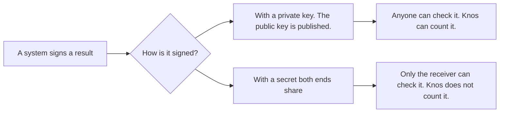

# Sources: signed results from systems other than CI

**In plain words.** Knos counts work when a trusted system signs a result. Until now that system was CI (the
automatic checks that run on each change). This page is about other systems. Knos takes a result from one only if
anyone can check the signature. A new word? See [the word list](../WORDS.md).

## The one rule

A result is neutral evidence only if a third party can check it. That person needs no secret and no help from us.

- **A public key can do this.** The system signs with a private key (a secret only it holds). It publishes the
  matching public key (a key anyone may hold). Anyone can then check the signature.
- **A shared secret cannot.** Many webhooks (messages one system sends another) are signed with a secret both ends
  hold. This is called an HMAC. It proves the message to the one receiver. It proves nothing to anyone else. The
  receiver holds the secret, so the receiver could have made the message too.


*A public key lets anyone check; a shared secret lets only the receiver check.*

## Which sources can be neutral evidence

| source | how it signs | neutral evidence? | why |
|---|---|---|---|
| GitHub Actions and GitLab sign-in tokens | Public keys in a key list ([GitHub's](https://token.actions.githubusercontent.com/.well-known/jwks), [GitLab's](https://gitlab.com/oauth/discovery/keys)) | yes | The Knos program checks GitHub's on chain today ([OIDC.md](OIDC.md)). GitLab's: tested here, not yet run on gitlab.com ([ADAPTERS.md](ADAPTERS.md)). |
| Sigstore build records (npm and GitHub provenance) | A short-lived certificate from Sigstore's authority, and an entry in Rekor, a public log ([Sigstore](https://docs.sigstore.dev/logging/overview/)) | yes | The keys are published. The log is public. **Knos reads these today** (below). |
| npm's own publish record | npm's public key ([npm](https://docs.npmjs.com/generating-provenance-statements)) | could be | A public key, so it can be checked. No adapter reads it yet. |
| GitHub webhooks | HMAC-SHA256 with a shared secret, header `X-Hub-Signature-256` ([GitHub](https://docs.github.com/en/webhooks/using-webhooks/validating-webhook-deliveries)) | no | Only the receiver holds the secret. |
| Stripe webhooks | A secret shared with your endpoint ([Stripe](https://docs.stripe.com/webhooks/signature)) | no | The same reason. |
| Linear webhooks | HMAC-SHA256 with a shared secret ([Linear](https://linear.app/developers/webhooks)) | no | The same reason. [ADAPTERS.md](ADAPTERS.md) shows how Linear, Jira and Notion still start a payment, without being the evidence. |

## The Sigstore adapter

npm and GitHub can publish a build record for a package. It says: "this file was built from this commit, by this
workflow, in this run". The workflow signs it inside GitHub Actions. Sigstore certifies who signed. Rekor records it
in public. The code is [`src/knos/sources/sigstore.py`](../../src/knos/sources/sigstore.py).

It checks five things, with no network:

1. Sigstore's authority issued the signing certificate. The log recorded the entry while the certificate was valid.
2. GitHub Actions vouched for the signer. The build ran on a machine GitHub hosts, not one the owner controls.
3. The statement's signature checks against the certificate.
4. Rekor recorded this exact signature. Rekor's own key signed that record and the tree it sits in.
5. The statement is a build record (SLSA provenance v1). Its repository and commit match the certificate.

The keys come from Sigstore's published key file (its "trusted root"). Knos keeps a copy in
[`src/knos/sources/sigstore_trusted_root.json`](../../src/knos/sources/sigstore_trusted_root.json). The code pins that
copy by its sha256 (a fingerprint of the file). It was taken from Sigstore's key server,
`https://tuf-repo-cdn.sigstore.dev`, on 10 Oct 2026.

If the record matches the order's terms, it becomes one meter line. The line says "accepted". Its artifact is the
commit. Its `evidence` field is the record's sha256. The terms name the repository. They may also name the workflow
file and the built file's digest.

### What it does not check

- That the key file is still current. Sigstore can change its keys. Copy the new file and change the pin.
- The certificate's own log stamp (a second, separate public log).
- Entries in Rekor's newer log, signed with another kind of key. The adapter refuses them and says why.
- That the build is good. A build record says where and from what a file was built. It says nothing about quality.

### Tested with real records

The tests use two real records, taken from npm's registry on 10 Oct 2026:

| package | built by | Rekor entry |
|---|---|---|
| `knos-settle` 0.3.25 | this repository's release workflow, commit `095f52ae` | [3177480388](https://search.sigstore.dev/?logIndex=3177480388) |
| `sigstore` 3.0.0 | the `sigstore-js` release workflow, commit `3a57a741` | [139985224](https://search.sigstore.dev/?logIndex=139985224) |

Both are in [`tests/data/sources/`](../../tests/data/sources). [`tests/test_sources.py`](../../tests/test_sources.py)
checks that both pass. It changes one signed part at a time and checks that each change is refused. It checks the
signature maths against OpenSSL. The `knos-settle` record names the same file npm serves: its sha512 equals the
`integrity` value in npm's listing.

### What this is not

The Knos program on chain does not read these records. A Sigstore record becomes a meter line, counted off chain.
To pay on chain, the order still needs a signed run of the pinned workflow ([ADAPTERS.md](ADAPTERS.md), the row for
artifact attestations). No outside party sends Knos these records today.

## Write an adapter

An adapter is a class with a `name` and two methods ([`src/knos/sources/__init__.py`](../../src/knos/sources/__init__.py)):

- `fetch(ref)` gets the signed record as bytes. Only this step uses the network.
- `verify(raw)` checks the signature against the issuer's published keys. It returns an `Evidence`, or raises
  `Refused` with the reason in plain words.

`knos.sources.line(evidence, terms)` then makes the meter line. Use it in your own code:

```python
from knos import sources
src = sources.adapter("sigstore")
ev = src.verify(src.fetch("npm:knos-settle@0.3.25"))
row = sources.line(ev, sources.Terms(buyer=1, seller=2, order="ab" * 32, policy="cd" * 32, milestone=1,
                                     rate=5_000_000, repository="https://github.com/drexthealpha/Knos"))
print(row.line())
```

An adapter for a shared-secret webhook will not be accepted. It cannot be neutral evidence.
