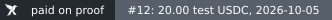

# "Paid on proof" beside a bounty

A platform that lists a bounty Knos paid can show one small picture next to it, linked to the public record of the
payment. The picture says only what the receipt says: which pull request, how much, in which money, on which day.

Paid is an event: the checks the funder named passed at the merge and the program paid. It is not a score of the
work. On devnet all money is test USDC, the badge says so, and it is grey; green is kept for real money.

## The picture

`knos badge octo/widgets#12 --out paid-pull-request.svg` writes the picture for one pull request, and
`knos badge octo/widgets --out paid-on-proof.svg` the count for a repository. Both read the chain and nothing else.
The two files in this folder are what they look like:

| File | Says |
| --- | --- |
| [`paid-pull-request.svg`](paid-pull-request.svg) | paid on proof: #12: 20.00 test USDC, 2026-10-05 |
| [`paid-on-proof.svg`](paid-on-proof.svg) | paid on proof: 3 payments in test USDC, as of 2026-10-05 |

Each is one SVG file with no script, no link and no font of its own, 20 pixels high, so it sits in a table row or
beside a title. Its `<title>` is the same fact as a sentence, for a screen reader.

## The link

The picture links to the repository's record on the Knos site, the page that lists every payment with its
transaction: `https://drexthealpha.github.io/Knos/r/<owner>/<repo>.html`. For `octo/widgets`:

    https://drexthealpha.github.io/Knos/r/octo/widgets.html

In Markdown, with the file served by the platform:

    

Where a file cannot be attached (a comment, an email), shields.io draws the same words from the address, and nothing
is fetched from Knos:

    

In HTML:

    

## Before showing it

Show the badge only for a payment the platform checked: `verify` in [`../webhook`](../webhook) answers offline
whether a receipt is the one GitHub's signed token stands behind, and `knos bundle verify FILE --rpc URL` compares
the wallets and amounts with the chain. A badge for a payment nobody checked says more than anyone knows.
